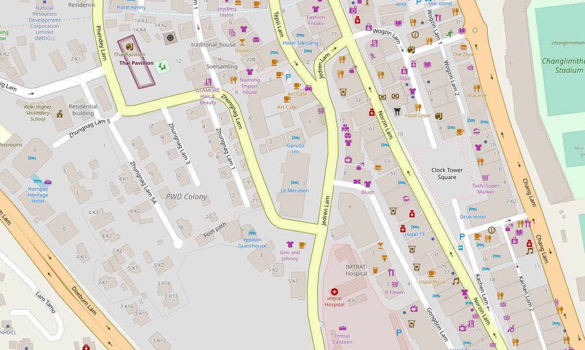
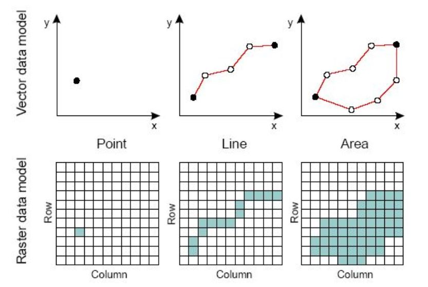
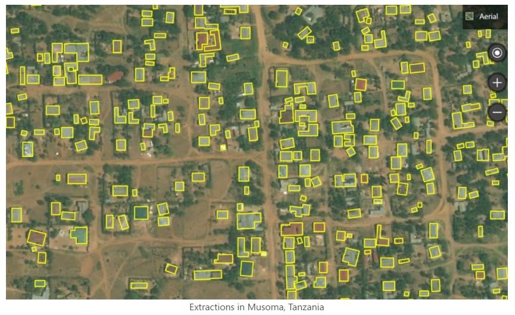
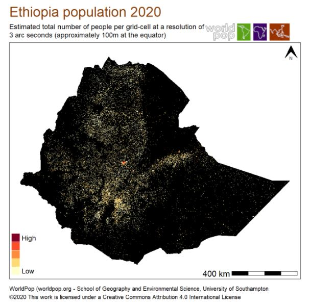
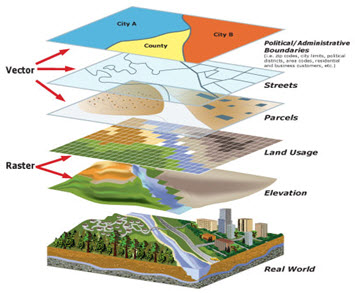

# Documenting geographic datasets and services

## The ISO 19100 metadata standards 

To make geographic information discoverable and to facilitate their dissemination and use, the ISO Technical Committee on Geographic Information/Geomatics (ISO/TC211) created a set of metadata standards to describe geographic **datasets** (ISO 19115), geographic **data structures** (ISO 19115-2 / ISO 19110), and geographic **data services** (ISO 19119). These standards have been "unified" into a common XML specification (ISO 19139). This set of standards, known as the ISO 19100 series, served as the cornerstone of multiple initiatives to improve the documentation and management of geographic information such as the [Open Geospatial Consortium (OGC)](https://www.ogc.org/), the [US Federal Geographic Data Committee (FDGC)](https://www.fgdc.gov/), the [European INSPIRE directive](https://inspire.ec.europa.eu), or more recently the [Research Data Alliance (RDA)](https://rd-alliance.org/), among others.

The ISO 19100 standards have been designed to cover the large scope of geographic information. The level of detail they provide goes beyond the needs of most data curators. What we use in the Metadata Editor is a subset of the standards, which focuses on what we consider as the most relevant metadata elements to describe and catalog geographic datasets and services. 
                                                  
Geographic information metadata standards cover three types of resources: (i) datasets (which can be of vector or raster type), (ii) data structure definitions, and (iii) data services. Each one of these three components is the object of a specific standard. To support their implementation, a common XML specification (ISO 19139) covering the three standards has been developed. The geographic metadata standard is however a very complex standard. Its use requires expertise not only in data documentation, but also in the use of geospatial data. We provide in this chapter some information that readers who are not familiar with geographic data may find useful to better understand the purpose and use of the geographic metadata standards.

## Documenting geographic datasets and services

**Geographic data services** refers to  operations or set of operations that allows users to access, manipulate, transform, analyze, or visualize geographic data over a network or system. It’s not the data itself — it’s the functionality provided to interact with the data. In other words, a geographic data service is something you can call or use to work with geographic data without downloading the full dataset first. Geographic data servies are documented using metadata elements from the ISO 19119 metadata standard. The elements of ISO 19119 are included in the XML specification ISO 19139.

**Geographic datasets** Geographic datasets refers to the actual stored data about the Earth’s features, phenomena, or events. Geographic datasets "identify and depict geographic locations, boundaries and characteristics of features on the surface of the earth. Geographic datasets can be vector data (points, lines, polygons) or raster data (grids, pixels, imagery). They include geographic coordinates (e.g., latitude and longitude) and data associated to geographic locations (...)". (Source: https://www.fws.gov/gis/) The ISO 19115 standard defines the structure and content of the metadata to be used to document geographic datasets. The ISO 19115 standard is split into two parts covering:
- **vector data** (ISO 19115-1), and 
- **raster data** including imagery and gridded data (ISO 19115-2). 
The elements of ISO 19115 are included in the XML specification ISO 19139.

*Vector* and *raster* spatial datasets are built with different structures and formats. The following summarizes how these two categories differ and how they can be processed using the R software. The descriptions of vector and raster data provided in this chapter are adapted from:
   - https://gisgeography.com/spatial-data-types-vector-raster/
   - https://datacarpentry.org/organization-geospatial/02-intro-vector-data/index.html]

### Vector data 

Vector data are comprised of **points**, **lines**, and **polygons** (areas). 

A vector **point** is defined by a single x, y coordinate. Generally, vector points are a latitude and longitude with a spatial reference frame. A point can for example represent the location of a building or facility. When multiple dots are connected in a set order, they become a vector **line** with each dot representing a **vertex**. Lines usually represent features that are linear in nature, like roads and rivers. Each bend in the line represents a vertex that has a defined x, y location. When a set of 3 or more vertices is joined in a particular order and closed (i.e. the first and last coordinate pairs are the same), it becomes a **polygon**. Polygons are used to show boundaries. They will typically represent lakes, oceans, countries and their administrative subdivisions (provinces, states, districts), building footprints, or outline of survey plots. Polygons have an area (which will correspond to the square-footage for a building footprint, to the acreage for an agricultural plot, etc.) 

Vector data are often provided in one of the following file formats:

   - ESRI Shapefile (actually a zip set of files; not standard and limited as it is based on an outdated DBF format, but still widely used);
   - ESRI GeoDatabase file (not a standard format, but widely used);
   - GML: the Official OGC geospatial standard format, used by standard spatial data services;
   - GeoPackage: the OGC recommended standard for handling vector data;
   - GeoJSON: another OGC standard, often used when a *service* is associated to the data;
   - KML/KMZ: [Keyhole Markup Language](https://en.wikipedia.org/wiki/Keyhole_Markup_Language), an XML notation for expressing geographic annotation and visualization within two-dimensional maps and three-dimensional Earth browsers;
   - CSV file: Comma-separated values files, with geometries provided in OGC Well-Known-Text (WKT);
   - OSM: An XML-formatted file containing "nodes" (points), "ways" (connections), and "relations" from [OpenStreetMap](https://www.openstreetmap.org) format. 

**EXAMPLE**

The figure below provides an example of vector data extracted from [Open Street Map](https://www.openstreetmap.org/node/1376501203#map=18/27.47008/89.63725) for a part of the city of Thimphu, Bhutan (as of 17 May, 2021). 

### Raster data

**Raster data** are made up of pixels, also referred to as *grid cells*. Satellite imagery and other remote sensing data are raster datasets. Grid cells in raster data are usually (but not necessarily) regularly-spaced and square. Data stored in a raster format is arranged in a grid without storing the coordinates of each cell (pixel). The coordinates of the corner points and the spacing of the grid can be used to calculate (rather than to store) the coordinates of each location in a grid.

Any given pixel in a grid stores one or more values (in one or more bands). For example, each cell (pixel) value in a satellite image has a red, a green, and a blue value. Cells in raster data could represent anything from elevation, temperature, rainfall, land cover, population density, or others. (Source: https://worldbank.github.io/OpenNightLights/tutorials/mod2_1_data_overview.html) 

Raster data can be **discrete** or **continuous**. Discrete rasters have distinct themes or categories. For example, one grid cell can represent a land cover class, or a soil type. In a discrete raster, each thematic class can be discretely defined (usually represented by an integer) and distinguished from other classes. In other words, each cell is definable and its value applies to the entire area of the cell. For example, the value 1 for a class might indicate "urban area", value 2 "forest", and value 3 "others". Continuous (or non-discrete) rasters are grid cells with gradual changing values, which could for example represent elevation, temperature, or an aerial photograph.

The difference between vector and raster data, and between different types of vectors, is clearly illustrated in the figure below taken from the World Bank's [Light Every Night GitHub repository](https://worldbank.github.io/OpenNightLights/tutorials/mod2_1_data_overview.html).

Raster data are sometimes converted into vector data. For example, a building footprint layer (vector data, composed of polygons) can be derived from a satellite image (raster data). Such conversions can be implemented in a largely automated manner using machine learning algorithms. 

Source: https://blogs.bing.com/maps/2019-09/microsoft-releases-18M-building-footprints-in-uganda-and-tanzania-to-enable-ai-assisted-mapping

Raster data are often provided in one of the following file formats:

   - GeoTiFF (standard): Most of the remote sensing data are stored as GeoTIFF files. https://www.ogc.org/standards/geotiff
   - NetCDF (standard) https://www.unidata.ucar.edu/software/netcdf/docs/netcdf_introduction.html
   - ECW: https://en.wikipedia.org/wiki/ECW_(file_format)
   - JPEG 2000: https://fr.wikipedia.org/wiki/JPEG_2000
   - MrSid: https://en.wikipedia.org/wiki/MrSID
   - ArcGrid (ESRI Grid format)

**GeoTIFF** is a popular file format for raster data. A *Tagged Image File Format* (TIFF or TIF) is a file format designed to store raster-type data. A GeoTIFF file is a TIFF file that contains specific tags to store structured geospatial metadata including:

   - Spatial extent: the area coverage of the file
   - Coordinate reference system: the projection / coordinate reference system used
   - Resolution: the spatial extent of each pixel (spatial resolution)
   - Number of layers: number of layers or bands available in the file

TIFF files can be read using (among other options) the R package [*raster*](https://cran.r-project.org/package=raster) or the Python library [*rasterio*](https://pypi.org/project/rasterio/). 

GeoTIFF files can also be provided as **Cloud Optimized GeoTIFFS (COGs)**. In COGs, the data are structured in a way that allows them to be shared via web services which allow users to query, visualize, or download a user-defined subset of the content of the file, without having to download the entire file. This option can be a major advantage, as geoTIFF files generated by remote sensing/satellite imagery can be very large. Extracting only the relevant part of a file can save significant time and storage space.

**EXAMPLE**

The example below shows the spatial distribution of the Ethiopian population in 2020. The data file was downloaded from the [WorldPop](https://www.worldpop.org/) website on 17 May 2021.

### Combining vector and raster data in GIS applications

In GIS applications, vector and raster data are often combined into multi-layer datasets, as shown in the figure below extracted from the [County of San Bernardino (US) website](http://sbcounty.gov/). 

## Describing data structures - The ISO 19115-2 and ISO 19110 standards

The ISO 19115-2 provides the necessary metadata elements to describe the structure of raster data. The ISO 19115-1 standard does not provide all necessary metadata elements needed to describe the structure of vector datasets. The description of data structures for vector data (also referred to as *feature types*) is therefore often omitted. The ISO 19110 standard solves that issue, by providing the means to document the structure of vector datasets (column names and definitions, codes and value labels, measurement units, etc.), which will contribute to making the data more discoverable and usable.

## Unified metadata specification - The ISO/TS 19139 standard

The three metadata standards previously described - ISO 19115 for vector and raster datasets, ISO 19110 for vector data structures, and ISO 19119 for data services, provide a set of concepts and definitions useful to describe the geographic information. To facilitate their practical implementation, a digital specification, which defines how this information is stored and organized in an electronic metadata file, is required. The ISO/TS 19139 standard, an XML specification of the ISO 19115/10110/19119/, was created for that purpose.

The ISO/TS 19139 is a standard used worldwide to describe geographic information. It is the backbone for the implementation of [INSPIRE](https://inspire.ec.europa.eu/) dataset and service metadata in the European Union. It is supported by a wide range of tools, including desktop applications like [Quantum GIS](https://qgis.org/en/site/), [ESRI ArcGIS](https://www.arcgis.com/index.html)), and OGC-compliant metadata catalogs (e.g., [GeoNetwork](https://geonetwork-opensource.org/)) and geographic servers (e.g., [GeoServer](http://geoserver.org/)). 

ISO 19139-compliant metadata can be generated and edited using specialized metadata editors such as [CatMDEdit](http://catmdedit.sourceforge.net/) or [QSphere](https://www.fgdc.gov/organization/working-groups-subcommittees/mwg/iso-metadata-editors-registry/qsphere), or using programmatic tools like Java Apache SIS or the R packages [geometa](https://cran.r-project.org/web/packages/geometa/index.html) and [geoflow](https://github.com/eblondel/geoflow), among others.

The Metadata Editor uses the ISO 19139 to provide a solution compatible with the ISO 19115, ISO 19110, and ISO 19119 standards.

## Metadata templates or profiles for the practical implementation of ISO 19139

The ISO 19139 specification is complex. To enable and simplify its use in the Metadata Editor, we produced a JSON version of (part of) the standard. We selected the elements we considered most relevant for our purpose, and organized them into the JSON schema described below. For data curators with limited expertise in XML and geographic data documentation, this JSON schema will make the production of metadata compliant with the ISO 19139 standard easier. 

Some organizations have sought to make the use of ISO 19139 manageable, by defining *templates* or *profiles* that consist of subsets. This includes the INSPIRE set of elements defined by the European Union, and the GEMINI set of elements defined by the United Kingdom.

The Metadata Editor is also provided with recommended templates that only contain the elements of the ISO 19139 that are considered the most useful for the documentation of geographic datasets and services. The template provided in the Metadata Editor contains all elements from the INSPIRE and GEMINI profiles, and a few more.

### INSPIRE - Infrastructure for Spatial Information in Europe

The INSPIRE geographic metadata template refers to a standardized set of metadata elements that organizations in Europe must use to describe geographic datasets and services under the INSPIRE Directive. It aims to create a European-wide, interoperable spatial data infrastructure to support environmental policies and activities that impact the environment.

The INSPIRE metadata template is based mainly on ISO 19115 (for datasets) and ISO 19119 (for services), but it specifies exactly which metadata elements are mandatory, conditional, or optional for INSPIRE compliance. It also sometimes restricts choices or defines controlled vocabularies (for example, for topics, keywords, spatial scope) to ensure harmonization across countries. The rules are detailed in the INSPIRE Metadata Regulation (Commission Regulation (EC) No 1205/2008) and its technical guidelines.

See the INSPIRE knowledge base at https://knowledge-base.inspire.ec.europa.eu/index_en

### UK GEMINI 2.3

GEMINI is the UK standard for spatial metadata. It's based on ISO 19139 and takes into account the needs of INSPIRE too. 

See:
- https://guidance.data.gov.uk/publish_and_manage_data/harvest_or_add_data/harvest_data/gemini/#gemini-and-iso-19139-metadata
- A description of UK GEMINI 2.3 2020-04-07 dataset or series: [https://agiorguk.github.io/gemini/1062-gemini-datasets-and-data-series.html](https://agiorguk.github.io/gemini/1037-uk-gemini-introduction.html)
  
  
## Documenting a geographic dataset 

This section describes how to document a geographic dataset (vector or raster) using the Metadata Editor. Documenting a data service follows the exact same principles, except that the option to extract metadata from data files does not apply when documenting a data service.

The metadata template provided with the Metadata Editor identifies metadata elements that are specific to vector or raster datasets, or to data services.

### Prepare your materials

Gather all information
Organize the data and metadata in a folder
Generate a gallery of images

### Create a project

### Extract metadata from data files 

The Metadata Editor allows you to extract metadata contained in geographic datasets. The following formats are supported:
- GeoTiff and COG (cloud-optimized GeoTiff)
- Shape files
- geoJSON
- NetCDF
- KML
- ...

To extract information from data files:
- ...

The metadata that will be extracted will be automatically entered in the relevant metadata elements. What can be extracted depends on the data format, and on what the data producer may have included in the data files. Typically, the following metadata will be extracted:
- Filename
- Bounding box
- Reference system
- Features (for vector datasets)
- ...

### Enter additional metadata

We describe below the metadata elements included in the recommended templates. Thois is only a subset of the elements contained in the ISO 19139. If you developed or imported a different, more comprehensive template, consult the description of metadata elements provided by the ISO 19139 documentation.

In the list of metadata elements below, the *key* of each element in the metadata standard is provided between brackets next to the corresponding element's label in the template.

- **`Primary ID`** (*description/idno*) The "Primary ID" (also referred to as IDNO) is a unique identification number used to identify the study (geographic dataset or service). A unique identifier is required for cataloguing purpose, so this element is declared as "Required". The identifier will allow users to cite the study properly. The identifier must be unique within the catalog. Ideally, it should also be globally unique; the recommended option is to obtain a Digital Object Identifier (DOI) for the study. Alternatively, the "Primary ID" can be constructed by an organization using a consistent scheme. The identifier should not contain blank spaces.

- **`Metadata language`** (*description/language*) Main language used in the metadata description. It is recommended to select a value from a controlled vocabulary, for example that provided by ISO 639-2.

- **`Character set`** (*characterSet*) The character set encoding used in the dataset.
  - **`Characterset code`** (*characterSet/codeListValue*) 
  - **`Codelist used`** (*characterSet/codeList*) 

- **`Parent identifier`** (*description/parentIdentifier*) A geographic data resource can be a subset of a larger dataset. For example, an aquatic species distribution map can be part of a data collection covering all species, or the 2010 population census dataset of a country can be part of a dataset that includes all population censuses for that country since 1900. In such case, the parent identifier metadata element can be used to identify this higher-level resource. As for the fileIdentifier, the parentIdentifier must be a unique identifier persistent in time. In a data catalog, a parentIdentifier will allow the user to move from one dataset to another. The parentIdentifier is generally applied to datasets, although it may in some cases be used in data services descriptions.

- **`Hierarchy level`** (*description/hierarchyLevel*) This is the type of resource being described by the metadata and it is filled in with a value from a classification of the resource based on its scope. The choice of Resource Type will be probably the first decision made by the user and it will define the metadata elements that should be filled.

  The hierarchy level defines the scope of the resource. It indicates whether the resource is a collection, a dataset, a series, a service, or another type of resource. The ISO 19139 provides a controlled vocabulary for this element. It is recommended but not mandatory to make use of it. The most relevant levels for the purpose of cataloguing geographic data and services are dataset (for both raster and vector data), service (a capability which a service provider entity makes available to a service user entity through a set of interfaces that define a behavior), and series. Series will be used when the data represent an ordered succession, in time or in space; this will typically apply to time series, but it can also be used to describe other types of series (e.g., a series of ocean water temperatures collected at a succession of depths).

  NOTES:
  - dataset: is an identifiable data that can be accessed separately. A dataset can be a part of a whole (series) or a segregate resource.
  - series: is a collection of resources or related datasets that share the same product specification.
  - service: technologies providing availability and access to spatial information, for example, web map services, web feature services, web coverage services, web processing services, catalogue web services, etc.

- **`Hierarchy level name`** (*description/hierarchyLevelName*) The "hierarchy level name" provides an alternative to describe hierarchy levels, using free text instead of a controlled vocabulary. The use of "hierarchy level" is preferred to the use of "hierarchy level name".

- **`contact`** (*description/contact*) NOT-AVAILABLE
  - **`Individual name`** (*description/contact/individualName*) The responsible party (person) in charge of the feature catalogue production.
  - **`Organisation name`** (*description/contact/organisationName*) The responsible party (organization) in charge of the feature catalogue production.
  - **`Position`** (*description/contact/positionName*) 
  - **`Role`** (*description/contact/role*) Role of the person/organization. A recommended controlled vocabulary is provided by ISO 19139
  - **`Contact information`** 
    - **`Email`** (*description/contact/contactInfo/address/electronicMailAddress*) 
    - **`Phone`** 
      - **`Voice`** (*description/contact/contactInfo/phone/voice*) 
      - **`Facsimile`** (*description/contact/contactInfo/phone/facsimile*) 
    - **`Address`** (*description/contact/section-1676477188264/contactInfo/address*) NOT-AVAILABLE
      - **`Delivery point`** (*description/contact/section-1676477188264/contactInfo/address/deliveryPoint*) Physical address - Street, building number, etc.
      - **`City`** (*description/contact/section-1676477188264/contactInfo/address/city*) Physical address - City name
      - **`Postal code`** (*description/contact/section-1676477188264/contactInfo/address/postalCode*) Physical address - Postal code
      - **`Country`** (*description/contact/section-1676477188264/contactInfo/address/country*) Physical address - Country name
    - **`Online resource`** 
      - **`Name`** (*description/contact/section-1676477380255/contactInfo/onlineResource/name*) Name of the online resource. In case of a geographic standard data services, this should be filled with the identifier of the resource as published in the service. Example, for an OGC Web Map Service (WMS), we will use the layer name.
      - **`Description`** (*description/contact/section-1676477380255/contactInfo/onlineResource/description*) Description of the online resource
      - **`URL`** (*description/contact/section-1676477380255/contactInfo/onlineResource/linkage*) URL of the online resource. In case of a geographic standard data services, only the base URL should be provided, without any service parameter.
      - **`Protocol`** (*description/contact/section-1676477380255/contactInfo/onlineResource/protocol*) Web protocol used to get the resource, e.g., FTP, HTTP. In case of a basic HTTP, the ISO 19139 suggests the value "WWW:LINK-1.0-http–link". For geographic standard data services, it is recommended to fill this element with the appropriate protocol identifier. For an OGC Web Map Service (WMS) link for example, use "OGC:WMS-1.1.0-http-get-map"
      - **`Function`** (*description/contact/section-1676477380255/contactInfo/onlineResource/function*) Function (purpose) of the online resource.

- **`Date stamp`** (*description/dateStamp*) Date and time when the metadata record was created or updated. Requires an extended ISO 8601 formatted combined UTC date and time string (2009-11-17T10:00:00).

- **`Metadata standard version`** (*description/metadataStandardVersion*) The version of the metadata standard being used. It is good practice to enter the standard’s inception/revision year. ISO standards are revised with an average periodicity of 10-year. Although the ISO TC211 geographic information metadata standards have been reviewed, it is still accepted to refer to the original version of the standard as many information systems/catalogs still make use of that version. The recommended values are:
  - in the case of vector dataset metadata: ISO 19115:2003
  - in the case of grid/imagery dataset metadata: ISO 19115-2:2009
  - in the case of service metadata: ISO 19119:2005

- **`Metadata standard name`** (*description/metadataStandardName*) The name of the geographic metadata standard used to describe the resource. The recommended values are:
  - in the case of vector dataset metadata: ISO 19115 Geographic information - Metadata
  - in the case of grid/imagery dataset metadata: ISO 19115-2 Geographic Information - Metadata Part 2 Extensions for imagery and gridded data
  - in the case of service metadata: ISO 19119 Geographic information - Services

- **`Dataset URI`** (*description/dataSetURI*) A unique resource identifier for the dataset, such as a web link that uniquely identifies the dataset. The use of a Digital Object Identifier (DOI) is recommended.

**IDENTIFICATION** 

***CITATION*** 

- **`Title`** (*description/identificationInfo/citation/title*) Title of the resource.

- **`Alternate title`** (*description/identificationInfo/citation/alternateTitle*) An alternate title (if applicable)

- **`Date`** (*description/identificationInfo/citation/date*) Date(s) associated to a resource. This may include different types of dates. The metadata shall contain a date of publication, revision or creation of the resource.
  The following types will often be used:
  - Date of publication: This is the date of publication of the resource when available, or the date of entry into force. There may be more than one date of publication. Date of publication differs from the temporal extent. For example, a dataset might have been published in March 2009 (2009-03-15) but the covered information was collected over the year 2008 (temporal extent from 2008-01-01 to 2008-12-31).
  - Date of last revision: This date describes when the resource was last revised, if the resource has been revised. Date of revision differs from the temporal extent. For example, a dataset might have been revised in April 2009 (2009-04-15) but the covered information was collected over the year 2008 (temporal extent from 2008-01-01 to 2008-12-31).
  - Date of creation: This date describes when the resource was created. Date of creation differs from the temporal extent. For example, a dataset might have been created in February 2009 (2009-02-15) but the covered information was collected over the year 2008 (temporal extent from 2008-01-01 to 2008-12-31).
  - **`Date`** (*description/identificationInfo/citation/date/date*) The date, in ISO format.
  - **`Type`** (*description/identificationInfo/citation/date/type*) The type of date should be provided, and selected from the controlled vocabulary proposed by the ISO 19139.

- **`Edition`** (*description/identificationInfo/citation/edition*) Edition of the resource.

- **`Edition date`** (*description/identificationInfo/citation/editionDate*) Edition date, in ISO format.

- **`Identifier`** (*description/identificationInfo/citation/identifier*) 
  - **`Identifier`** (*description/identificationInfo/citation/identifier/code*) A value uniquely identifying an object within a namespace.
  - **`Authority`** (*description/identificationInfo/citation/identifier/authority*) A unique persistent identifier for the metadata. If a DOI is available for the resource, the DOI should be entered here. The same file identifier should be used if no other persistent identifier is available.

- **`Responsible party`** (*description/identificationInfo/citation/citedResponsibleParty*) 
  - **`Organisation name`** (*description/identificationInfo/citation/citedResponsibleParty/organisationName*) 
  - **`Individual name`** (*description/identificationInfo/citation/citedResponsibleParty/individualName*) 
  - **`Position`** (*description/identificationInfo/citation/citedResponsibleParty/positionName*) 
  - **`Role`** (*description/identificationInfo/citation/citedResponsibleParty/role*) 
  - **`Email`** (*description/identificationInfo/citation/citedResponsibleParty/contactInfo/address/electronicMailAddress*)
  - **`Phone`**
    - **`Voice`** (*description/identificationInfo/citation/citedResponsibleParty/contactInfo/phone/voice*) 
    - **`Facsimile`** (*description/identificationInfo/citation/citedResponsibleParty/contactInfo/phone/facsimile*) 
  - **`Address`** (*description/identificationInfo/citation/citedResponsibleParty/section-1676478323711/contactInfo/address*) NOT-AVAILABLE
    - **`Delivery point`** (*description/identificationInfo/citation/citedResponsibleParty/section-1676478323711/contactInfo/address/deliveryPoint*) 
    - **`City`** (*description/identificationInfo/citation/citedResponsibleParty/section-1676478323711/contactInfo/address/city*) 
    - **`Postal code`** (*description/identificationInfo/citation/citedResponsibleParty/section-1676478323711/contactInfo/address/postalCode*) 
    - **`Country`** (*description/identificationInfo/citation/citedResponsibleParty/section-1676478323711/contactInfo/address/country*) 
  - **`Online resource`** (*description/identificationInfo/citation/citedResponsibleParty/section-1676478338407/contactInfo/onlineResource*) NOT-AVAILABLE
    - **`Name`** (*description/identificationInfo/citation/citedResponsibleParty/section-1676478338407/contactInfo/onlineResource/name*) 
    - **`Description`** (*description/identificationInfo/citation/citedResponsibleParty/section-1676478338407/contactInfo/onlineResource/description*) 
    - **`URL`** (*description/identificationInfo/citation/citedResponsibleParty/section-1676478338407/contactInfo/onlineResource/linkage*) 
    - **`Protocol`** (*description/identificationInfo/citation/citedResponsibleParty/section-1676478338407/contactInfo/onlineResource/protocol*) 
    - **`Function`** (*description/identificationInfo/citation/citedResponsibleParty/section-1676478338407/contactInfo/onlineResource/function*) 

- **`Presentation form`** (*description/identificationInfo/citation/presentationForm*) Form in which the resource is made available. The ISO 19139 recommends a controlled vocabulary. For a geospatial dataset or web-layer, the value "Map digital" will be preferred.

- **`Series name`** (*description/identificationInfo/citation/series/name*) A description of the series, in case the resource is part of a series.

- **`Series issue`** (*description/identificationInfo/citation/series/issueIdentification*) A description of the series, in case the resource is part of a series.

- **`Series page`** (*description/identificationInfo/citation/series/page*) A description of the series, in case the resource is part of a series.

- **`Other citation details`** (*description/identificationInfo/citation/otherCitationDetails*) Any other citation details to specify.

- **`Collective title`** (*description/identificationInfo/citation/collectiveTitle*) A title in case the resource is part of a broader resource (e.g., data collection).

- **`ISBN`** (*description/identificationInfo/citation/ISBN*) International Standard Book Number (ISBN); an international standard identification number for uniquely identifying publications that are not intended to continue indefinitely.

- **`ISSN`** (*description/identificationInfo/citation/ISSN*) International Standard Serial Number (ISSN); an international standard for serial publications.

**ABSTRACT, PURPOSE, CREDIT, STATUS**

- **`Abstract`** (*description/identificationInfo/abstract*) This is a brief narrative summary of the content of the resource. The abstract provides a clear and concise statement that enables the reader to understand the content of the data or service.
  RECOMMENDATIONS
  1. The resource abstract is a succinct description that can include:
    - A brief summary with the most important details that summarize the data or service
    - Coverage: linguistic transcriptions of the extent or location in addition to the bounding box
    - Main attributes
    - Data sources
    - Legal references
    - Importance of the work
  2. Do not use unexplained acronyms.
  3. Summarize the most important details in the first sentence or first 100 characters.

- **`Purpose`** (*description/identificationInfo/purpose*) 

- **`Credit`** (*description/identificationInfo/credit*) 

- **`Status`** (*description/identificationInfo/status*) 

**POINT OF CONTACT**

- **`Contact`**
  - **`Individual name`** (*description/identificationInfo/pointOfContact/individualName*) 
  - **`Organisation name`** (*description/identificationInfo/pointOfContact/organisationName*) 
  - **`Position`** (*description/identificationInfo/pointOfContact/positionName*) 
  - **`Role`** (*description/identificationInfo/pointOfContact/role*) Function performed by the responsible party. Select all roles that best represent the function performed by the responsible party.
  - **`Contact information`** 
    - **`Phone`**
      - **`Voice`** (*description/identificationInfo/pointOfContact/contactInfo/phone/voice*) 
      - **`Facsimile`** (*description/identificationInfo/pointOfContact/contactInfo/phone/facsimile*) 
    - **`Email`** (*description/identificationInfo/pointOfContact/contactInfo/address/electronicMailAddress*) 
    - **`Address`** 
      - **`Delivery point`** (*description/identificationInfo/pointOfContact/section-1676479710348/contactInfo/address/deliveryPoint*) 
      - **`City`** (*description/identificationInfo/pointOfContact/section-1676479710348/contactInfo/address/city*) 
      - **`Postal code`** (*description/identificationInfo/pointOfContact/section-1676479710348/contactInfo/address/postalCode*) 
      - **`Country`** (*description/identificationInfo/pointOfContact/section-1676479710348/contactInfo/address/country*) 
    - **`Online resource`** 
      - **`Name`** (*description/identificationInfo/pointOfContact/section-1676479717564/contactInfo/onlineResource/name*) 
      - **`URL`** (*description/identificationInfo/pointOfContact/section-1676479717564/contactInfo/onlineResource/linkage*) 
      - **`Description`** (*description/identificationInfo/pointOfContact/section-1676479717564/contactInfo/onlineResource/description*) 
      - **`Protocol`** (*description/identificationInfo/pointOfContact/section-1676479717564/contactInfo/onlineResource/protocol*) 
      - **`Function`** (*description/identificationInfo/pointOfContact/section-1676479717564/contactInfo/onlineResource/function*) 

**RESOURCE MAINTENANCE**

- **`Frequency`** (*description/identificationInfo/resourceMaintenance/maintenanceAndUpdateFrequency*) Maintenance and update frequency

- **`Date of next update`** (*description/identificationInfo/resourceMaintenance/dateOfNextUpdate*) Date of the next update of the resource in ISO format.

- **`User defined maintenance frequency`** (*description/identificationInfo/resourceMaintenance/userDefinedMaintenanceFrequency*) User defined maintenance frequency.

- **`Update scope`** (*updateScope*) 
    - **`Update scope`** (*description/identificationInfo/resourceMaintenance/updateScope/scope*) Update scope.
    - **`Description`** (*description/identificationInfo/resourceMaintenance/updateScope/description*) Description of the update scope.

- **`Maintenance note`** (*description/identificationInfo/resourceMaintenance/maintenanceNote*) Maintenance note.

- **`contact`** 

**GRAPHIC OVERVIEW**

- **`Graphic overview`** (*description/identificationInfo/graphicOverview*) 
  - **`File name`** (*description/identificationInfo/graphicOverview/fileName*) 
  - **`File description`** (*description/identificationInfo/graphicOverview/fileDescription*) 
  - **`File type`** (*description/identificationInfo/graphicOverview/fileType*) 

**DESCRIPTIVE KEYWORDS**

- **`Keywords`** (*description/identificationInfo/descriptiveKeywords*) 
  - **`Type`** (*description/identificationInfo/descriptiveKeywords/type*) Keywords type. The ISO 19139 provides a recommended controlled vocabulary.
  - **`Keyword`** (*description/identificationInfo/descriptiveKeywords/keyword*) The keyword itself. When possible, existing vocabularies should be preferred to writing free-text keywords. An example of global vocabulary is the Global Change Master Directory that could be a valuable source to reference data domains / disciplines, or the UNESCO Thesaurus.
  - **`Thesaurus name`** (*description/identificationInfo/descriptiveKeywords/thesaurusName*) A reference to a thesaurus (if applicable) from which the keywords are extracted. The thesaurus itself should then be documented as a citation.

**LEGAL CONSTRAINTS** 

- **`Use limitation`** (*description/identificationInfo/resourceConstraints/section-1676478956897/legalConstraints/useLimitation*) 
- **`Access constraints`** (*description/identificationInfo/resourceConstraints/section-1676478956897/legalConstraints/accessConstraints*) Legal access constraints. The ISO 19139 provides a controlled vocabulary. These are the access constraints applied to assure the protection of privacy or intellectual property, and any special restrictions or limitations on obtaining the resource.
- **`Use constraints`** (*description/identificationInfo/resourceConstraints/section-1676478956897/legalConstraints/useConstraints*) Use constraints. To be entered as free text. Filling this element will depend on the resource that is described. As best practice recommended to fill this element, this is where terms of use, disclaimers, preferred citation or* even data limitations can be captured
- **`Other constraints`** (*description/identificationInfo/resourceConstraints/section-1676478956897/legalConstraints/otherConstraints*) Any other legal restrictions and legal prerequisites for accessing and using the resource or metadata.

**SECURITY CONSTRAINTS`**

- **`Use limitation`** (*description/identificationInfo/resourceConstraints/section-1676478978376/securityConstraints/useLimitation*) Restrictions on the access and use of a resource or metadata.
  - If no conditions apply to the access and use of the resource, ‘no conditions apply’ shall be used. If conditions are unknown, ‘conditions unknown’ shall be used.
  - Descriptions of terms and conditions, including where applicable, the corresponding fees shall be provided through this element or a link (URL) where these terms and conditions are described.
  - For detailed information it is recommended to provide a link to a license type (e.g. http://creativecommons.org/licenses/by/3.0), a website or to a document containing the necessary information.
- **`Classification`** (*description/identificationInfo/resourceConstraints/section-1676478978376/securityConstraints/classification*) Name of the handling restrictions on the resource. The ISO 19139 provides a controlled vocabulary.
- **`Classification system`** (*description/identificationInfo/resourceConstraints/section-1676478978376/securityConstraints/classificationSystem*) Information on the system used to classify the information. Organizations may have their own system to classify the information.
- **`Description of the classification`** (*description/identificationInfo/resourceConstraints/section-1676478978376/securityConstraints/handlingDescription*) Additional free-text description of the classification.
- **`Note on constraints`** (*description/identificationInfo/resourceConstraints/section-1676478978376/securityConstraints/userNote*) Note to users (free text)

**RESOURCE SPECIFIC USAGE** 

- **`Specific usage`** (*description/identificationInfo/resourceSpecificUsage/specificUsage*) 
- **`Time stamp`** (*description/identificationInfo/resourceSpecificUsage/usageDateTime*) 
- **`User determined limitations`** (*description/identificationInfo/resourceSpecificUsage/userDeterminedLimitations*) 
- **`User contact information`** 
  - **`Individual name`** (*description/identificationInfo/resourceSpecificUsage/userContactInfo/individualName*) 
  - **`Organisation name`** (*description/identificationInfo/resourceSpecificUsage/userContactInfo/organisationName*) 
  - **`Position`** (*description/identificationInfo/resourceSpecificUsage/userContactInfo/positionName*) 
  - **`Role`** (*description/identificationInfo/resourceSpecificUsage/userContactInfo/role*) 
  - **`Email`** (*description/identificationInfo/resourceSpecificUsage/userContactInfo/contactInfo/address/electronicMailAddress*) 
  - **`Phone`** 
    - **`Voice`** (*description/identificationInfo/resourceSpecificUsage/userContactInfo/contactInfo/phone/voice*) 
    - **`Facsimile`** (*description/identificationInfo/resourceSpecificUsage/userContactInfo/contactInfo/phone/facsimile*) 
  - **`Address`** 
    - **`Delivery point`** (*description/identificationInfo/resourceSpecificUsage/userContactInfo/section-1676479119224/contactInfo/address/deliveryPoint*) 
    - **`City`** (*description/identificationInfo/resourceSpecificUsage/userContactInfo/section-1676479119224/contactInfo/address/city*) 
    - **`Postal code`** (*description/identificationInfo/resourceSpecificUsage/userContactInfo/section-1676479119224/contactInfo/address/postalCode*) 
    - **`Country`** (*description/identificationInfo/resourceSpecificUsage/userContactInfo/section-1676479119224/contactInfo/address/country*) 
  - **`Online resource`**
    - **`Name`** (*description/identificationInfo/resourceSpecificUsage/userContactInfo/section-1676479152000/contactInfo/onlineResource/name*) 
    - **`URL`** (*description/identificationInfo/resourceSpecificUsage/userContactInfo/section-1676479152000/contactInfo/onlineResource/linkage*) 
    - **`Description`** (*description/identificationInfo/resourceSpecificUsage/userContactInfo/section-1676479152000/contactInfo/onlineResource/description*) 
    - **`Protocol`** (*description/identificationInfo/resourceSpecificUsage/userContactInfo/section-1676479152000/contactInfo/onlineResource/protocol*) 
    - **`Function`** (*description/identificationInfo/resourceSpecificUsage/userContactInfo/section-1676479152000/contactInfo/onlineResource/function*) 

**AGGREGATION INFORMATION**

- **`Aggregate dataset name`** (*description/identificationInfo/aggregationInfo/aggregateDataSetName*) 
- **`Aggregate dataset identifier`** (*description/identificationInfo/aggregationInfo/aggregateDataSetIdentifier*) 
- **`Association type`** (*description/identificationInfo/aggregationInfo/associationType*) 
- **`Type of initiative`** (*description/identificationInfo/aggregationInfo/initiativeType*) 

**BOUNDING BOX`**

- **`Bounding box`**
  - **`West bound longitude`** (*description/identificationInfo/extent/geographicElement/geographicBoundingBox/westBoundLongitude*) West
  - **`East bound longitude`** (*description/identificationInfo/extent/geographicElement/geographicBoundingBox/eastBoundLongitude*) East
  - **`South bound latitude`** (*description/identificationInfo/extent/geographicElement/geographicBoundingBox/southBoundLatitude*) South
  - **`North bound latitude`** (*description/identificationInfo/extent/geographicElement/geographicBoundingBox/northBoundLatitude*) North

**GEOHASH**  

- **`Geohash`**
  - **`Geohash`** (*description/identificationInfo/extent/geographicElement/geohash/geohash*) Geohash
  - **`Note`** (*description/identificationInfo/extent/geographicElement/geohash/note*) Notes
  
**GEOGRAPHIC ELEMENT**

- **`Geographic description`** (*description/identificationInfo/extent/geographicElement/geographicDescription*) 
- **`Geographic bounding polygon`** 
  - **`Polygon Identifier (ID)`** (*description/identificationInfo/extent/geographicElement/geographicBoundingPolygon/id*) 
  - **`Polygon`** (*geographicBoundingPolygon/polygon*) 
    - **`Interior or exterior ring`** (*description/identificationInfo/extent/geographicElement/geographicBoundingPolygon/polygon/ring*) 
    - **`Type`** (*description/identificationInfo/extent/geographicElement/geographicBoundingPolygon/polygon/type*) Type of geometry
    - **`Coordinates`** (*description/identificationInfo/extent/geographicElement/geographicBoundingPolygon/polygon/coordinates*) Coordinates of the polygon. The first and last coordinate pairs must be the same to close the polygon.

**TEMPORAL ELEMENT** 

The temporal extent defines the time period covered by the content of the resource. Depending on the temporal characteristics of the dataset, this will consist in a Time period (made of a begin position and end position) or a time instant (made of a single time position) referencing date/time information according to ISO 8601. This time period may be expressed as an individual date, an interval of dates (starting date and ending date), or a mix of individual dates and intervals of dates.
  
- **`beginPosition`** (*description/identificationInfo/extent/temporalElementExtent/beginPosition*) Begin time position. Requires an extended ISO 8601 formatted combined UTC date and time string (2009-11-17T10:00:00)
- **`endPosition`** (*description/identificationInfo/extent/temporalElementExtent/endPosition*) End time position. Requires an extended ISO 8601 formatted combined UTC date and time string (2009-11-17T10:00:00)

**VERTICAL ELEMENT** 
Spatial (vertical) extent element, providing two properties: minimum value, maximum value and vertical CRS (reference to the vertical coordinate reference system)

- **`Vertical element`**
  - **`Minimum value`** (*description/identificationInfo/extent/verticalElement/minimumValue*) 
  - **`Maximum value`** (*description/identificationInfo/extent/verticalElement/maximumValue*) 
  - **`Vertical CRS`** (*description/identificationInfo/extent/verticalElement/verticalCRS*) 

**SPATIAL REPRESENTATION TYPE** 
The spatial representation type of the dataset. Values should be selected from the following controlled vocabulary: {vector, grid, textTable, tin, stereoModel, video}

- **`Spatial resolution`** (*description/identificationInfo/spatialResolution*) The spatial resolution of the data as numeric value associated to a unit of measure. Spatial resolution refers to the level of detail of the data set. It shall be expressed as a set of zero to many resolution distances (typically for gridded data and imagery-derived products) or equivalent scales (typically for maps or map-derived products). An equivalent scale is generally expressed as an integer value expressing the scale denominator. A resolution distance shall be expressed as a numerical value associated with a unit of length.
EXAMPLES:
- 50000 (e.g. 1:50000 scale map)
- 0.25 (degrees)
NOTES:
- For services, it is not possible to express the restriction of a service concerning the spatial resolution in the current version of ISO 19119. While the problem is addressed by the standardization community, spatial resolution restrictions for services shall be expressed in the Abstract.
- When two equivalent scales or two ground sample distances are expressed, the spatial resolution is an interval bounded by these two values

**SPATIAL RESOLUTION UOM`**  

- **`Spatial resolution value`** (*description/identificationInfo/spatialResolution/value*) 

**DATASET LANGUAGE** 

The dataset language, defaulted to the language of the metadata. This refers to the language(s) used within the resource (dataset, series, or service if relevant).
It is recommended to use the alpha-3 codes of ISO 639-2. Use only three-letter codes from in ISO 639-2/B (bibliographic codes, example "eng" for English).
The list of all the codes is defined at http://www.loc.gov/standards/iso639-2/.
Regional languages also are included in this list.

**CHARACTER SET**

- **`Codelist value`** (*description/identificationInfo/description/characterSet/codeListValue*) The dataset character set has to be documented in ISO 19115 when ISO 10646-1 is not used. This element is mandatory only if an encoding is used that is not based on UTF-8 (the dominant encoding of ISO 10646-1).
- **`Codelist`** (*description/identificationInfo/description/characterSet/codeList*) 

**TOPIC CATEGORY** (*description/identificationInfo/topicCategory*) The topic category is a high-level classification scheme to assist in the grouping and topic-based search of available spatial data resources.
A correct categorization is very important to help users to search and find the resources they are looking for.

**RESOURCE FORMAT`** 

- **`Name`** (*description/identificationInfo/resourceFormat/name*) 
- **`Version`** (*description/identificationInfo/resourceFormat/version*) 
- **`Amendment number`** (*description/identificationInfo/resourceFormat/amendmentNumber*) Format version amendment number
- **`Format specification`** (*description/identificationInfo/resourceFormat/specification*) 
- **`File decompression technique`** (*description/identificationInfo/resourceFormat/fileDecompressionTechnique*) 
- **`Format distributor`** 
  - **`Individual name`** (*description/identificationInfo/resourceFormat/formatDistributor/formatDistributor/individualName*) 
  - **`Organisation name`** (*description/identificationInfo/resourceFormat/formatDistributor/formatDistributor/organisationName*) 
  - **`Position`** (*description/identificationInfo/resourceFormat/formatDistributor/formatDistributor/positionName*) 
  - **`Role`** (*description/identificationInfo/resourceFormat/formatDistributor/formatDistributor/role*) 
  - **`Email`** (*description/identificationInfo/resourceFormat/formatDistributor/formatDistributor/contactInfo/address/electronicMailAddress*) 
  - **`Phone`** 
    - **`Voice`** (*description/identificationInfo/resourceFormat/formatDistributor/formatDistributor/contactInfo/phone/voice*) 
    - **`Facsimile`** (*description/identificationInfo/resourceFormat/formatDistributor/formatDistributor/contactInfo/phone/facsimile*)  
  - **`Address`** 
    - **`Delivery point`** (*description/identificationInfo/resourceFormat/formatDistributor/section-1676479533357/formatDistributor/contactInfo/address/deliveryPoint*) 
    - **`City`** (*description/identificationInfo/resourceFormat/formatDistributor/section-1676479533357/formatDistributor/contactInfo/address/city*) 
    - **`Postal code`** (*description/identificationInfo/resourceFormat/formatDistributor/section-1676479533357/formatDistributor/contactInfo/address/postalCode*) 
    - **`Country`** (*description/identificationInfo/resourceFormat/formatDistributor/section-1676479533357/formatDistributor/contactInfo/address/country*) 
  - **`Online resource`** 
    - **`Name`** (*description/identificationInfo/resourceFormat/formatDistributor/section-1676479549701/formatDistributor/contactInfo/onlineResource/name*) 
    - **`URL`** (*description/identificationInfo/resourceFormat/formatDistributor/section-1676479549701/formatDistributor/contactInfo/onlineResource/linkage*) 
    - **`Description`** (*description/identificationInfo/resourceFormat/formatDistributor/section-1676479549701/formatDistributor/contactInfo/onlineResource/description*) 
    - **`Protocol`** (*description/identificationInfo/resourceFormat/formatDistributor/section-1676479549701/formatDistributor/contactInfo/onlineResource/protocol*) 
    - **`Function`** (*description/identificationInfo/resourceFormat/formatDistributor/section-1676479549701/formatDistributor/contactInfo/onlineResource/function*) 

**SUPPLEMENTAL INFORMATION** 

- **`Service identification`**
  - **`Service type`** (*description/identificationInfo/serviceIdentification/serviceType*) The type of service (as free text), e.g., OGC:WMS. This is a classification to assist in the search of available spatial data services.
  - **`Service type version`** (*description/identificationInfo/serviceIdentification/serviceTypeVersion*) The version of the service e.g. 1.3.0
  - **`Access properties`** 
    - **`Fees`** (*description/identificationInfo/serviceIdentification/accessProperties/fees*) 
    - **`Service availability date stamp`** (*description/identificationInfo/serviceIdentification/accessProperties/plannedAvailableDateTime*) 
    - **`Ordering instructions`** (*description/identificationInfo/serviceIdentification/accessProperties/orderingInstructions*) 
    - **`Turnaround`** (*description/identificationInfo/serviceIdentification/accessProperties/turnaround*) 
  - **`Legal constraints`** 
    - **`Use limitation`** (*description/identificationInfo/serviceIdentification/restrictions/legalConstraints/useLimitation*) 
    - **`Access constraints`** (*description/identificationInfo/serviceIdentification/restrictions/legalConstraints/accessConstraints*) 
  - **`Use constraints`** (*description/identificationInfo/serviceIdentification/restrictions/legalConstraints/useConstraints*) 
  - **`Other constraints`** (*description/identificationInfo/serviceIdentification/restrictions/legalConstraints/otherConstraints*) 
  - **`Security constraints`** 
    - **`Use limitation`** (*description/identificationInfo/serviceIdentification/restrictions/securityConstraints/useLimitation*) 
    - **`Classification`** (*description/identificationInfo/serviceIdentification/restrictions/securityConstraints/classification*) 
    - **`Note on security classification`** (*description/identificationInfo/serviceIdentification/restrictions/securityConstraints/userNote*) 
    - **`Classification system`** (*description/identificationInfo/serviceIdentification/restrictions/securityConstraints/classificationSystem*) 
    - **`Handling description`** (*description/identificationInfo/serviceIdentification/restrictions/securityConstraints/handlingDescription*) 

**KEYWORDS** 

A keyword is defined by:
- a keyword value ("keyword")
- an optional originating controlled vocabulary which in ISO standard is referred to as “Thesaurus”. If the keyword value originates from a controlled vocabulary (thesaurus, ontology), for example GEMET - Concepts, the citation of the originating controlled vocabulary shall be provided.
It is better to select keyword values from a collection of terms linked and predefined (controlled vocabularies).
RECOMMENDATIONS
If only one keyword is used, then for spatial dataset or spatial dataset series, the keyword:
- shall describe the relevant data theme
- shall be expressed in the language of the metadata
For example, a keyword that comes from GEMET - Concepts shall be cited as follows:
- keyword: freshwater
- thesaurus name: GEMET - Concepts, version 2.4

- **`Type`** (*description/identificationInfo/serviceIdentification/keywords/type*) 
- **`Keyword`** (*description/identificationInfo/serviceIdentification/keywords/keyword*) The keyword value is a commonly used word, formalized word or phrase used to describe the subject. While the topic category is too coarse for detailed queries, keywords help narrowing a full text search and they allow for structured keyword search.
EXAMPLES:
  - Atmospheric conditions (INSPIRE Spatial Data Theme)
  - humanCatalogueViewer (spatial data service subcategory)
  - water springs (AGROVOC)
  - rain water (GEMET Concepts)
- **`Thesaurus name`** (*description/identificationInfo/serviceIdentification/keywords/thesaurusName*) The thesaurus name shall include at least the title and a reference date (date of publication, date of last revision or of creation) of the originating controlled vocabulary. It is important to specify which version of the thesaurus was used to take the keyword value from.

- **`Coupled resource`**  
  - **`Operation name`** (*description/identificationInfo/serviceIdentification/coupledResource/operationName*) 
  - **`Identifier`** (*description/identificationInfo/serviceIdentification/coupledResource/identifier*) 

- **`Coupling type`** (*description/identificationInfo/serviceIdentification/couplingType*) 

- **`Contains operations`** 
  - **`Operation name`** (*description/identificationInfo/serviceIdentification/containsOperations/operationName*) 
  - **`DCP`** (*description/identificationInfo/serviceIdentification/containsOperations/DCP*) 
  - **`Operation description`** (*description/identificationInfo/serviceIdentification/containsOperations/operationDescription*) 
  - **`Invocation name`** (*description/identificationInfo/serviceIdentification/containsOperations/invocationName*) 
  - **`Parameters`** (*parameters*) 
    - **`Name`** (*description/identificationInfo/serviceIdentification/containsOperations/parameters/name*) 
    - **`Direction`** (*description/identificationInfo/serviceIdentification/containsOperations/parameters/direction*) 
    - **`Description`** (*description/identificationInfo/serviceIdentification/containsOperations/parameters/description*) 
    - **`Optionality`** (*description/identificationInfo/serviceIdentification/containsOperations/parameters/optionality*) 
    - **`Repeatability`** (*description/identificationInfo/serviceIdentification/containsOperations/parameters/repeatability*) 
    - **`Value type`** (*description/identificationInfo/serviceIdentification/containsOperations/parameters/valueType*) 
  - **`Connect point`** (*connectPoint*) 
    - **`Linkage`** (*description/identificationInfo/serviceIdentification/containsOperations/connectPoint/linkage*) 
    - **`Name`** (*description/identificationInfo/serviceIdentification/containsOperations/connectPoint/name*) 
    - **`Description`** (*description/identificationInfo/serviceIdentification/containsOperations/connectPoint/description*) 
    - **`Protocol`** (*description/identificationInfo/serviceIdentification/containsOperations/connectPoint/protocol*) 
    - **`Function`** (*description/identificationInfo/serviceIdentification/containsOperations/connectPoint/function*)
      
  - **`Operates on`** (*description/identificationInfo/serviceIdentification/operatesOn*) 
    - **`uuidref`** (*description/identificationInfo/serviceIdentification/operatesOn/uuidref*) 

- **`Vector spatial representation`** 
  - **`Topology level`** (*description/spatialRepresentationInfo/section-1676484144220/vectorSpatialRepresentation/topologyLevel*) Topology level is the type of topology used in the vector spatial dataset. The ISO 19139 provides a controlled vocabulary. In most cases, vector datasets will be described as geometryOnly which covers common geometry types (points, lines, polygons).

- **`Geometric objects`**
  - **`Type`** (*description/spatialRepresentationInfo/section-1676484144220/vectorSpatialRepresentation/geometricObjects/geometricObjectType*) The type of geometry handled. A controlled vocabulary is used. In the case of an homogeneous geometry type, a single geometricObjectselement can be defined. For complex geometries (mixture of various geometry types), one geometricObjects element will be defined for each geometry type.
  - **`Count`** (*description/spatialRepresentationInfo/section-1676484144220/vectorSpatialRepresentation/geometricObjects/geometricObjectCount*) The number (count) of geometries in the dataset.

- **`Grid spatial representation`** 
  - **`Number of dimensions`** (*description/spatialRepresentationInfo/gridSpatialRepresentation/gridSpatialRepresentation/numberOfDimensions*) Number of dimensions in the grid.
  - **`Axis dimension properties`** (*gridSpatialRepresentation/axisDimensionProperties*) A list of each dimension including, for each dimension, the name, size, and resolution.

- **`Axis dimension properties`** 
  - **`Name`** (*description/spatialRepresentationInfo/gridSpatialRepresentation/gridSpatialRepresentation/axisDimensionProperties/dimensionName*) The name of the dimension type: the ISO 19139 provides a controlled vocabulary with the following options: row, column, vertical, track, crossTrack, line, sample, and time. These options represent the following:
    - row: ordinate (y) axis
    - column: abscissa (x) axis
    - vertical: vertical (z) axis
    - track: along the direction of motion of the scan point
    - crossTrack: perpendicular to the direction of motion of the scan point
    - line: scan line of a sensor
    - sample: element along a scan line
    - time: duration
  - **`Size`** (*description/spatialRepresentationInfo/gridSpatialRepresentation/gridSpatialRepresentation/axisDimensionProperties/dimensionSize*) The length of the dimension.
  - **`Resolution`** (*description/spatialRepresentationInfo/gridSpatialRepresentation/gridSpatialRepresentation/axisDimensionProperties/resolution*) The dimension resolution: a resolution number associated to a unit of measurement. This is the resolution of the grid cell dimension. For example:
    - for longitude/latitude dimensions, and a grid at 1deg x 5deg, the ‘row’ dimension will have a resolution of 1 deg and the ‘column’ dimension will have a resolution of 5 deg.
    - for a “vertical” dimension, this will represent the elevation step. For example, the vertical resolution of the mean Ozone concentration between 40m and 50m altitude at a location of longitude x/ latitude y would be 10 m.
    - similar: in case of a spatial-temporal grid, the “time” resolution will represent the time lag (e.g., 1 year, 1 month, 1 week, etc.) between two measures.
  - **`Cell geometry`** (*description/spatialRepresentationInfo/gridSpatialRepresentation/gridSpatialRepresentation/cellGeometry*) The type of geometry used for grid cells. Possible values are: point, area, voxel, and stratum. Most “grids” are commonly area-based, but in principle a grid goes beyond this and the grid cells can target a point, an area, or a volume.
    - point: each cell represents a point
    - area: each cell represents an area
    - voxel: each cell represents a volumetric measurement on a regular grid in a three dimensional space
    - stratum: height range for a single point vertical profile
  - **`Transformation parameter availability`** (*description/spatialRepresentationInfo/gridSpatialRepresentation/gridSpatialRepresentation/transformationParameterAvailability*) 
  - **`Reference system`** (*description/referenceSystemInfo*) The reference system(s) typically (but not necessarily) applies to the geographic reference system of the dataset. Multiple reference systems can be listed if a dataset is distributed with different spatial reference systems. This block of elements may also apply to service metadata. A spatial web-service may support several map projections / geographic coordinate reference systems. A reference system is defined by two properties:
    - the identifier of the reference system. The recommended practice is to use to the Spatial Reference IDentifier (SRID) number. For example, the SRID of the World Geodetic System (WGS 84) is 4326.
    - the code space of the source authority providing the SRID. The best practice is to use the EPSG authority code EPSG (as most of geographic reference systems are registered in it). Codes from other authorities can be used to define ad-hoc projections, for example:
ESRI:54012 (Eckert IV equal area projection)
EPSG:4326 (World Geodetic System 84 - aka WGS84), the system used for GPS
EPSG:3857 (Web Mercator / Pseudo-Mercator) - widely used for map visualization from web map tile providers.
The main reference system registry is EPSG, which provides a “search by name” tool for users who need to find a SRID (global or local/country-specific). Other websites reference geographic systems, but are not authoritative sources including http://epsg.io/ and https://spatialreference.org/ The advantage of these sites is that they go beyond the EPSG registry, and handle other specific registries given by providers like ESRI.
The following ESRI projections could be relevant, in particular those in support of world equal-area projected maps (maps conserving area proportions):
- ESRI:54012 (Eckert IV)
- ESRI:54009 (Mollweide)
- ESRI:54030 (Robinson)
    - **`Code`** (*description/referenceSystemInfo/code*) 
    - **`Code space`** (*description/referenceSystemInfo/codeSpace*) 

- **`Feature catalogue description`** 
  - **`Compliance code`** (*description/contentInfo/featureCatalogueDescription/featureCatalogueDescription/complianceCode*) Boolean
  - **`Language`** (*description/contentInfo/featureCatalogueDescription/featureCatalogueDescription/language*) 
  - **`Included with dataset`** (*description/contentInfo/featureCatalogueDescription/featureCatalogueDescription/includedWithDataset*)
  
- **`Feature catalogue citation`** 
  - **`Title`** (*description/contentInfo/featureCatalogueDescription/featureCatalogueCitation/featureCatalogueDescription/featureCatalogueCitation/title*) 
  - **`Alternate title`** (*description/contentInfo/featureCatalogueDescription/featureCatalogueCitation/featureCatalogueDescription/featureCatalogueCitation/alternateTitle*) 
  - **`Date`** (*featureCatalogueDescription/featureCatalogueCitation/date*) 
    - **`Date`** (*description/contentInfo/featureCatalogueDescription/featureCatalogueCitation/featureCatalogueDescription/featureCatalogueCitation/date/date*) 
    - **`Type`** (*description/contentInfo/featureCatalogueDescription/featureCatalogueCitation/featureCatalogueDescription/featureCatalogueCitation/date/type*) Date type e.g. publication, revision, creation
    - **`Edition`** (*description/contentInfo/featureCatalogueDescription/featureCatalogueCitation/featureCatalogueDescription/featureCatalogueCitation/edition*) 
    - **`Edition date`** (*description/contentInfo/featureCatalogueDescription/featureCatalogueCitation/featureCatalogueDescription/featureCatalogueCitation/editionDate*) 
  - **`Feature catalog identifier`** 
    - **`Identifier code`** (*description/contentInfo/featureCatalogueDescription/featureCatalogueCitation/featureCatalogueDescription/featureCatalogueCitation/identifier/code*) 
    - **`Identifier authority`** (*description/contentInfo/featureCatalogueDescription/featureCatalogueCitation/featureCatalogueDescription/featureCatalogueCitation/identifier/authority*) Identifier
  - **`Cited responsible party`**
    - **`Individual name`** (*description/contentInfo/featureCatalogueDescription/featureCatalogueCitation/featureCatalogueDescription/featureCatalogueCitation/citedResponsibleParty/individualName*) 
    - **`Organisation name`** (*description/contentInfo/featureCatalogueDescription/featureCatalogueCitation/featureCatalogueDescription/featureCatalogueCitation/citedResponsibleParty/organisationName*)    - **`Position`** (*description/contentInfo/featureCatalogueDescription/featureCatalogueCitation/featureCatalogueDescription/featureCatalogueCitation/citedResponsibleParty/positionName*) 
    - **`Role`** (*description/contentInfo/featureCatalogueDescription/featureCatalogueCitation/featureCatalogueDescription/featureCatalogueCitation/citedResponsibleParty/role*) 
    - **`Contact information`**
      - **`Email`** (*description/contentInfo/featureCatalogueDescription/featureCatalogueCitation/featureCatalogueDescription/featureCatalogueCitation/citedResponsibleParty/contactInfo/address/electronicMailAddress*) 
      - **`Phone`**
        - **`Voice`** (*description/contentInfo/featureCatalogueDescription/featureCatalogueCitation/featureCatalogueDescription/featureCatalogueCitation/citedResponsibleParty/contactInfo/phone/voice*) 
        - **`Facsimile`** (*description/contentInfo/featureCatalogueDescription/featureCatalogueCitation/featureCatalogueDescription/featureCatalogueCitation/citedResponsibleParty/contactInfo/phone/facsimile*) 
      - **Address`**
        - **`Delivery point`** (*description/contentInfo/featureCatalogueDescription/featureCatalogueCitation/featureCatalogueDescription/featureCatalogueCitation/citedResponsibleParty/section-1676484775072/contactInfo/address/deliveryPoint*) 
        - **`City`** (*description/contentInfo/featureCatalogueDescription/featureCatalogueCitation/featureCatalogueDescription/featureCatalogueCitation/citedResponsibleParty/section-1676484775072/contactInfo/address/city*) 
        - **`Country`** (*description/contentInfo/featureCatalogueDescription/featureCatalogueCitation/featureCatalogueDescription/featureCatalogueCitation/citedResponsibleParty/section-1676484775072/contactInfo/address/country*) 
        - **`Postal code`** (*description/contentInfo/featureCatalogueDescription/featureCatalogueCitation/featureCatalogueDescription/featureCatalogueCitation/citedResponsibleParty/section-1676484775072/contactInfo/address/postalCode*) 
      - **Online resource`**
        - **`Name`** (*description/contentInfo/featureCatalogueDescription/featureCatalogueCitation/featureCatalogueDescription/featureCatalogueCitation/citedResponsibleParty/section-1676484798167/contactInfo/onlineResource/name*) 
        - **`Description`** (*description/contentInfo/featureCatalogueDescription/featureCatalogueCitation/featureCatalogueDescription/featureCatalogueCitation/citedResponsibleParty/section-1676484798167/contactInfo/onlineResource/description*) 
        - **`URL`** (*description/contentInfo/featureCatalogueDescription/featureCatalogueCitation/featureCatalogueDescription/featureCatalogueCitation/citedResponsibleParty/section-1676484798167/contactInfo/onlineResource/linkage*) 
        - **`Protocol`** (*description/contentInfo/featureCatalogueDescription/featureCatalogueCitation/featureCatalogueDescription/featureCatalogueCitation/citedResponsibleParty/section-1676484798167/contactInfo/onlineResource/protocol*) 
        - **`Function`** (*description/contentInfo/featureCatalogueDescription/featureCatalogueCitation/featureCatalogueDescription/featureCatalogueCitation/citedResponsibleParty/section-1676484798167/contactInfo/onlineResource/function*) 

**`Resource presentation`** 

- **`Series`** 
  - **`Series name`** (*description/contentInfo/featureCatalogueDescription/featureCatalogueCitation/section-1676485939426/featureCatalogueDescription/featureCatalogueCitation/series/name*) 
  - **`Identification of the issue`** (*description/contentInfo/featureCatalogueDescription/featureCatalogueCitation/section-1676485939426/featureCatalogueDescription/featureCatalogueCitation/series/issueIdentification*) 
  - **`Page`** (*description/contentInfo/featureCatalogueDescription/featureCatalogueCitation/section-1676485939426/featureCatalogueDescription/featureCatalogueCitation/series/page*) 
  - **`Other citation details`** (*description/contentInfo/featureCatalogueDescription/featureCatalogueCitation/featureCatalogueDescription/featureCatalogueCitation/otherCitationDetails*) 
  - **`Collective title`** (*description/contentInfo/featureCatalogueDescription/featureCatalogueCitation/featureCatalogueDescription/featureCatalogueCitation/collectiveTitle*) 
  - **`ISBN`** (*description/contentInfo/featureCatalogueDescription/featureCatalogueCitation/featureCatalogueDescription/featureCatalogueCitation/ISBN*) 
  - **`ISSN`** (*description/contentInfo/featureCatalogueDescription/featureCatalogueCitation/featureCatalogueDescription/featureCatalogueCitation/ISSN*) 

- **`Coverage description`** 
  - **`Content type`** (*description/contentInfo/featureCatalogueDescription/coverageDescription/featureCatalogueDescription/coverageDescription/contentType*) 
  - **`Dimension`** (*featureCatalogueDescription/coverageDescription/dimension*) List of coverage dimensions. Each dimension can be defined by a name and a type. For the type, a good practice is to rely on primitive data types defined in the XML Schema https://www.w3.org/2009/XMLSchema/XMLSchema.xsd
    
- **`Dimension`** 
  - **`Name`** (*description/contentInfo/featureCatalogueDescription/coverageDescription/featureCatalogueDescription/coverageDescription/dimension/name*) 
  - **`Type`** (*description/contentInfo/featureCatalogueDescription/coverageDescription/featureCatalogueDescription/coverageDescription/dimension/type*) 

- **`Distribution format`** 
  - **`Name`** (*description/distributionInfo/distributionFormat/name*) 
  - **`Version`** (*description/distributionInfo/distributionFormat/version*) 
  - **`Amendment number`** (*description/distributionInfo/distributionFormat/amendmentNumber*) Format version amendment number
  - **`Format specification`** (*description/distributionInfo/distributionFormat/specification*) 
  - **`File decompression technique`** (*description/distributionInfo/distributionFormat/fileDecompressionTechnique*) 

- **`Format distributor`** 
  - **`Individual name`** (*description/distributionInfo/distributionFormat/formatDistributor/formatDistributor/individualName*) 
  - **`Organisation name`** (*description/distributionInfo/distributionFormat/formatDistributor/formatDistributor/organisationName*) 
  - **`Position`** (*description/distributionInfo/distributionFormat/formatDistributor/formatDistributor/positionName*) 
  - **`Contact information`** 
    - **`Email`** (*description/distributionInfo/distributionFormat/formatDistributor/formatDistributor/contactInfo/address/electronicMailAddress*) 
    - **`Phone`** (*description/distributionInfo/distributionFormat/formatDistributor/formatDistributor/contactInfo/phone*) NOT-AVAILABLE
      - **`Voice`** (*description/distributionInfo/distributionFormat/formatDistributor/formatDistributor/contactInfo/phone/voice*) 
      - **`Facsimile`** (*description/distributionInfo/distributionFormat/formatDistributor/formatDistributor/contactInfo/phone/facsimile*) 
    - **`Role`** (*description/distributionInfo/distributionFormat/formatDistributor/formatDistributor/role*) 
    - **`Address`** 
      - **`Delivery point`** (*description/distributionInfo/distributionFormat/formatDistributor/section-1676484562938/formatDistributor/contactInfo/address/deliveryPoint*) 
      - **`City`** (*description/distributionInfo/distributionFormat/formatDistributor/section-1676484562938/formatDistributor/contactInfo/address/city*) 
      - **`Postal code`** (*description/distributionInfo/distributionFormat/formatDistributor/section-1676484562938/formatDistributor/contactInfo/address/postalCode*) 
      - **`Country`** (*description/distributionInfo/distributionFormat/formatDistributor/section-1676484562938/formatDistributor/contactInfo/address/country*) 
    - **`Online resource`** 
      - **`Name`** (*description/distributionInfo/distributionFormat/formatDistributor/section-1676484571929/formatDistributor/contactInfo/onlineResource/name*) 
      - **`URL`** (*description/distributionInfo/distributionFormat/formatDistributor/section-1676484571929/formatDistributor/contactInfo/onlineResource/linkage*) 
      - **`Description`** (*description/distributionInfo/distributionFormat/formatDistributor/section-1676484571929/formatDistributor/contactInfo/onlineResource/description*) 
      - **`Protocol`** (*description/distributionInfo/distributionFormat/formatDistributor/section-1676484571929/formatDistributor/contactInfo/onlineResource/protocol*) 
      - **`Function`** (*description/distributionInfo/distributionFormat/formatDistributor/section-1676484571929/formatDistributor/contactInfo/onlineResource/function*) 

- **`Distributor`** 
  - **`Individual name`** (*description/distributionInfo/distributor/individualName*) 
  - **`Organisation name`** (*description/distributionInfo/distributor/organisationName*) 
  - **`Position`** (*description/distributionInfo/distributor/positionName*) 
  - **`Role`** (*description/distributionInfo/distributor/role*) 
  - **`Contact information`**
    - **`Email`** (*description/distributionInfo/distributor/contactInfo/address/electronicMailAddress*) 
    - **`Phone`** 
      - **`Voice`** (*description/distributionInfo/distributor/contactInfo/phone/voice*) 
      - **`Facsimile`** (*description/distributionInfo/distributor/contactInfo/phone/facsimile*) 
    - **`Address`** 
      - **`Delivery point`** (*description/distributionInfo/distributor/section-1676485351151/contactInfo/address/deliveryPoint*) 
      - **`City`** (*description/distributionInfo/distributor/section-1676485351151/contactInfo/address/city*) 
      - **`Postal code`** (*description/distributionInfo/distributor/section-1676485351151/contactInfo/address/postalCode*) 
      - **`Country`** (*description/distributionInfo/distributor/section-1676485351151/contactInfo/address/country*) 
    - **`Online resource`** 
      - **`Name`** (*description/distributionInfo/distributor/section-1676485358879/contactInfo/onlineResource/name*) 
      - **`URL`** (*description/distributionInfo/distributor/section-1676485358879/contactInfo/onlineResource/linkage*) 
      - **`Description`** (*description/distributionInfo/distributor/section-1676485358879/contactInfo/onlineResource/description*) 
      - **`Protocol`** (*description/distributionInfo/distributor/section-1676485358879/contactInfo/onlineResource/protocol*) 
      - **`Function`** (*description/distributionInfo/distributor/section-1676485358879/contactInfo/onlineResource/function*) 

**DATA QUALITY INFORMATION`**

- **`Scope`** (*description/dataQualityInfo/scope*) Scope / hierarchy level targeted by the data quality information section. The ISO 19139 recommends the use of a controlled vocabulary.
  
- **`Result`** 
  - **`Name of measure`** (*description/dataQualityInfo/report/DQ_DomainConsistency/result/nameOfMeasure*) One or more measure names used for the data quality report.
  - **`Measure identification`** (*description/dataQualityInfo/report/DQ_DomainConsistency/result/measureIdentification*) Identification of the measure, using a unique identifier (if applicable).
  - **`Measure description`** (*description/dataQualityInfo/report/DQ_DomainConsistency/result/measureDescription*) A description of the measure.
  - **`Evaluation method type`** (*description/dataQualityInfo/report/DQ_DomainConsistency/result/evaluationMethodType*) Type of evaluation method. The ISO 19139 recommends the use of a controlled vocabulary with the following options: directInternal, directExternal, indirect.
  - **`Evaluation method description`** (*description/dataQualityInfo/report/DQ_DomainConsistency/result/evaluationMethodDescription*) Description of the evaluation method.

- **`Evaluation procedure`**
  - **`Title`** (*description/dataQualityInfo/report/section-1676486651592/DQ_DomainConsistency/result/evaluationProcedure/title*) Citation of the evaluation procedure (as citation element).
  - **`Alternate title`** (*description/dataQualityInfo/report/section-1676486651592/DQ_DomainConsistency/result/evaluationProcedure/alternateTitle*) 
  - **`Date`** (*DQ_DomainConsistency/result/evaluationProcedure/date*) Date time when the report was established.
  - **`Type`** (*description/dataQualityInfo/report/section-1676486651592/DQ_DomainConsistency/result/evaluationProcedure/date/type*) Date type e.g. publication, revision, creation
  - **`Edition`** (*description/dataQualityInfo/report/section-1676486651592/DQ_DomainConsistency/result/evaluationProcedure/edition*) 
  - **`Edition date`** (*description/dataQualityInfo/report/section-1676486651592/DQ_DomainConsistency/result/evaluationProcedure/editionDate*) 
  - **Identifier`**
    - **`Identifier authority`** (*description/dataQualityInfo/report/section-1676486651592/DQ_DomainConsistency/result/evaluationProcedure/identifier/authority*) 
    - **`Identifier code`** (*description/dataQualityInfo/report/section-1676486651592/DQ_DomainConsistency/result/evaluationProcedure/identifier/code*) 
  - **`Result`** 
    - **`Date and time`** (*description/dataQualityInfo/report/section-1676486651592/DQ_DomainConsistency/result/dateTime*) 
  - **`Cited responsible party`** 
    - **`Individual name`** (*description/dataQualityInfo/report/section-1676486651592/DQ_DomainConsistency/result/evaluationProcedure/citedResponsibleParty/individualName*) 
    - **`Organisation name`** (*description/dataQualityInfo/report/section-1676486651592/DQ_DomainConsistency/result/evaluationProcedure/citedResponsibleParty/organisationName*) 
    - **`Position`** (*description/dataQualityInfo/report/section-1676486651592/DQ_DomainConsistency/result/evaluationProcedure/citedResponsibleParty/positionName*) 
    - **`Role`** (*description/dataQualityInfo/report/section-1676486651592/DQ_DomainConsistency/result/evaluationProcedure/citedResponsibleParty/role*) 
    - **`Address`** 
      - **`Email`** (*description/dataQualityInfo/report/section-1676486651592/DQ_DomainConsistency/result/evaluationProcedure/citedResponsibleParty/contactInfo/address/electronicMailAddress*) 
      - **`phone`** 
        - **`Voice`** (*description/dataQualityInfo/report/section-1676486651592/DQ_DomainConsistency/result/evaluationProcedure/citedResponsibleParty/contactInfo/phone/voice*) 
        - **`Facsimile`** (*description/dataQualityInfo/report/section-1676486651592/DQ_DomainConsistency/result/evaluationProcedure/citedResponsibleParty/contactInfo/phone/facsimile*) 
      - **`address`** 
        - **`Delivery point`** (*description/dataQualityInfo/report/section-1676486651592/DQ_DomainConsistency/result/evaluationProcedure/citedResponsibleParty/section-1676486382816/contactInfo/address/deliveryPoint*) 
        - **`City`** (*description/dataQualityInfo/report/section-1676486651592/DQ_DomainConsistency/result/evaluationProcedure/citedResponsibleParty/section-1676486382816/contactInfo/address/city*) 
       - **`Postal code`** (*description/dataQualityInfo/report/section-1676486651592/DQ_DomainConsistency/result/evaluationProcedure/citedResponsibleParty/section-1676486382816/contactInfo/address/postalCode*) 
       - **`Country`** (*description/dataQualityInfo/report/section-1676486651592/DQ_DomainConsistency/result/evaluationProcedure/citedResponsibleParty/section-1676486382816/contactInfo/address/country*) 
      - **`Online resource`** 
        - **`Name`** (*description/dataQualityInfo/report/section-1676486651592/DQ_DomainConsistency/result/evaluationProcedure/citedResponsibleParty/section-1676486391064/contactInfo/onlineResource/name*) 
       - **`URL`** (*description/dataQualityInfo/report/section-1676486651592/DQ_DomainConsistency/result/evaluationProcedure/citedResponsibleParty/section-1676486391064/contactInfo/onlineResource/linkage*) 
        - **`Description`** (*description/dataQualityInfo/report/section-1676486651592/DQ_DomainConsistency/result/evaluationProcedure/citedResponsibleParty/section-1676486391064/contactInfo/onlineResource/description*) 
        - **`Protocol`** (*description/dataQualityInfo/report/section-1676486651592/DQ_DomainConsistency/result/evaluationProcedure/citedResponsibleParty/section-1676486391064/contactInfo/onlineResource/protocol*) 
        - **`Function`** (*description/dataQualityInfo/report/section-1676486651592/DQ_DomainConsistency/result/evaluationProcedure/citedResponsibleParty/section-1676486391064/contactInfo/onlineResource/function*) 

- **`Resource presentation`**  
  - **`Series`** 
    - **`Name`** (*description/dataQualityInfo/report/section-1676486651592/section-1676486975620/specification/series/name*) 
    - **`Issue`** (*description/dataQualityInfo/report/section-1676486651592/section-1676486975620/specification/series/issueIdentification*) Identification of the issue
    - **`Page`** (*description/dataQualityInfo/report/section-1676486651592/section-1676486975620/specification/series/page*) 
    - **`Other citation details`** (*description/dataQualityInfo/report/section-1676486651592/DQ_DomainConsistency/result/evaluationProcedure/otherCitationDetails*) 
    - **`Collective title`** (*description/dataQualityInfo/report/section-1676486651592/DQ_DomainConsistency/result/evaluationProcedure/collectiveTitle*) 
    - **`ISBN`** (*description/dataQualityInfo/report/section-1676486651592/DQ_DomainConsistency/result/evaluationProcedure/ISBN*) 
    - **`ISSN`** (*description/dataQualityInfo/report/section-1676486651592/DQ_DomainConsistency/result/evaluationProcedure/ISSN*) 
    - **`Date and time`** (*description/dataQualityInfo/report/DQ_DomainConsistency/result/dateTime*) 

**`description/dataQualityInfo/report/DQ_DomainConsistency/result/result/specification`** (*description/dataQualityInfo/report/DQ_DomainConsistency/result/result/specification*) NOT-AVAILABLE
**`Title`** (*description/dataQualityInfo/report/DQ_DomainConsistency/result/result/specification/title*) 
**`Alternate title`** (*description/dataQualityInfo/report/DQ_DomainConsistency/result/result/specification/alternateTitle*) 
**`Date`** (*specification/date*) 
**`description/dataQualityInfo/report/DQ_DomainConsistency/result/result/specification/date`** (*description/dataQualityInfo/report/DQ_DomainConsistency/result/result/specification/date*) NOT-AVAILABLE
**`Date`** (*description/dataQualityInfo/report/DQ_DomainConsistency/result/result/specification/date/date*) 
**`Type`** (*description/dataQualityInfo/report/DQ_DomainConsistency/result/result/specification/date/type*) Date type e.g. publication, revision, creation
**`Edition`** (*description/dataQualityInfo/report/DQ_DomainConsistency/result/result/specification/edition*) 
**`Edition date`** (*description/dataQualityInfo/report/DQ_DomainConsistency/result/result/specification/editionDate*) 

**`Identifier`**
**`Identifier authority`** (*description/dataQualityInfo/report/DQ_DomainConsistency/result/result/specification/identifier/authority*) 
**`Identifier code`** (*description/dataQualityInfo/report/DQ_DomainConsistency/result/result/specification/identifier/code*) 

**`Cited responsible party`** 
**`Individual name`** (*description/dataQualityInfo/report/DQ_DomainConsistency/result/result/specification/citedResponsibleParty/individualName*) 
**`Organisation name`** (*description/dataQualityInfo/report/DQ_DomainConsistency/result/result/specification/citedResponsibleParty/organisationName*) 
**`Position`** (*description/dataQualityInfo/report/DQ_DomainConsistency/result/result/specification/citedResponsibleParty/positionName*) 
**`Role`** (*description/dataQualityInfo/report/DQ_DomainConsistency/result/result/specification/citedResponsibleParty/role*) 
**`Contact information`** 
**`Email`** (*description/dataQualityInfo/report/DQ_DomainConsistency/result/result/specification/citedResponsibleParty/contactInfo/address/electronicMailAddress*) 
**`Phone`** 
**`Voice`** (*description/dataQualityInfo/report/DQ_DomainConsistency/result/result/specification/citedResponsibleParty/contactInfo/phone/voice*) 
**`Facsimile`** (*description/dataQualityInfo/report/DQ_DomainConsistency/result/result/specification/citedResponsibleParty/contactInfo/phone/facsimile*) 
**`Address`** 
**`Delivery point`** (*description/dataQualityInfo/report/DQ_DomainConsistency/result/result/specification/citedResponsibleParty/section-1676487442077/contactInfo/address/deliveryPoint*) 
**`City`** (*description/dataQualityInfo/report/DQ_DomainConsistency/result/result/specification/citedResponsibleParty/section-1676487442077/contactInfo/address/city*) 
**`Postal code`** (*description/dataQualityInfo/report/DQ_DomainConsistency/result/result/specification/citedResponsibleParty/section-1676487442077/contactInfo/address/postalCode*) 
**`Country`** (*description/dataQualityInfo/report/DQ_DomainConsistency/result/result/specification/citedResponsibleParty/section-1676487442077/contactInfo/address/country*) 
**`Online resource`** 
**`Name`** (*description/dataQualityInfo/report/DQ_DomainConsistency/result/result/specification/citedResponsibleParty/section-1676487449053/contactInfo/onlineResource/name*) 
**`URL`** (*description/dataQualityInfo/report/DQ_DomainConsistency/result/result/specification/citedResponsibleParty/section-1676487449053/contactInfo/onlineResource/linkage*) 
**`Description`** (*description/dataQualityInfo/report/DQ_DomainConsistency/result/result/specification/citedResponsibleParty/section-1676487449053/contactInfo/onlineResource/description*) 
**`Protocol`** (*description/dataQualityInfo/report/DQ_DomainConsistency/result/result/specification/citedResponsibleParty/section-1676487449053/contactInfo/onlineResource/protocol*) 
**`Function`** (*description/dataQualityInfo/report/DQ_DomainConsistency/result/result/specification/citedResponsibleParty/section-1676487449053/contactInfo/onlineResource/function*) 
**`Resource presentation`** (*description/dataQualityInfo/report/DQ_DomainConsistency/result/result/specification/presentationForm*) 
**`Series`** 
**`Name`** (*description/dataQualityInfo/report/DQ_DomainConsistency/result/result/specification/series_section/specification/series/name*) 
**`Issue`** (*description/dataQualityInfo/report/DQ_DomainConsistency/result/result/specification/series_section/specification/series/issueIdentification*) Identification of the issue
**`Page`** (*description/dataQualityInfo/report/DQ_DomainConsistency/result/result/specification/series_section/specification/series/page*) 
**`Other citation details`** (*description/dataQualityInfo/report/DQ_DomainConsistency/result/result/specification/otherCitationDetails*) 
**`Collective title`** (*description/dataQualityInfo/report/DQ_DomainConsistency/result/result/specification/collectiveTitle*) 
**`ISBN`** (*description/dataQualityInfo/report/DQ_DomainConsistency/result/result/specification/ISBN*) 
**`ISSN`** (*description/dataQualityInfo/report/DQ_DomainConsistency/result/result/specification/ISSN*) 
**`description/dataQualityInfo/report/DQ_DomainConsistency/result/result`** (*description/dataQualityInfo/report/DQ_DomainConsistency/result/result*) NOT-AVAILABLE
**`Explanation`** (*description/dataQualityInfo/report/DQ_DomainConsistency/result/result/explanation*) 
**`Pass`** (*description/dataQualityInfo/report/DQ_DomainConsistency/result/result/pass*) Indication of the conformance result.
- true if conformant
- false if not conformant
- null (blank) if not evaluated

**LINEAGE** 

**`Lineage statement`** (*description/dataQualityInfo/lineage/lineage/statement*) Lineage is “a statement on process history and/or overall quality of the spatial data set. Where appropriate it may include a statement whether the data set has been validated or quality assured, whether it is the official version (if multiple versions exist), and whether it has legal validity. The value domain of this element is free text.” This element is not applicable to geographic services.

RECOMMENDATIONS:
- If a data provider has a procedure for the quality management of their spatial data set (series) then the appropriate ISO data quality elements and measures should be used to evaluate and report (in the metadata) the results. If not, the Lineage metadata element (defined in the Implementing Rules for Metadata) should be used to describe the overall quality of a spatial data set (series).
- The use of acronyms should be avoided. If used, their meaning should be explained.
  
- **`Process step`**
  - **`Description`** (*description/dataQualityInfo/lineage/lineage/processStep/description*) Description of the process step performed.
  - **`Rationale`** (*description/dataQualityInfo/lineage/lineage/processStep/rationale*) Rationale of the process step.
  - **`Date`** (*description/dataQualityInfo/lineage/lineage/processStep/dateTime*) Date of the processing.
  - **`Processor`** (*processor*) Contact(s) acting as processor(s) for the target step.

- **`Processor`** 
  - **`Individual name`** (*description/dataQualityInfo/lineage/lineage/processStep/processor/individualName*) 
  - **`Organisation name`** (*description/dataQualityInfo/lineage/lineage/processStep/processor/organisationName*) 
  - **`Position`** (*description/dataQualityInfo/lineage/lineage/processStep/processor/positionName*) 
  - **`Role`** (*description/dataQualityInfo/lineage/lineage/processStep/processor/role*) 
  - **`Address`** 
    - **`Email`** (*description/dataQualityInfo/lineage/lineage/processStep/processor/contactInfo/address/electronicMailAddress*) 
    - **`Phone`** 
    - **`Voice`** (*description/dataQualityInfo/lineage/lineage/processStep/processor/contactInfo/phone/voice*) 
    - **`Facsimile`** (*description/dataQualityInfo/lineage/lineage/processStep/processor/contactInfo/phone/facsimile*) 
  - **`Address`** 
    - **`Delivery point`** (*description/dataQualityInfo/lineage/lineage/processStep/processor/section-1676487859880/contactInfo/address/deliveryPoint*) 
    - **`City`** (*description/dataQualityInfo/lineage/lineage/processStep/processor/section-1676487859880/contactInfo/address/city*) 
    - **`Postal code`** (*description/dataQualityInfo/lineage/lineage/processStep/processor/section-1676487859880/contactInfo/address/postalCode*) 
    - **`Country`** (*description/dataQualityInfo/lineage/lineage/processStep/processor/section-1676487859880/contactInfo/address/country*) 
  - **`Online resource`** (*description/dataQualityInfo/lineage/lineage/processStep/processor/section-1676487869001/contactInfo/onlineResource*) NOT-AVAILABLE
    - **`Name`** (*description/dataQualityInfo/lineage/lineage/processStep/processor/section-1676487869001/contactInfo/onlineResource/name*) 
    - **`URL`** (*description/dataQualityInfo/lineage/lineage/processStep/processor/section-1676487869001/contactInfo/onlineResource/linkage*) 
    - **`Description`** (*description/dataQualityInfo/lineage/lineage/processStep/processor/section-1676487869001/contactInfo/onlineResource/description*) 
    - **`Protocol`** (*description/dataQualityInfo/lineage/lineage/processStep/processor/section-1676487869001/contactInfo/onlineResource/protocol*) 
    - **`Function`** (*description/dataQualityInfo/lineage/lineage/processStep/processor/section-1676487869001/contactInfo/onlineResource/function*) 

- **`Source citation`** 
  - **`Title`** (*description/dataQualityInfo/lineage/lineage/processStep/source/sourceCitation/title*) 
  - **`Alternate title`** (*description/dataQualityInfo/lineage/lineage/processStep/source/sourceCitation/alternateTitle*) 
  - **`Source`** 
    - **`Description`** (*description/dataQualityInfo/lineage/lineage/processStep/source/description*) 
    - **`Date`** (*sourceCitation/date*)
      - **`Date`** (*sourceCitation/date*) 
      - **`Type`** (*description/dataQualityInfo/lineage/lineage/processStep/source/sourceCitation/date/type*) Date type e.g. publication, revision, creation
  - **`Edition`** (*description/dataQualityInfo/lineage/lineage/processStep/source/sourceCitation/edition*) 
  - **`Edition date`** (*description/dataQualityInfo/lineage/lineage/processStep/source/sourceCitation/editionDate*) 
  - **`Identifier`** 
    - **`Identifier authority`** (*description/dataQualityInfo/lineage/lineage/processStep/source/sourceCitation/identifier/authority*) 
    - **`Identifier code`** (*description/dataQualityInfo/lineage/lineage/processStep/source/sourceCitation/identifier/code*) 
  - **`Cited responsible party`** 
    - **`Individual name`** (*description/dataQualityInfo/lineage/lineage/processStep/source/sourceCitation/citedResponsibleParty/individualName*) 
    - **`Organisation name`** (*description/dataQualityInfo/lineage/lineage/processStep/source/sourceCitation/citedResponsibleParty/organisationName*) 
    - **`Position`** (*description/dataQualityInfo/lineage/lineage/processStep/source/sourceCitation/citedResponsibleParty/positionName*) 
    - **`Role`** (*description/dataQualityInfo/lineage/lineage/processStep/source/sourceCitation/citedResponsibleParty/role*) 
    - **`Address`** 
      - **`Email`** (*description/dataQualityInfo/lineage/lineage/processStep/source/sourceCitation/citedResponsibleParty/contactInfo/address/electronicMailAddress*) 
      - **`Phone`** 
        - **`Voice`** (*description/dataQualityInfo/lineage/lineage/processStep/source/sourceCitation/citedResponsibleParty/contactInfo/phone/voice*) 
        - **`Facsimile`** (*description/dataQualityInfo/lineage/lineage/processStep/source/sourceCitation/citedResponsibleParty/contactInfo/phone/facsimile*) 
      - **`Address`** 
        - **`Delivery point`** (*description/dataQualityInfo/lineage/lineage/processStep/source/sourceCitation/citedResponsibleParty/section-1676488006215/contactInfo/address/deliveryPoint*) 
        - **`City`** (*description/dataQualityInfo/lineage/lineage/processStep/source/sourceCitation/citedResponsibleParty/section-1676488006215/contactInfo/address/city*) 
        - **`Postal code`** (*description/dataQualityInfo/lineage/lineage/processStep/source/sourceCitation/citedResponsibleParty/section-1676488006215/contactInfo/address/postalCode*) 
        - **`Country`** (*description/dataQualityInfo/lineage/lineage/processStep/source/sourceCitation/citedResponsibleParty/section-1676488006215/contactInfo/address/country*) 
      - **`Online resource`** 
        - **`Name`** (*description/dataQualityInfo/lineage/lineage/processStep/source/sourceCitation/citedResponsibleParty/section-1676488011368/contactInfo/onlineResource/name*) 
        - **`URL`** (*description/dataQualityInfo/lineage/lineage/processStep/source/sourceCitation/citedResponsibleParty/section-1676488011368/contactInfo/onlineResource/linkage*) 
        - **`Description`** (*description/dataQualityInfo/lineage/lineage/processStep/source/sourceCitation/citedResponsibleParty/section-1676488011368/contactInfo/onlineResource/description*) 
        - **`Protocol`** (*description/dataQualityInfo/lineage/lineage/processStep/source/sourceCitation/citedResponsibleParty/section-1676488011368/contactInfo/onlineResource/protocol*) 
        - **`Function`** (*description/dataQualityInfo/lineage/lineage/processStep/source/sourceCitation/citedResponsibleParty/section-1676488011368/contactInfo/onlineResource/function*) 

- **`Resource presentation`**  
  - **`Series`** 
    - **`Name`** (*description/dataQualityInfo/lineage/lineage/processStep/source/sourceCitation/series_section/sourceCitation/series/name*) 
    - **`Issue`** (*description/dataQualityInfo/lineage/lineage/processStep/source/sourceCitation/series_section/sourceCitation/series/issueIdentification*) Identification of the series issue
    - **`Page`** (*description/dataQualityInfo/lineage/lineage/processStep/source/sourceCitation/series_section/sourceCitation/series/page*) 
    - **`Other citation details`** (*description/dataQualityInfo/lineage/lineage/processStep/source/sourceCitation/otherCitationDetails*) 
    - **`Collective title`** (*description/dataQualityInfo/lineage/lineage/processStep/source/sourceCitation/collectiveTitle*) 
    - **`ISBN`** (*description/dataQualityInfo/lineage/lineage/processStep/source/sourceCitation/ISBN*) 
    - **`ISSN`** (*description/dataQualityInfo/lineage/lineage/processStep/source/sourceCitation/ISSN*) 

**`Metadata maintenance`** 

- **`Metadata maintenance and update frequency`** (*description/metadataMaintenance/maintenanceAndUpdateFrequency*) The metadata maintenance and update frequency elements provide information on the maintenance of the metadata including the frequency of updates. This is a free text element. The information should be chosen from values recommended by the ISO 19139 controlled vocabulary with the following options: continual, daily, weekly, fortnightly, monthly, quarterly, biannually, annually, asNeeded, irregular, notPlanned, unknown.

**Portrayal catalogue**

- **`Portrayal catalogue citation`**
  - **`Title`** (*portrayalCatalogueInfo/portrayalCatalogueCitation/title*) 
  - **`Alternate title`** (*portrayalCatalogueInfo/portrayalCatalogueCitation/alternateTitle*) 
  - **`Date`** (*date*) 
    - **`Date`** (*portrayalCatalogueInfo/portrayalCatalogueCitation/date/date*) 
    - **`Type`** (*portrayalCatalogueInfo/portrayalCatalogueCitation/date/type*) Date type e.g. publication, revision, creation
  - **`Edition`** (*portrayalCatalogueInfo/portrayalCatalogueCitation/edition*) 
  - **`Edition date`** (*portrayalCatalogueInfo/portrayalCatalogueCitation/editionDate*) 
  - **`Identifier`**
    - **`Identifier authority`** (*portrayalCatalogueInfo/portrayalCatalogueCitation/identifier/authority*) 
    - **`Identifier code`** (*portrayalCatalogueInfo/portrayalCatalogueCitation/identifier/code*) 
  - **`Cited responsible party`** 
    - **`Individual name`** (*portrayalCatalogueInfo/portrayalCatalogueCitation/citedResponsibleParty/individualName*) 
    - **`Organisation name`** (*portrayalCatalogueInfo/portrayalCatalogueCitation/citedResponsibleParty/organisationName*) 
    - **`Position`** (*portrayalCatalogueInfo/portrayalCatalogueCitation/citedResponsibleParty/positionName*) 
    - **`Role`** (*portrayalCatalogueInfo/portrayalCatalogueCitation/citedResponsibleParty/role*) 
    - **`Phone`** 
      - **`Voice`** (*portrayalCatalogueInfo/portrayalCatalogueCitation/citedResponsibleParty/contactInfo/phone/voice*) 
      - **`Facsimile`** (*portrayalCatalogueInfo/portrayalCatalogueCitation/citedResponsibleParty/contactInfo/phone/facsimile*) 
    - **`Address`** 
      - **`Email`** (*portrayalCatalogueInfo/portrayalCatalogueCitation/citedResponsibleParty/contactInfo/address/electronicMailAddress*) 
      - **`Address`** 
        - **`Delivery point`** (*portrayalCatalogueInfo/portrayalCatalogueCitation/citedResponsibleParty/section-1676489185668/contactInfo/address/deliveryPoint*) 
        - **`City`** (*portrayalCatalogueInfo/portrayalCatalogueCitation/citedResponsibleParty/section-1676489185668/contactInfo/address/city*) 
        - **`Postal code`** (*portrayalCatalogueInfo/portrayalCatalogueCitation/citedResponsibleParty/section-1676489185668/contactInfo/address/postalCode*) 
        - **`Country`** (*portrayalCatalogueInfo/portrayalCatalogueCitation/citedResponsibleParty/section-1676489185668/contactInfo/address/country*) 
    - **`Online resource`** 
      - **`Name`** (*portrayalCatalogueInfo/portrayalCatalogueCitation/citedResponsibleParty/section-1676489193500/contactInfo/onlineResource/name*) 
      - **`URL`** (*portrayalCatalogueInfo/portrayalCatalogueCitation/citedResponsibleParty/section-1676489193500/contactInfo/onlineResource/linkage*) 
      - **`Description`** (*portrayalCatalogueInfo/portrayalCatalogueCitation/citedResponsibleParty/section-1676489193500/contactInfo/onlineResource/description*) 
      - **`Protocol`** (*portrayalCatalogueInfo/portrayalCatalogueCitation/citedResponsibleParty/section-1676489193500/contactInfo/onlineResource/protocol*) 
      - **`Function`** (*portrayalCatalogueInfo/portrayalCatalogueCitation/citedResponsibleParty/section-1676489193500/contactInfo/onlineResource/function*) 

**`Resource presentation`** (*portrayalCatalogueInfo/portrayalCatalogueCitation/presentationForm*) 
**`portrayalCatalogueInfo/portrayalCatalogueCitation/series_section/series`** (*portrayalCatalogueInfo/portrayalCatalogueCitation/series_section/series*) NOT-AVAILABLE
**`Name`** (*portrayalCatalogueInfo/portrayalCatalogueCitation/series_section/series/name*) 
**`Issue`** (*portrayalCatalogueInfo/portrayalCatalogueCitation/series_section/series/issueIdentification*) Identification of the series issue
**`Page`** (*portrayalCatalogueInfo/portrayalCatalogueCitation/series_section/series/page*) 
**`Other citation details`** (*portrayalCatalogueInfo/portrayalCatalogueCitation/otherCitationDetails*) 
**`Collective title`** (*portrayalCatalogueInfo/portrayalCatalogueCitation/collectiveTitle*) 
**`ISBN`** (*portrayalCatalogueInfo/portrayalCatalogueCitation/ISBN*) 
**`ISSN`** (*portrayalCatalogueInfo/portrayalCatalogueCitation/ISSN*) 
**`description/thesaurusInfo`** (*description/thesaurusInfo*) NOT-AVAILABLE
**`Title`** (*description/thesaurusInfo/title*) 
**`Alternate title`** (*description/thesaurusInfo/alternateTitle*) 
**`description/thesaurusInfo/date`** (*description/thesaurusInfo/date*) NOT-AVAILABLE
**`Date`** (*description/thesaurusInfo/date/date*) 
**`Type`** (*description/thesaurusInfo/date/type*) Date type e.g. publication, revision, creation
**`Edition`** (*description/thesaurusInfo/edition*) 
**`Edition date`** (*description/thesaurusInfo/editionDate*) 
**`description/thesaurusInfo/identifier`** (*description/thesaurusInfo/identifier*) NOT-AVAILABLE
**`Identifier authority`** (*description/thesaurusInfo/identifier/authority*) 
**`Identifier code`** (*description/thesaurusInfo/identifier/code*) 
**`description/thesaurusInfo/citedResponsibleParty`** (*description/thesaurusInfo/citedResponsibleParty*) NOT-AVAILABLE
**`Individual name`** (*description/thesaurusInfo/citedResponsibleParty/individualName*) 
**`Organisation name`** (*description/thesaurusInfo/citedResponsibleParty/organisationName*) 
**`Position`** (*description/thesaurusInfo/citedResponsibleParty/positionName*) 
**`Role`** (*description/thesaurusInfo/citedResponsibleParty/role*) 
**`description/thesaurusInfo/citedResponsibleParty/contactInfo/address`** (*description/thesaurusInfo/citedResponsibleParty/contactInfo/address*) NOT-AVAILABLE
**`Email`** (*description/thesaurusInfo/citedResponsibleParty/contactInfo/address/electronicMailAddress*) 
**`description/thesaurusInfo/citedResponsibleParty/contactInfo/phone`** (*description/thesaurusInfo/citedResponsibleParty/contactInfo/phone*) NOT-AVAILABLE
**`Voice`** (*description/thesaurusInfo/citedResponsibleParty/contactInfo/phone/voice*) 
**`Facsimile`** (*description/thesaurusInfo/citedResponsibleParty/contactInfo/phone/facsimile*) 
**`description/thesaurusInfo/citedResponsibleParty/section-1676489464483/contactInfo/address`** (*description/thesaurusInfo/citedResponsibleParty/section-1676489464483/contactInfo/address*) NOT-AVAILABLE
**`Delivery point`** (*description/thesaurusInfo/citedResponsibleParty/section-1676489464483/contactInfo/address/deliveryPoint*) 
**`City`** (*description/thesaurusInfo/citedResponsibleParty/section-1676489464483/contactInfo/address/city*) 
**`Postal code`** (*description/thesaurusInfo/citedResponsibleParty/section-1676489464483/contactInfo/address/postalCode*) 
**`Country`** (*description/thesaurusInfo/citedResponsibleParty/section-1676489464483/contactInfo/address/country*) 
**`description/thesaurusInfo/citedResponsibleParty/section-1676489470043/contactInfo/onlineResource`** (*description/thesaurusInfo/citedResponsibleParty/section-1676489470043/contactInfo/onlineResource*) NOT-AVAILABLE
**`Name`** (*description/thesaurusInfo/citedResponsibleParty/section-1676489470043/contactInfo/onlineResource/name*) 
**`URL`** (*description/thesaurusInfo/citedResponsibleParty/section-1676489470043/contactInfo/onlineResource/linkage*) 
**`Description`** (*description/thesaurusInfo/citedResponsibleParty/section-1676489470043/contactInfo/onlineResource/description*) 
**`Protocol`** (*description/thesaurusInfo/citedResponsibleParty/section-1676489470043/contactInfo/onlineResource/protocol*) 
**`Function`** (*description/thesaurusInfo/citedResponsibleParty/section-1676489470043/contactInfo/onlineResource/function*) 
**`Resource presentation`** (*description/thesaurusInfo/presentationForm*) 
**`description/thesaurusInfo/series_section/series`** (*description/thesaurusInfo/series_section/series*) NOT-AVAILABLE
**`Name`** (*description/thesaurusInfo/series_section/series/name*) 
**`Issue`** (*description/thesaurusInfo/series_section/series/issueIdentification*) 
**`Page`** (*description/thesaurusInfo/series_section/series/page*) 
**`Other citation details`** (*description/thesaurusInfo/otherCitationDetails*) 
**`Collective title`** (*description/thesaurusInfo/collectiveTitle*) 
**`ISBN`** (*description/thesaurusInfo/ISBN*) 
**`ISSN`** (*description/thesaurusInfo/ISSN*) 
**`description/feature_catalogue`** (*description/feature_catalogue*) NOT-AVAILABLE
**`Name`** (*description/feature_catalogue/name*) Name of the feature catalogue.
**`Scope`** (*description/feature_catalogue/scope*) Subject domain(s) of feature types defined in this feature catalogue.
**`Fields of application`** (*description/feature_catalogue/fieldOfApplication*) One or more fields of applications for this feature catalogue.
**`Version number`** (*description/feature_catalogue/versionNumber*) Version number of this feature catalogue, which may include both a major version number or letter and a sequence of minor release numbers or letters, such as ‘3.2.4a.’ The format of this attribute may differ between cataloguing authorities.
**`description/feature_catalogue/versionDate`** (*description/feature_catalogue/versionDate*) NOT-AVAILABLE
**`Version date`** (*description/feature_catalogue/versionDate/date*) Version date in ISO 8601 format.
**`Version date type`** (*description/feature_catalogue/versionDate/type*) 
**`description/feature_catalogue/producer`** (*description/feature_catalogue/producer*) NOT-AVAILABLE
**`Role`** (*description/feature_catalogue/producer/role*) 
**`Delivery point`** (*description/contact/contactInfo/address/deliveryPoint*) 
**`City`** (*description/contact/contactInfo/address/city*) 
**`Postal code`** (*description/contact/contactInfo/address/postalCode*) 
**`Country`** (*description/contact/contactInfo/address/country*) 
**`description/feature_catalogue/producer/contactInfo/onlineResource`** (*description/feature_catalogue/producer/contactInfo/onlineResource*) NOT-AVAILABLE
**`Name`** (*description/feature_catalogue/producer/contactInfo/onlineResource/name*) 
**`URL`** (*description/feature_catalogue/producer/contactInfo/onlineResource/linkage*) 
**`Description`** (*description/feature_catalogue/producer/contactInfo/onlineResource/description*) 
**`Protocol`** (*description/feature_catalogue/producer/contactInfo/onlineResource/protocol*) 
**`Function`** (*description/feature_catalogue/producer/contactInfo/onlineResource/function*) 
**`Functional language`** (*description/feature_catalogue/functionalLanguage*) Formal functional language in which the feature operation formal definition occurs in this feature catalogue.
**`description/feature_catalogue/featureType`** (*description/feature_catalogue/featureType*) NOT-AVAILABLE
**`Type name`** (*description/feature_catalogue/featureType/typeName*) Text string that uniquely identifies this feature type within the feature catalogue that contains this feature type.
**`Definition`** (*description/feature_catalogue/featureType/definition*) Definition of the feature type.
**`Code`** (*description/feature_catalogue/featureType/code*) Code that uniquely identifies this feature type within the feature catalogue that contains this feature type.
**`Is abstract`** (*description/feature_catalogue/featureType/isAbstract*) Indicates if the feature type is abstract or not
**`Aliases`** (*description/feature_catalogue/featureType/aliases*) One or more aliases as equivalent names of the feature type.
**`description/feature_catalogue/featureType/carrierOfCharacteristics`** (*description/feature_catalogue/featureType/carrierOfCharacteristics*) NOT-AVAILABLE
**`Member name`** (*description/feature_catalogue/featureType/carrierOfCharacteristics/memberName*) Name of the property member of the feature type.
**`Definition`** (*description/feature_catalogue/featureType/carrierOfCharacteristics/definition*) Definition of the property member.

**`description/feature_catalogue/featureType/carrierOfCharacteristics/cardinality`** (*description/feature_catalogue/featureType/carrierOfCharacteristics/cardinality*) NOT-AVAILABLE
**`Cardinality lower`** (*description/feature_catalogue/featureType/carrierOfCharacteristics/cardinality/lower*) Definition of the member type cardinality. The cardinality is set of two properties: lower cardinality (lower) and upper cardinality (upper). For simple tabular datasets, the cardinality will be 1-1. Multiple cardinalities (eg. 1-N, N-N) apply particularly to feature catalogues/types that describe relational databases.
**`Cardinality upper`** (*description/feature_catalogue/featureType/carrierOfCharacteristics/cardinality/upper*) Definition of the member type cardinality. The cardinality is set of two properties: lower cardinality (lower) and upper cardinality (upper). For simple tabular datasets, the cardinality will be 1-1. Multiple cardinalities (eg. 1-N, N-N) apply particularly to feature catalogues/types that describe relational databases.
**`Code`** (*description/feature_catalogue/featureType/carrierOfCharacteristics/code*) Code for the attribute member of the feature type. Corresponds to the actual column name in an attributes table.
**`Measurement unit`** (*description/feature_catalogue/featureType/carrierOfCharacteristics/valueMeasurementUnit*) Measurement unit of the values (in case of the feature member corresponds to a measurable variable)
**`Value type`** (*description/feature_catalogue/featureType/carrierOfCharacteristics/valueType*) Type of value. A good practice is to rely on primitive data types defined in the XML Schema https://www.w3.org/2009/XMLSchema/XMLSchema.xsd
**`Listed values`** (*listedValue*) List of controlled value(s) used in the attribute member. Each value corresponds to an object compound by 1) a label, 2) a code (as contained in the dataset), 3) a definition. This element will be used when the feature member relates to reference datasets, such as code lists or registers. e.g., list of countries, land cover types, etc.
**`description/feature_catalogue/featureType/carrierOfCharacteristics/listedValue`** (*description/feature_catalogue/featureType/carrierOfCharacteristics/listedValue*) NOT-AVAILABLE
**`Label`** (*description/feature_catalogue/featureType/carrierOfCharacteristics/listedValue/label*) 
**`Code`** (*description/feature_catalogue/featureType/carrierOfCharacteristics/listedValue/code*) 
**`Definition`** (*description/feature_catalogue/featureType/carrierOfCharacteristics/listedValue/definition*) 

**TAGS** 

Tags, especially when organized in tag groups, provide a powerful and flexible solution to enable custom facets (filters) in data catalogs.
  - **`Tag`** (*tags/tag*) A user-defined tag.
  - **`Tag group`** (*tags/tag_group*) A user-defined group (optional) to which the tag belongs. Grouping tags allows implementation of controlled facets in data catalogs.

## Save, export, and use the metadata

Save package
Export ISO 19139
Export JSON
Publish to NADA

