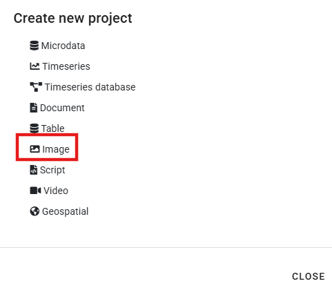
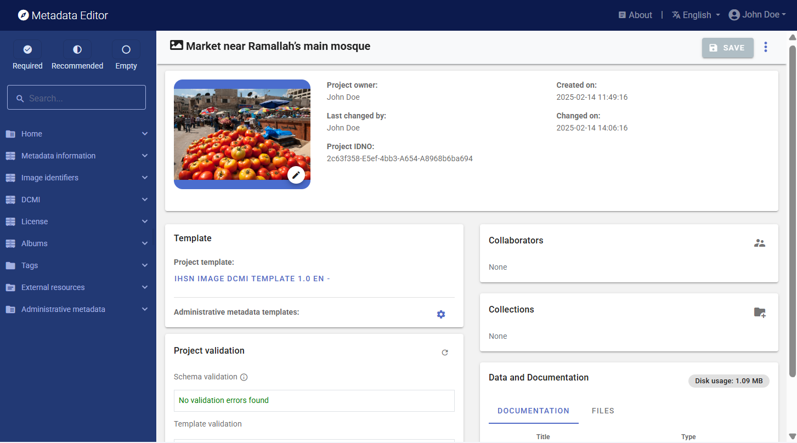
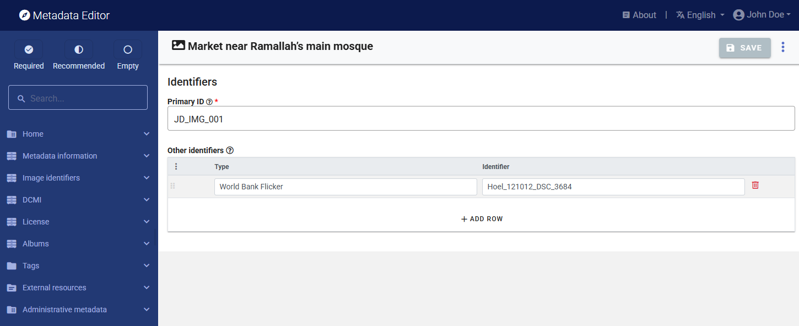
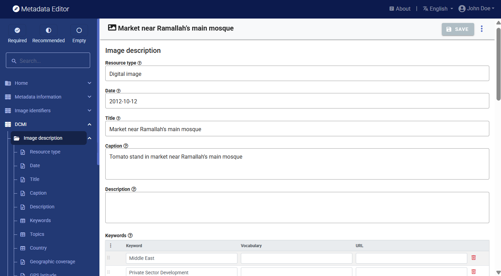
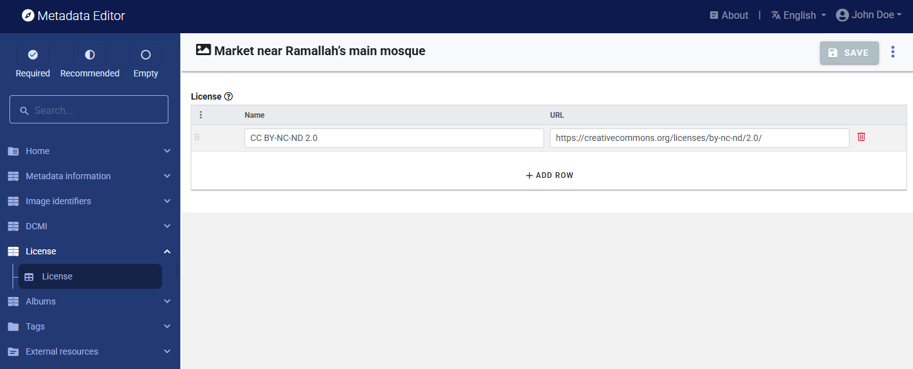
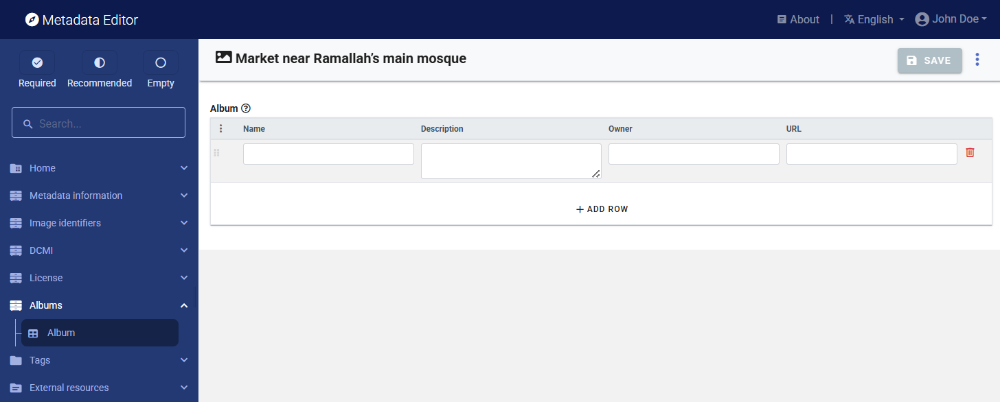
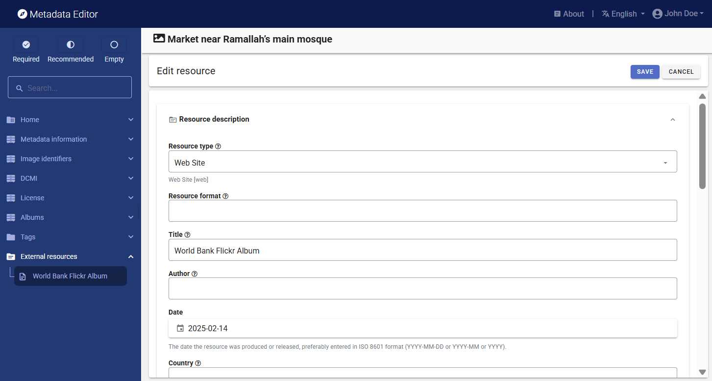
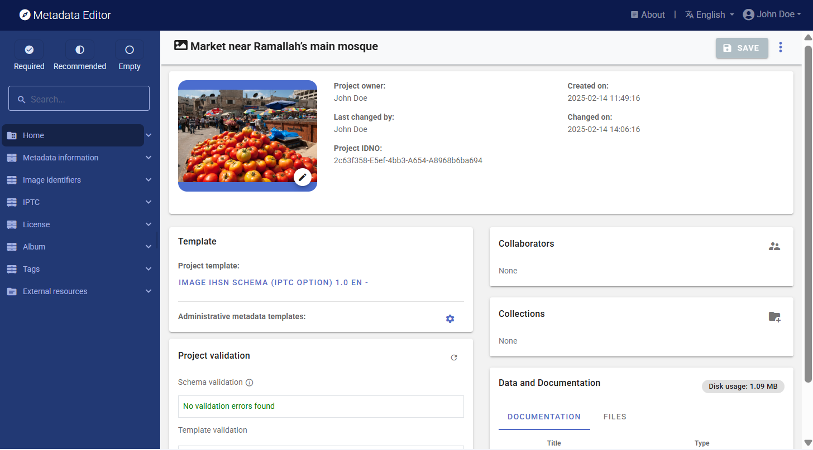
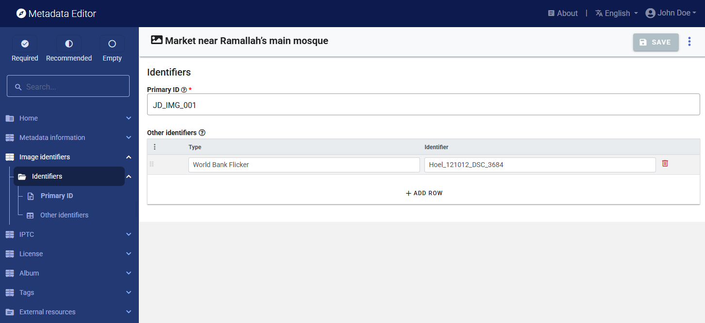
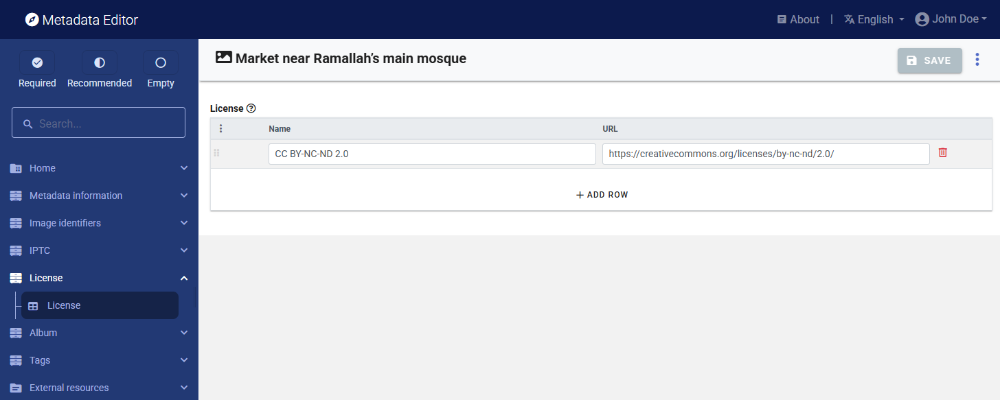

# Documenting an image

## Metadata standards

## Image metadata 

This chapter describes the documentation of an image using the Metadata Editor. Images in the context of this chapter refers to digital images, i.e. images available as electronic files. These files will typically be available in a format like JPG, PNG, or TIFF. Images can be photos taken by digital cameras, images generated by computer, or scanned images. The metadata standards used in the Metadata Editor are intended to make these images discoverable, accessible, and usable. For that purpose, metadata must be provided on the content of the image (in the form of caption, description, keywords, etc.), on the location and date the image was generated, on the author, and more. Information on use license and copyrights, on possible privacy protection issues (persons, possibly minors, etc.) is needed to provide users with information they need to ensure their use of the published images is legal, ethical, and responsible.

Some devices used to generate images (such as digital cameras) generate and embed metadata in the image file. Digital cameras generate EXIF (Exchangeable Image File Format) metadata. EXIF will record information on the date and time the image was taken, on the GPS location coordinates (latitude & longitude, possibly altitude) if the camera was equipped with a GPS and geolocation was enabled, information on the device including manufacturer and model, technical information (lens type, focal range, aperture, shutter speed, flash settings), the system-generated unique image identifier, and more. There are several ways to extract or view an image's EXIF Data. For example, the R packages ExifTool and ExifR allow extraction and use of EXIF metadata, and applications like Flickr will display EXIF content. But with the exception of the date, location (if captured), and unique image identifier, the content of the EXIF does not provide information that users interested in identifying images based on their source and/or content will find useful. Metadata describing the content and source of an image will have to be obtained from another source or using other tools.

EXIF metadata may be useful to some users, but (with a few exceptions like the date the photo was taken and the GPS location if generated), they lack information on the content of the image (what is represented in it). This information must added by curators. Part of it will be entered manually, other could be extracted in an automated manner using machine learning models and APIs. This information must be structured and stored in compliance with a metadata standard. The Metadata Editor uses a metadata schema that combines metadata elements from the **Dublin Core (DCMI)**, and the **IPTC**. When documenting an image in the Metadata Editor, users will select either one or the other option.

### IPTC and Dublin Core standards 

The metadata schema used in the Metadata Editor for documenting images contains two mutually-exclusive options: the Dublin Core, as a simple option, and the IPTC as a more complex and advanced option. The schema also contains a few metadata elements that are common to both options. The schema is structured as follows:

- A few elements common to both options are provided to document the metadata (not the image itself), to provide some cataloguing parameters, and to set a unique identifier for the image being documented. 

- Then come the two options for documenting the image itself: the IPTC block of metadata elements, and the Dublin Core block of elements. Users will make use of one of them, not both.

  - The IPTC is the most detailed and complex schema. The version embedded in our schema is 2019.1 According to the [IPTC website](https://iptc.org/standards/photo-metadata/iptc-standard/), "The IPTC Photo Metadata Standard is the most widely used standard to describe photos, because of its universal acceptance among news agencies, photographers, photo agencies, libraries, museums, and other related industries. It structures and defines metadata properties that allow users to add precise and reliable data about images." The IPTC standard consists of two schemas: IPTC Core and IPTC Extension. They provide a comprehensive set of fields to document an image including information on time and geographic coverage, people and objects shown in the image, information on rights, and more. The schema is complex and in most cases only a small subset of fields will be used to document an image. Controlled vocabularies are recommended for some elements. 

  - The Dublin Core (DCMI) is a simpler and highly flexible standard, composed of 15 core elements which we supplement with a few elements mostly taken from the ImageObject schema from schema.org.  

- Last, a small number of additional metadata elements are provided, which are common to both options described above.

Two metadata templates are provided with the Metadata Editor to document images. One is based on the Dublin Core option, the other one on the IPTC option. These metadata templates can be edited using the Template Manager.

## Documenting an image using the Dublin Core option

The Dublin Core standard contains 15 core elements, which are generic and versatile enough to be used for documenting different types of resources. Other elements can be added to the specification to increase its relevancy for specific uses. We added a few elements inspired by the [ImageObject](https://schema.org/ImageObject) schema from schema.org to the 15 elements.

The fifteen elements, with their definition extracted from the [Dublin Core website](https://dublincore.org/), are the following:

| Element name         | Description                                                      | 
| -------------------- | ---------------------------------------------------------------- | 
| identifier           | An unambiguous reference to the resource within a given context. |
| type                 | The nature or genre of the resource.                             |
| title                | A name given to the resource.                                    |
| description          | An account of the resource.                                      |
| subject              | The topic of the resource.                                       |
| creator              | An entity primarily responsible for making the resource.         |
| contributor          | An entity responsible for making contributions to the resource.  |
| publisher            | An entity responsible for making the resource available.         |
| date                 | A point or period of time associated with an event in the life cycle of the resource. |
| coverage             | The spatial or temporal topic of the resource, the spatial applicability of the resource, or the jurisdiction under which the resource is relevant.|
| format               | The file format, physical medium, or dimensions of the resource. |
| language             | A language of the resource.                                      |
| relation             | A related resource.                                              |
| rights               | Information about rights held in and over the resource.          |
| source               | A related resource from which the described resource is derived. |

We do not use the `identifier` element, as we already have a unique identifier in the common element `idno`. 

We added the following elements to the schema, which are not part of the core list of the DCMI: 

- identifiers
- caption
- keywords
- topics
- country
- gps (latitude, longitude, altitude)
- note

These elements are included in the default template for the DCMI option.

### Create a project

Create a new project by clicking on CREATE NEW PROJECT in the *My projects* page, and select option *Image* as data type.

In the new *project home page*, select a DCMI template (one DCMI template is provided with the application).

Edit the thumbnail by selecting an image. It is highly recommended to select the image being documented as thumbnail. The thumbnail will be used in the Metadata Editor itself, and in a NADA catalog is the image is published in NADA. The system will automatically save the thumbnail as a low-resoluton image.

### Fill out the *Information on metadata* section

### Fill out the *Image identifiers* section

### Fill out the *DCMI/Image description* and *DCMI/Authors and rights* sections

### Fill out the *License* section

### Fill out the *Albums* section

### Fill out the *Tags* section

### Add the external resources

### Add information on provenance

### Save and export metadata

### Publish metadata

## Documenting an image using the IPTC option

### Create a project

Create a new project by clicking on CREATE NEW PROJECT in the *My projects* page, and select option *Image* as data type.

In the new *project home page*, select a IPTC template (one IPTC template is provided with the application).

Edit the thumbnail by selecting an image. It is highly recommended to select the image being documented as thumbnail. The thumbnail will be used in the Metadata Editor itself, and in a NADA catalog is the image is published in NADA. The system will automatically save the thumbnail as a low-resoluton image.

### Fill out the *Information on metadata* section

### Fill out the *Image identifiers* section

### Fill out the sections under IPTC

The `sceneCodes` describe the scene of a photo content. The [IPTC Scene-NewsCodes](http://cv.iptc.org/newscodes/scene) controlled vocabulary (published under a Creative Commons Attribution (CC BY) 4.0 license) should be used, where a scene is represented as a string of 6 digits. 
   
  | code  | Label            | Description                       |
  |:-----:|:----------------:|-----------------------------------|
  |010100 | headshot         | A head only view of a person (or animal/s) or persons as in a montage.|
  |010200 | half-length      | A torso and head view of a person or persons.|
  |010300 | full-length      | A view from head to toe of a person or persons |
  |010400 | profile          | A view of a person from the side |
  |010500 | rear view        | A view of a person or persons from the rear. |
  |010600 | single           | A view of only one person, object or animal. |
  |010700 | couple           | A view of two people who are in a personal relationship, for example engaged, married or in a romantic partnership. |
  |010800 | two              | A view of two people |
  |010900 | group            | A view of more than two people |
  |011000 | general view     | An overall view of the subject and its surrounds |
  |011100 | panoramic view   | A panoramic or wide angle view of a subject and its surrounds |
  |011200 | aerial view      | A view taken from above |
  |011300 | under-water      | A photo taken under water |
  |011400 | night scene      | A photo taken during darkness |
  |011500 | satellite        | A photo taken from a satellite in orbit |
  |011600 | exterior view    | A photo that shows the exterior of a building or other object |
  |011700 | interior view    | A scene or view of the interior of a building or other object |
  |011800 | close-up         | A view of, or part of a person/object taken at close range in order to emphasize detail or accentuate mood. Macro photography. |
  |011900 | action           | Subject in motion such as children jumping, horse running |
  |012000 | performing       | Subject or subjects on a stage performing to an audience |
  |012100 | posing           | Subject or subjects posing such as a "victory" pose or other stance that symbolizes leadership. |
  |012200 | symbolic         | A posed picture symbolizing an event - two rings for marriage |
  |012300 | off-beat         | An attractive, perhaps fun picture of everyday events - dog with sunglasses, people cooling off in the fountain |
  |012400 | movie scene      | Photos taken during the shooting of a movie or TV production. |

  Specifies one or more subjects from the [IPTC Subject-NewsCodes](http://cv.iptc.org/newscodes/subjectcode) controlled vocabulary to categorize the image. Each Subject is represented as a string of 8 digits. The vocabulary consists of about 1400 terms organized into 3 levels (users can decide to use only the first, or the first two levels; the more detail is provided, the better the discoverability of the image). The first level of the controlled vocabulary is as follows:
 
      
  | code   | Label             | Description                       |
  |:------:|:-----------------:|-----------------------------------|
  |01000000| arts, culture and entertainment | Matters pertaining to the advancement and refinement of the human mind, of interests, skills, tastes and emotions |
  |02000000| crime, law and justice | Establishment and/or statement of the rules of behavior in society, the enforcement of these rules, breaches of the rules and the punishment of offenders. Organizations and bodies involved in these activities. |
  |03000000| disaster and accident | Man made and natural events resulting in loss of life or injury to living creatures and/or damage to inanimate objects or property.|
  |04000000| economy, business and finance | All matters concerning the planning, production and exchange of wealth.|
  |05000000| education | All aspects of furthering knowledge of human individuals from birth to death.|
  |06000000| environmental issue | All aspects of protection, damage, and condition of the ecosystem of the planet earth and its surroundings.|
  |07000000| health | All aspects pertaining to the physical and mental welfare of human beings.|
  |08000000| human interest | Lighter items about individuals, groups, animals or objects.
  |09000000| labor | Social aspects, organizations, rules and conditions affecting the employment of human effort for the generation of wealth or provision of services and the economic support of the unemployed.|
  |10000000| lifestyle and leisure | Activities undertaken for pleasure, relaxation or recreation outside paid employment, including eating and travel.|
  |11000000| politics | Local, regional, national and international exercise of power, or struggle for power, and the relationships between governing bodies and states.|
  |12000000| religion and belief | All aspects of human existence involving theology, philosophy, ethics and spirituality.|
  |13000000| science and technology | All aspects pertaining to human understanding of nature and the physical world and the development and application of this knowledge|
  |14000000| social issue | Aspects of the behavior of humans affecting the quality of life.|
  |15000000| sport | Competitive exercise involving physical effort. Organizations and bodies involved in these activities.|
  |16000000| unrest | conflicts and war Acts of socially or politically motivated protest and/or violence.|
  |17000000| weather | The study, reporting and prediction of meteorological phenomena.
  
  
  As an example of subjects at the three levels, the list below zooms on the subject "education".  
  
  | code   | Subject                | Description                       |
  |:------:|:----------------------:|-----------------------------------|
  |05000000| education              | All aspects of furthering knowledge of human individuals from birth to death|
  |05001000|   Adult education      | Education provided for older students outside the usual age groups of 5-25|
  |05002000|   Further education    | Any form of education beyond basic education of several levels|
  |05003000|   parent organization  | Groups of parents set up to support schools|
  |05004000|   preschool            | Education for children under the national compulsory education age|
  |05005000|   school               | A building or institution in which education of various sorts is provided|
  |05005001|     elementary schools | Schools usually of a level from kindergarten through 11 or 12 years of age|
  |05005002|     middle schools     | Transitional school between elementary and high school, 12 through 13 years of age|
  |05005003|     high schools       | Pre-college/ university level education 14 to 17 or 18 years of age, called freshman, sophomore, junior and senior|
  |05006000|   teachers union       | Organization of teachers for collective bargaining and other purposes|
  |05007000|   university           | Institutions of higher learning capable of providing doctorate degrees|
  |05008000|   upbringing           | Lessons learned from parents and others as one grows up|
  |05009000|   entrance examination | Exams for entering colleges, universities, junior and senior high schools, and all other higher and lower education institutes, including cram schools, which help students prepare for exams for entry to prestigious schools.|
  |05010000|   teaching and learning| Either end of the education equation|
  |05010001|     students           | People of any age in a structured environment, not necessarily a classroom, in order to learn something|
  |05010002|     teachers           | People with knowledge who can impart that knowledge to others|
  |05010003|     curriculum         | The courses offered by a learning institution and the regulation of those courses|
  |05010004|     test/examination   | A measurement of student accomplishment|
  |05011000|   religious education  | Instruction by any faith, in that faith or about other faiths, usually, but not always, conducted in schools run by religious bodies|
  |05011001|     parochial school   | A school run by the Roman Catholic faith|
  |05011002|     seminary           | A school of any faith specifically designed to train ministers|
  |05011003|     yeshiva            | A school for training rabbis|
  |05011004|     madrasa            | A school for teaching Islam|

  | Genre              | Description                       |
  |:------------------:|-----------------------------------|
  |Actuality           | Recording of an event|
  |Advertiser Supplied | Content is supplied by an organization or individual that has paid the news provider for its placement|
  |Advice              | Letters and answers about readers' personal problems|
  |Advisory            | Recommendation on editorial or technical matters by a provider to its customers|
  |On This Day         | List of data, including birthdays of famous people and items of historical significance, for a given day|
  |Analysis            | Data and conclusions drawn by a journalist who has conducted in depth research for a story|
  |Archival material   | Material selected from the originator's archive that has been previously distributed|
  |Background          | Scene setting and explanation for an event being reported|
  |Behind the Story    | The content describes how a story was reported and offers context on the reporting|
  |Biography           | Facts and background about a person|
  |Birth Announcement  | News of newly born children|
  |Current Events      | Content about events taking place at the time of the report|
  |Curtain Raiser      | Information about the staging and outcome of an immediately upcoming event|
  |Daybook             | Items filed on a regular basis that are lists of upcoming events with time and place, designed to inform others of events for planning purposes.|
  |Exclusive           | Information content, in any form, that is unique to a specific information provider.|
  |Fact Check          | The news item looks into the truth or falsehood of another reported news item or assertion (for example a statement on social media by a public figure)|
  |Feature             | The object content is about a particular event or individual that may not be significant to the current breaking news.|
  |Fixture             | The object contains data that occurs often and predictably.|
  |Forecast            | The object contains opinion as to the outcome of a future event.|
  |From the Scene      | The object contains a report from the scene of an event.|
  |Help us to Report   | The news item is a call for readers to provide information that may help journalists to investigate a potential news story|
  |History             | The object content is based on previous rather than current events.|
  |Horoscope           | Astrological forecasts|
  |Interview           | The object contains a report of a dialogue with a news source that gives it significant voice (includes Q and A).|
  |Listing of facts    | Detailed listing of facts related to a topic or a story|
  |Music               | The object contains music alone.|
  |Obituary            | The object contains a narrative about an individual's life and achievements for publication after his or her death.|
  |Opinion             | The object contains an editorial comment that reflects the views of the author.|
  |Polls and Surveys   | The object contains numeric or other information produced as a result of questionnaires or interviews.|
  |Press Release       | The object contains promotional material or information provided to a news organisation.|
  |Press-Digest        | The object contains an editorial comment by another medium completely or in parts without significant journalistic changes.|
  |Profile             | The object contains a description of the life or activity of a news subject (often a living individual).|
  |Program             | A news item giving lists of intended events and time to be covered by the news provider. Each program covers a day, a week, a month or a year. The covered period is referenced as a keyword.|
  |Question and Answer Session | The object contains the interviewer and subject questions and answers.|
  |Quote               | The object contains a one or two sentence verbatim in direct quote.|
  |Raw Sound           | The object contains unedited sounds.|
  |Response to a Question | The object contains a reply to a question.|
  |Results Listings and Statistics | The object contains alphanumeric data suitable for presentation in tabular form.|
  |Retrospective       | The object contains material that looks back on a specific (generally long) period of time such as a season, quarter, year or decade.|
  |Review              | The object contains a critique of a creative activity or service (for example a book, a film or a restaurant).|
  |Satire              | Uses exaggeration, irony, or humor to make a point; not intended to be understood as factual|
  |Scener              | The object contains a description of the event circumstances.|
  |Side bar and supporting information | Related story that provides additional context or insight into a news event|
  |Special Report      | In-depth examination of a single subject requiring extensive research and usually presented at great length, either as a single item or as a series of items|
  |Sponsored           | Content is produced on behalf of an organization or individual that has paid the news provider for production and may approve content publication|
  |Summary             | Single item synopsis of a number of generally unrelated news stories|
  |Supported           | Content is produced with financial support from an organization or individual, yet not approved by the underwriter before or after publication|
  |Synopsis            | The object contains a condensed version of a single news item.|
  |Text only           | The object contains a transcription of text.|
  |Transcript and Verbatim | A word for word report of a discussion or briefing|
  |Update              | The object contains an intraday snapshot (as for electronic services) of a single news subject.|
  |Voicer              | Content is only voice|
  |Wrap                | Complete summary of an event|
  |Wrapup              | Recap of a running story|

### Fill out the *License* section

### Fill out the *Albums* section

### Fill out the *Tags* section

### Add the external resources

### Add information on provenance

### Save and export metadata

### Publish metadata
         

## Augmenting image metadata

