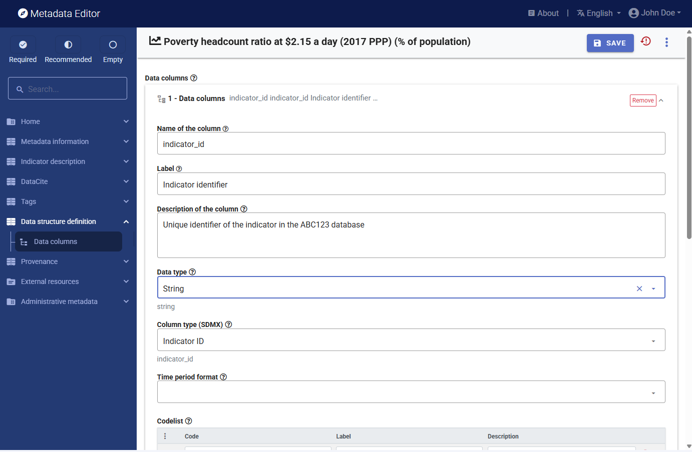

# Documenting indicators and databases

Two metadata schemas are employed to document indicators and their respective databases. The first schema is utilized to individually document each indicator. The second standard is applied to document collections or databases of indicators. We refer to these metadata as schemas and not standards, as they have been developed by the World Bank and are not maintained by an international community. 

## Metadata schemas

Indicators are summary measures related to key issues or phenomena, derived from observed facts. Indicators form time series when they are provided for a specific geography and with a temporal ordering, i.e. when their values are provided with an ordered annual, quarterly, monthly, daily, or other time reference. 

The World Bank developed its metadata standard for documenting indicators by compiling and structuring metadata elements utilized by various organizations, including the Bank itself, United Nations agencies, International Monetary Fund (IMF), Organisation for Economic Co-operation and Development (OECD), and Eurostat. 

The standard is compatible with the Statistical Data and Metadata Exchange (SDMX) standard. SDMX is a data exchange standard designed to facilitate machine-to-machine data exchanges. It provides a framework for structuring metadata through Metadata Structure Definitions (MSDs), but it does not specify the content of MSDs. Consequently, the Bank’s metadata standard complements and can be integrated within the SDMX framework effectively. The Metadata Editor offers a tool to export metadata templates as MSDs and the indicators' metadata as meta-datasets. This enables the metadata produced using the Metadata Editor to be incorporated into SDMX-compliant data management and dissemination systems.

The World Bank metadata standard also includes a section for documenting the data structure (structural metadata), which outlines how the indicator is organized in the data file or database. This data structure aligns with the SDMX data structure definition (DSD). The data structure details the columns of an indicator dataset (assuming the data are provided in long format). It defines the specific role of each column (in a manner compatible with SDMX) and provides the associated metadata.

The technical description of the schema is available at https://worldbank.github.io/metadata-schemas/#tag/Timeseries.

The metadata schema is complemented by another schema developed to document a database of indicators (i.e.a collection of indicators). The main objective of documenting a database is to provide additional information for each indicator. The metadata schema used to document an indicator contains one element to store the identifier of a database, which establishes the link between an indicator metadata and the related database metadata. 

IN NADA: example

## Documenting an indicator

This section describes in detail the process of documenting an indicator, and the various functionalities provided in the Metadata Editor for generating and publishing indicators metadata. The section focuses on the functionalities specific to the documentation of indicators. Refer to the *General instructions* for guidance on the components of the application that are common to all data types.

### Create a new project

The first step in documenting an indicator is to create a new project. You do that by clicking on `CREATE NEW PROJECT` in the *My projects* page. Select *Indicator* as data type. This will open a new, untitled *Project page*. 

In that page, select the Template you want to use to document the indicator. A default template is proposed; no action is needed if you want to use the default template. Otherwise, switch to another template by clicking on the `Switch template` icon in the *Templates* frame. Note that you can at any time change the template used for the documentation of a project. The selected template will determine what you see in the navigation tree and in the metadata entry pages, but switching from one template to another will not impact the metadata that has already been entered; no information will be deleted from the metadata.

### Information on metadata

The *Metadata information* section in the navigation tree (in the *Project page*) contains elements intended to document the metadata being generated, i.e., metadata about the metadata. All content in this section is optional; it is however recommended practice to document the metadata as precisely as possible. This information will not be useful to data users, but it will be to catalog administrators. When metadata is shared across catalogs, the information entered in the Document description provides transparency and clarity on the origin of the metadata.

### Descriptive metadata

The documentation of an indicator is a straightforward process. The navigation tree provides access to various metadata entry pages where the information about the indicator can be captured. These metadata entry pages are defined by the selected template. The template includes a description of each metadata element it contains, which are used as instructions to data curators. The template can be printed as PDF and used as a reference document by data curators. The instructions are also provided in the metadata entry pages, by clicking on the (?) icon next to each element's name.

We provide here some guidance on a selection of key metadata elements.

id
other ids
name
aliases
definition short / long
relevance
method (formula?)
sources
concepts
limitations

- **Geographic coverage**: If your data are related to a single country, the information can easily be entered manually. If you have a multi-country database of indicators, the best option to fill this element is to tabulate your data by country, with the country code and country name included in the table. You may then copy/paste the columns containing the country code and country name in the Metadata Editor. Only include in the list the countries/geographies for which data are available for the indicator. Do not copy/paste a standard code list.
- **Time coverage**: Enter the range of rime (minimum and maximum) for which data are available. 

You may take advantage of generative AI tools like ChatGPT or equivalent to suggest content for selected fields. For example, generative AI can help:
- Suggest **keywords** (ask ChatGPT to "Please suggest 20 keywords related to an indicator titled (*enter the title of the indicator here*) defined as (*enter the definition of the indicator here*).
- Propose a **definition** (ask ChatGPT to either *Suggest a definition for a statistical indicator titled (...)*) or to *Improve the following definition of a statistical indicator titled (title) and currently defined as (definition)*. 
- Propose a description of the indicator's **relevance** (ask ChatGPT to either *Please describe the relevance of a statistical indicator titled (...) and defined as (definition). In the description, indicate to whom and for what purposes the indicator is relevant.* 
Do not blindly accept suggestions formulated by AI models. Carefully review and improve (or reject) the proposed content.

The metadata element **Database ID** is important if you want to link the description of the indicator to the description of the database to which the indicator belong. The DatabaseID must correspond to the PrimaryID element in a database metadata (see section below on *Documenting the database*).

By default, all elements of a metadata standards will contain unformatted text. If the template allows it, some elements may however include formulas or formatted text. Formulas must be entered using the LaTex language. Formatted text may be HTML or markdown formatted text. 

### Structural metadata

The data structure definition (DSD) allows you to describe how the data are organized in the data file. This is the structural metadata for the indicator. The DSD in the Metadata Editor follows the SDMX standard.

In a data file, the indicator is supposed to be stored in long (not wide) format, i.e. in a database type of format where each row corresponds to one observation value. Each row must contain the core information required to define what the observation value represents, complemented by additional (optional) information.  

Typically, a data file for an indicator will look like one of the two options below, which use the population by sex of two countries as an example.

- ***Option 1***. In option 1, the population by sex is provided as three different indicators: Population, total", "Population, male", and "Population, female". The data file may look like this:

   

 - ***Option 2***. In option 2, the information is provided as a single indicator ("Population" with a *dimension* "sex" with values M, F or T for Male, Female, and Total).

   

Organizations make their own decisions on how to organize their indicators. Using dimensions has the advantage of reducing the number of indicators. But it makes data discovery (indexing and search in data catalogs) somewhat more complex. In some cases, the use of dimensions is the only practical option. For example, data on population by age group (with 9 age groups + total), sex (2 options + total), and urban/rural (2 options with total) would require 10 x 3 x 3 = 90 different indicators. Maintaining a single indicator "population" with 3 dimensions would be more efficient (one indicator can have multiple dimensions).

Properly documenting the data structure of an indicator provides users (and machines) with the information they need to query and use the data.

A data structure definition consists of providing the following information about the indicator and the way it is organized in the data file. This information will be provided **for each column of the data file**:
- ***Name:*** The column name
- ***Label:*** The column label
- ***Description:*** A brief description of the column
- ***Data type:*** The type of variable, with the following possible values: String, Integer, Float, Date, and Boolean.
- ***Column type:*** The type of column, with the following options:
  - ***Dimension:*** In our Option 2 example, column "sex" is a dimension.
  - ***Time period:*** The column indicates the time period to which the observation value applies. In our Option 2 example, "year" is a time period.
  - ***Measure:*** 
  - ***Attribute:*** 
  - ***Indicator ID:*** The column is the indicator unique identifier. Only one column can be an Indicator ID. In our Option 2 example, "IndicatorID" is the Indicator ID.
  - ***Indicator name:*** The column is the name (or title) of the indicator. In our Option 2 example, "Name" is the Indicator ID.
  - ***Annotation:*** 
  - ***Geography:*** The geographic area to which the value corresponds. In our example, column "country" is the geography.
  - ***Observation value:*** The observation value (the "data" itself). In our example, column "value" is the observation value.
  - ***Periodicity:*** 
- ***Time period format:*** Time period format is used to indicate the format of the date in the column identified as Time period. In our Option 2 example, Time period format is "YYYY" as we have data by year.
- ***Codelist:***
- ***Codelist reference:***

### External resources

External resources are all materials (and links) that relate to the indicator. This may include documents on methodology, scripts, photos and videos, and any other resource available in digital format. These materials and links are added to the documentation of an indicator in the External resources container. Click on **External resources** in the navigation tree, then on CREATE RESOURCE. Enter the relevant information on the resource (at least a title), then provide either a filename (the file will then be uploaded on the server that hosts the Metadata Editor) or a URL to the resource.

External resources that have already been created for another project can also be imported. To do that, they must first be exported as JSON or RDF from the other project. The click on IMPORT in the External resources page, and select the file. 

External resources will be part of the project ZIP package (when the ZIP package is generated - See the main menu). 

### Provenance

The **Provenance** container is used to document how and when the dataset was acquired. It is used to ensure traceability. See section "Documenting - General instructions".

### DataCite

See section "Documenting - General instructions".

### Tags

See section "Documenting - General instructions".

## Database-level metadata

Not to be documented for each indicator.
Document once, give it an ID, and enter it in each indicator in field *databaseID*. When published in NADA, this will create a one-to-many relationship.

### Create new project

### Information on metadata

### Descriptive metadata

### Export and publish

