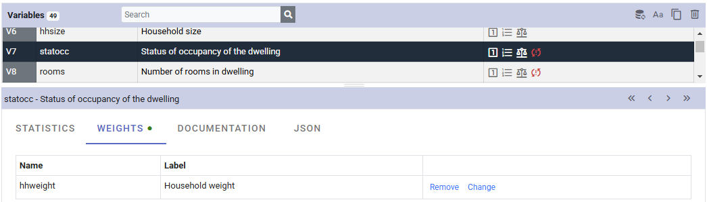

# Documenting microdata

## Defining microdata ##

When surveys or censuses are conducted, or when administrative data are recorded, information is collected on each unit of observation. The unit of observation can be a person, a household, a firm, an agricultural holding, a facility, or other. **Microdata** are the data files resulting from these data collection activities, which contain the **unit-level** information (as opposed to aggregated data in the form of counts, means, or other). Information on each unit is stored in variables, which can be of different types (e.g. numeric or character variables, with discrete or continuous values). These variables may contain data reported by the respondent (e.g., the marital status of a person), obtained by observation or measurement (e.g., the GPS location of a dwelling or other sensor), or generated by calculation, recoding or derivation (e.g., the sample weight in a survey).

For efficiency reasons, variables are usually stored in numeric format (i.e. coded values), even when they contain qualitative information (coded values). For example, the sex of a respondent may be stored in a variable named ‘Q_01’, and include values 1, 2 and 9 where 1 represents “male”, 2 represents “female”, and 9 represents “unreported”. Microdata must therefore be provided at a minimum with a *data dictionary* (i.e., structural metadata) containing the variables and value labels and, for derived variables, information of the derivation process. But many other features of a micro-dataset should also be described such as the objectives and the methodology of data collection, a description of the sampling design for sample surveys, the period of data collection, the identification of the primary investigator and other contributors, the scope and geographic coverage of the data, and much more. This information will make the microdata usable and discoverable.

## Metadata standards

### DDI Codebook for documenting the dataset

The Data Documentation Initiative (DDI) metadata standard provides a structured and comprehensive list of hundreds of elements and attributes which may be used to document microdata. It is unlikely that any one study would ever require using them all, but this list provides a convenient solution to foster completeness of the information, and to generate documentation that will meet the needs of users.

The Data Documentation Initiative (DDI) metadata standard originated in the Inter-university Consortium for Political and Social Research (ICPSR), a membership-based organization with more than 500 member colleges and universities worldwide. The DDI is now the project of an alliance of North American and European institutions. Member institutions comprise many of the largest data producers and data archives in the world. The DDI standard is used by a large community of data archivists, including data librarians from academia, data managers in national statistical agencies and other official data producing agencies, and international organizations. The standard has two branches: the *DDI-Codebook* (version 2.x) and the *DDI LifeCycle* (version 3.x). These two branches serve different purposes and audiences. The DDI standard is published under the terms of the [GNU General Public License]((http://www.gnu.org/licenses) (version 3 or later).

The Metadata Editor implements the DDI-Codebook. It uses a slightly simplified version of version 2.5 of the DDI Codebook, to which a few elements are added. The Metadata Editor exports fuly-compliant DDI Codebook metadata.

The DDI Alliance developed the DDI-Codebook for organizing the content, presentation, transfer, and preservation of metadata in the social and behavioral sciences. It enables documenting microdata files in a simultaneously flexible and rigorous way. The DDI-Codebook aims to provide a straightforward means of recording and communicating all the salient characteristics of a micro-dataset. It is designed to encompass the kinds of data resulting from surveys, censuses, administrative records, experiments, direct observation and other systematic methodology for generating empirical measurements. The unit of observation can be individual persons, households, families, business establishments, transactions, countries or other subjects of scientific interest.

The DDI Alliance publishes the DDI-Codebook as an XML schema. We present in this Guide a JSON implementation of the schema, which is used in our R package NADAR and Python Library PyNADA. The NADA cataloguing application works with both the XML and the JSON version. 

The technical description of the JSON schema used for the documentation of microdata is available at https://worldbank.github.io/metadata-schemas/#tag/Microdata.

### Dublin Core for documenting external resources

For documenting external resources, a template based on the Dublin Core standard is used. See sections **General instructions** and **External resources**.


## Before you start

Before you start documenting a micro-dataset, it is highly recommended to carefuly prepare the data and the related materials.

- **Prepare your data files**
   - ***Variable and value labels***: Ensure that all variables and values are labeled (if the data are stored in Stata, SPSS, or another application that loows documentation of variables)
   - ***Direct identifiers***: Drop the direct identifiers from the dataset (names, phone number of respondents, addresses, social security numbers, etc) if you plan to share the data. This information should be kept confidential, unless the respondents provided an explicit consent to have their personal data published.
   - ***Unique identifiers and relationships***: Check that each observation in each data file has one or a combination of variables that provide a unique identifier for each observation. Ensure that there are no duplicated identifiers of observations in any data file. If your dataset is composed of multiple related data files, check that the files can be merged without any issue. For example, if you have data files at the household and individual levels, make sure all households have at least one corresponding individual, and that each individual belongs to one and only one household.
   - ***Missing values***: Use system missing values (instead of values like '999') for indicating missing values. 
   - ***Work variables***: Drop all temporary or working variables that do not need to be part of the data.  
   - ***Weighting***: Include the sampling weight variables in all data files where they apply. 
   - ***File names***: Name your data (and other) files using names that make them easy to understand.
   - ***Format data files***: If necessary, export your data files to a format supported by the Metadata Editor.

  - **Prepare the related materials to be included as external resources**
     - Have a copy of the questionnaire or data collection form in electronic format. Include the file in both the original format and in a PDF version. If the survey was conducted using computer-assisted interviews using a software like Survey Solutions or CsPro, generate a PDF copy of the electronic form (Survey Solutions provide an otion to generate such a file).
     - Collect an electronic copy of all other relevant documents, such interviewer manuals, technical documentation on sampling, survey technical and analytical reports, presentations of results, press releases, etc. For documents in proprietary format, generate a PDF copy.
     - Collect other digital materials related to the dataset, such as data editing scripts, photos and videos, etc.

## Create a project

The first step in documenting a dataset is to create a new project. You do that by clicking on CREATE NEW PROJECT in the *My projects* page. Select *Microdata* as data type. This will open a new, untitled *project home page*. 

In that page, select the Template you want to use to document the dataset. A default template is proposed; no action is needed if you want to use the default template. Otherwise, switch to another template by clicking on *Switch template* in the **Templates** frame. Note that you can at any time change the template used for the documentation of a project. The selected template will determine what you see in the navigation tree and in the metadata entry pages, but switching from one template to another will not impact the metadata that has already been entered; no information will be deleted from the metadata.


## Document the dataset

Once a project has been created, you can start entering metadata and subsequently import the data files (assuming you want to include file and variable-level documentation, which is not mandatory), or you can first import the data files then add metadata. The sequence in which you document the dataset does not matter. 

Refer to the **General instructions** for instructions on sections common to all data types.

The DDI Codebook metadata standard used to document microdata has the following sections (*containers*), which will be found in any template designed based on that standard:
- **Document description:** This section contains metadata on the metadata (to capture information on who documented the dataset, when, etc.)
- **Study description:** This section contains cataloguing and referential metadata that describe the study (survey, census, administrative recording system), with information like the title, geographic and temporal coverage, producers and sponsors, and many more.
- **File description:** This section provides a brief description of each data file.
- **Variable description:** The section contains the documentation of each variable, with elements like variable name and label, value labels, literal questions and interviwer instructions, universe, summary statistics, and more.
- **Variable groups:** This optional section provides a way to organize variables into groups other than the data files, e.g., grouping of variables by theme. Variable grouping is intended to increase the convenience to users, and possibly the online discoverability of data (if useful group descriptions are provided).

   

The container **Tags** is not part of the DDI Codebook standard. It is a container that has been added to all metadata standards used by the Metadata Editor. Refer to **General instructions** for information on tags.


### Document description

The **Document description** section of the navigation tree contains elements intended to document the metadata being generated ("metadata about the metadata"). In the DDI jargon, the *document* is the DDI-compliant metadata file (XML or JSON) that contains the structured metadata related to the dataset. This section corresponds to the section **Information on metadata** in other standards. 

All content in this section is optional; it is however good and recommended practice to document the metadata as precisely as possible. This information will not be useful to data users, but it will be to catalog administrators. When metadata is shared across catalogs (or automatically harvested from DDI-compliant data catalogs), the information entered in the **Document description** provides transparency and clarity on the origin of the metadata.


### Study description

The **Study description** section of the DDI Codebook metadata standard contains the **cataloguing and referential metadata**. Two metadata elements are required in this container: the *primary unique identifier* of the dataset, and its *title*. Other elements are optional, unless they have been set as *required* in a custom-defined template.

The metadata entered for this section should be as comprehensive as possible. You enter metadata by selecting a section in the nagivation tree, and entering the information in the metadata entry page.

Note that all dates should preferably be entered in ISO format (YYYY-MM-DD or YYYY-MM or YYYY).

Refer to **General instructions** for information on importing metadata from an existing project, and on copy/pasting content in fields that allow it.

By default, all content entered in the metadata entry page will consist of plain text (which will be saved in XML or JSON format). A few fields may allow entering formatted content (markdown, HTML, or LaTex formulas); which fields allow for such formating is determined in the template design.

We provide below a description of the metadata elements contained in the `Study description` section of the default metadata template provided in the Metadata Editor. For each element, we provide between brackets the name (the *key*) of the element in the metadata standard.

**IDENTIFICATION**

- **`title`** *[Required ; Not repeatable ; String]*  <br>
This element is "Required". Provide here the full authoritative title for the study. Make sure to use a unique name for each distinct study. The title should indicate the time period covered. For example, in a country conducting monthly labor force surveys, the title of a study would be like “Labor Force Survey, December 2020”. When a survey spans two years (for example, a household income and expenditure survey conducted over a period of 12 months from June 2020 to June 2021), the range of years can be provided in the title, for example “Household Income and Expenditure Survey 2020-2021”. The title of a survey should be its official name as stated on the survey questionnaire or in other study documents (report, etc.). Including the country name in the title is optional (another metadata element is used to identify the reference countries). Pay attention to the consistent use of capitalization in the title.
  
- **`sub_title`** *[Optional ; Not repeatable ; String]*  <br>
The `sub-title` is a secondary title used to amplify or state certain limitations on the main title, for example to add information usually associated with a sequential qualifier for a survey. For example, we may have “[country] Universal Primary Education Project, Impact Evaluation Survey 2007” as `title`, and “Baseline dataset” as `sub-title`. Note that this information could also be entered as a Title with no Subtitle: “[country] Universal Primary Education Project, Impact Evaluation Survey 2007 - Baseline dataset”. 

- **`alternate_title`** *[Optional ; Not repeatable ; String]*  <br> 
The `alternate_title` will typically be used to capture the abbreviation of the survey title. Many surveys are known and referred to by their acronym. The survey reference year(s) may be included. For example, the "Demographic and Health Survey 2012" would be abbreviated as "DHS 2012", or the "Living Standards Measurement Study 2020-2012" as "LSMS 2020-2021".  

- **`translated_title`** *[Optional ; Not repeatable ; String]*  <br>  
In countries with more than one official language, a translation of the title may be provided here. Likewise, the translated title may simply be a translation into English from a country’s own language. Special characters should be properly displayed, such as accents and other stress marks or different alphabets.

- **`idno`** *[Required ; Not repeatable ; String]*  <br>
`idno` is the primary identifier of the dataset. It is a unique identification number used to identify the study (survey, census or other). A unique identifier is required for cataloguing purpose, so this element is declared as "Required". The identifier will allow users to cite the dataset properly. The identifier must be unique within the catalog. Ideally, it should also be globally unique; the recommended option is to obtain a Digital Object Identifier (DOI) for the study. Alternatively, the `idno` can be constructed by an organization using a consistent scheme. The scheme could for example be “catalog-country-study-year-version”, where country is the 3-letter ISO country code, producer is the abbreviation of the producing agency, study is the study acronym, year is the reference year (or the year the study started), version is a version number. Using that scheme, the Uganda 2005 Demographic and Health Survey for example would have the following `idno` (where “MDA” stand for “My Data Archive”): MDA_UGA_DHS_2005_v01. Note that the schema allows you to provide more than one identifier for a same study (in element `identifiers`); a catalog-specific identifier is thus not incompatible with a globally unique identifier like a DOI. The identifier should not contain blank spaces.

- **`identifiers`** *[Optional ; Repeatable]*  <br>
This repeatable element is used to enter identifiers (IDs) other than the `idno` entered in the Title statement. It can for example be a Digital Object Identifier (DOI). The `idno` can be repeated here (the `idno` element does not provide a `type` parameter; if a DOI or other standard reference ID is used as `idno`, it is recommended to repeat it here with the identification of its `type`). 
  - **`type`** *[Optional ; Not repeatable ; String]* <br>
  The type of unique ID, e.g. "DOI".
  - **`identifier`** *[Required ; Not repeatable ; String]* <br>
  The identifier itself. <br><br>

- **`series_name`** *[Optional ; Not repeatable ; String]* <br>
The name of the series to which the study belongs. For example, "Living Standards Measurement Study (LSMS)" or "Demographic and Health Survey (DHS)" or "Multiple Indicator Cluster Survey VII (MICS7)". A description of the series can be provided in the element "series_info".<br>

- **`series_info`** *[Optional ; Not repeatable ; String]* <br>
A brief description of the characteristics of the series, including when it started, how many rounds were already implemented, and who is in charge would be provided here. <br>


**VERSION**

- **`version`** The version number, also known as release or edition. 

- **`version_date`** The ISO 8601 standard for dates (YYYY-MM-DD) is recommended for use with the "date" attribute.

- **`version_resp`** The person(s) or organization(s) responsible for this version of the study.

- **`version_notes`** Version notes should provide a brief report on the changes made through the versioning process. The note should indicate how this version differs from other versions of the same dataset.


**OVERVIEW**

- **`abstract`** An un-formatted summary describing the purpose, nature, and scope of the data collection, special characteristics of its contents, major subject areas covered, and what questions the primary investigator(s) attempted to answer when they conducted the study. The summary should ideally be between 50 and 5000 characters long. The abstract should provide a clear summary of the purposes, objectives and content of the survey. It should be written by a researcher or survey statistician aware of the study. Inclusion of this element is strongly recommended.<br>

- **`data_kind`** This field describes the main type of microdata generated by the study: survey data, census/enumeration data, aggregate data, clinical data, event/transaction data, program source code, machine-readable text, administrative records data, experimental data, psychological test, textual data, coded textual, coded documents, time budget diaries, observation data/ratings, process-produced data, etc. A controlled vocabulary should be used as this information may be used to build facets (filters) in a catalog user interface.<br>

- **`analysis_unit`** A study can have multiple units of analysis. This field will list the various units that can be analyzed. For example, a Living Standard Measurement Study (LSMS) may have collected data on households and their members (individuals), on dwelling characteristics, on prices in local markets, on household enterprises, on agricultural plots, and on characteristics of health and education facilities in the sample areas.


**SCOPE**

- **`keywords`** Keywords are words or phrases that describe salient aspects of a data collection's content. The addition of keywords can significantly improve the discoverability of data. Keywords can summarize and improve the description of the content or subject matter of a study. For example, keywords "poverty", "inequality", "welfare", and "prosperity" could be attached to a household income survey used to generate poverty and inequality indicators (for which these keywords may not appear anywhere else in the metadata). A controlled vocabulary can be employed. Keywords can be selected from a standard thesaurus, preferably an international, multilingual thesaurus. <br>
  - **`keyword`** A keyword (or phrase).  
  - **`vocab`** The controlled vocabulary from which the keyword is extracted, if any.  
  - **`uri`** The URI of the controlled vocabulary used, if any.<br>

- **`topics`** The `topics` field indicates the broad substantive topic(s) that the study covers. A topic classification facilitates referencing and searches in on-line data catalogs.
  - **`topic`** The label of the topic. Topics should be selected from a standard controlled vocabulary such as the [Council of European Social Science Data Archives (CESSDA) Topic Classification](https://vocabularies.cessda.eu/vocabulary/TopicClassification).<br>
  - **`vocab`** The specification (name including the version) of the controlled vocabulary in use.<br>
  - **`uri`** A link (URL) to the controlled vocabulary website. <br>


**UNIVERSE AND GEOGRAPHIC COVERAGE**

- **`universe`** The universe is the group of persons (or other units of observations, like dwellings, facilities, or other) that are the object of the study and to which any analytic results refer. The universe will rarely cover the entire population of the country. Sample household surveys, for example, may not cover homeless, nomads, diplomats, community households. Population censuses do not cover diplomats. Facility surveys may be limited to facilities of a certain type (e.g., public schools). Try to provide the most detailed information possible on the population covered by the survey/census, focusing on excluded categories of the population. For household surveys, age, nationality, and residence commonly help to delineate a given universe, but any of a number of factors may be involved, such as sex, race, income, veteran status, criminal convictions, etc. In general, it should be possible to tell from the description of the universe whether a given individual or element (hypothetical or real) is a member of the population under study.

- **`nation`** Indicates the country or countries (or "economies", or "territories") covered in the study (but not the sub-national geographic areas). If the study covers more than one country, they will be entered separately.
  - **`name`** The country name, even in cases where the study does not cover the entire country.<br> 
  - **`abbreviation`** The `abbreviation` will contain a country code, preferably the 3-letter [ISO 3166-1 country code](https://en.wikipedia.org/wiki/ISO_3166-1_alpha-3).<br>

- **`geog_coverage_notes`** Additional information on the geographic coverage of the study entered as a free text field.<br>
  
- **`geog_unit`** Describes the levels of geographic aggregation covered by the data. Particular attention must be paid to include information on the lowest geographic area for which data are representative.<br>

- **`bbox`** This element is used to define one or multiple bounding box(es), which are the rectangular fundamental geometric description of the geographic coverage of the data. A bounding box is defined by west and east longitudes and north and south latitudes, and includes the largest geographic extent of the dataset's geographic coverage. The bounding box provides the geographic coordinates of the top left (north/west) and bottom-right (south/east) corners of a rectangular area. This element can be used in catalogs as the first pass of a coordinate-based search. This element is optional, but if the `bound_poly` element (see below) is used, then the `bbox` element must be included.
  - **`west`** West longitude of the bounding box. <br>
  - **`east`** East longitude of the bounding box. <br>
  - **`south`** South latitude of the bounding box. <br>
  - **`north`** North latitude of the bounding box. <br>
      
- **`bound_poly`** The `bbox` metadata element (see above) describes a rectangular area representing the entire geographic coverage of a dataset. The element `bound_poly` allows for a more detailed description of the geographic coverage, by allowing multiple and non-rectangular polygons (areas) to be described. This is done by providing list(s) of latitude and longitude coordinates that define the area(s). It should only be used to define the <U>outer</u> boundaries of the covered areas. This field is intended to enable a refined coordinate-based search, not to actually map an area. Note that if the `bound_poly` element is used, then the element `bbox` MUST be present as well, and all points enclosed by the `bound_poly` MUST be contained within the bounding box defined in `bbox`.<br> 
  - **`lat`** The latitude of the coordinate. <br>
  - **`lon`** The longitude of the coordinate. <br>

- **`geog_coverage`** Information on the geographic coverage of the study. This includes the total geographic scope of the data, and any additional levels of geographic coding provided in the variables. Typical entries will be "National coverage", "Urban areas", "Rural areas", "State of ...", "Capital city", etc. This does not describe where the data were collected; it describes which area the data are representative of. This means for example that a sample survey could be declared as having a national coverage even if some districts of the country where not included in the sample, as long as the sample is nationally representative.<br>


**PRODUCERS AND SPONSORS**

**`authoring_entity`** *[Optional ; Repeatable]*  <br>
The name and affiliation of the person, corporate body, or agency responsible for the study’s substantive and intellectual content (the "authoring entity" or “primary investigator”). Generally, in a survey, the authoring entity will be the institution implementing the survey. Repeat the element for each authoring entity, and enter the `affiliation` when relevant. If various institutions have been equally involved as main investigators, then should all be listed. This only includes the agencies responsible for the implementation of the study, not sponsoring agencies or entities providing technical assistance (for which other metadata elements are available). The order in which authoring entities are listed is discretionary. It can be alphabetic or by significance of contribution. Individual persons can also be mentioned, if not prohibited by privacy protection rules. 
- **`name`** The name of the person, corporate body, or agency responsible for the work's substantive and intellectual content. The primary investigator will in most cases be an institution, but could also be an individual in the case of small-scale academic surveys. If persons are mentioned, use the appropriate format of *Surname, First name*.
- **`affiliation`** The affiliation of the person, corporate body, or agency mentioned in `name`.

- **`producers`** This field is provided to list other interested parties and persons that have played a significant but not the leading technical role in implementing and producing the data (which will be listed in `authoring_entity`), and not the financial sponsors (which will be listed in `funding_agencies`).
  - **`name`** The name of the person or organization.
  - **`abbr`** The official abbreviation of the organization mentioned in `name`.
  - **`affiliation`** The affiliation of the person or organization mentioned in `name`.
  - **`role`** A succinct description of the specific contribution by the person or organization in the production of the data. <br>

- **`funding_agencies`** The source(s) of funds for the production of the study. If different funding agencies sponsored different stages of the production process, use the `role` attribute to distinguish them. 
  - **`name`** The name of the funding agency.
  - **`abbr`** The abbreviation (acronym) of the funding agency mentioned in `name`.
  - **`grant`** The grant number. If an agency has provided more than one grant, list them all separated with a ";".
  - **`role`** The specific contribution of the funding agency mentioned in `name`. This element is used when multiple funding agencies are listed to distinguish their specific contributions.<br><br>

- **`study_budget`** This is a free-text field, not a structured element. The budget of a study will ideally be described by budget line. The currency used to describe the budget should be specified. This element can also be used to document issues related to the budget (e.g., documenting possible under-run and over-run).

- **`oth_id`** This element is used to acknowledge any other people and organizations that have in some form contributed to the study. This does not include other producers which should be listed in `producers`, and financial sponsors which should be listed in the element `funding_agencies`.
  - **`name`** The name of the person or organization.
  - **`affiliation`** The affiliation of the person or organization mentioned in `name`.
  - **`role`** A brief description of the specific role of the person or organization mentioned in `name`.


**STUDY AUTHORIZATION**

Provides structured information on the agency that authorized the study, the date of authorization, and an authorization statement. This element will be used when a special legislation is required to conduct the data collection (for example a Census Act) or when the approval of an Ethics Board or other body is required to collect the data.

- **`date`** The date, preferably entered in ISO 8601 format (YYYY-MM-DD), when the authorization to conduct the study was granted.<br>

- **`agency`** Identification of the agency that authorized the study.
  - **`name`** Name of the agent or agency that authorized the study. 
  - **`affiliation`** The institutional affiliation of the authorizing agent or agency mentioned in `name`. 
  - **`abbr`** The abbreviation of the authorizing agent's or agency's name.<br><br>
  
- **`authorization_statement`** The text of the authorization (or a description and link to a document or other resource containing the authorization statement). <br>


**SAMPLING**

- **`sample_frame`** A description of the sample frame used for identifying the population from which the sample was taken. For example, a telephone book may be a sample frame for a phone survey. Or the listing of enumeration areas (EAs) of a population census can provide a sample frame for a household survey. In addition to the name, label and text describing the sample frame, this structure lists who maintains the sample frame, the period for which it is valid, a use statement, the universe covered, the type of unit contained in the frame as well as the number of units available, the reference period of the frame and procedures used to update the frame.
  - **`name`** The name (title) of the sample frame. <br>
  - **`valid_period`** Defines a time period for the validity of the sampling frame, using a list of events and dates. <br>
    - **`event`** The event can for example be `start` or `end`.
    - **`date`** The date corresponding to the event, entered in ISO 8601 format: YYYY-MM-DD.
  - **`custodian`** Custodian identifies the agency or individual responsible for creating and/or maintaining the sample frame.
  - **`universe`** A description of the universe of population covered by the sample frame. Age,nationality, and residence commonly help to delineate a given universe, but any of a number of factors may be involved, such as sex, race, income, etc. The universe may consist of elements other than persons, such as housing units, court cases, deaths, countries, etc. In general, it should be possible to tell from the description of the universe whether a given individual or element (hypothetical or real) is included in the sample frame.
  - **`unit_type`** The type of the sampling frame unit (for example "household", or "dwelling").
  - **`is_primary`** This boolean attribute (true/false) indicates whether the unit is primary or not.
  - **`num_of_units`** The number of units in the sample frame, possibly with information on its distribution (e.g. by urban/rural, province, or other).<br><br>
  - **`update_procedure`** This element is used to describe how and with what frequency the sample frame is updated. For example: "The lists and boundaries of enumeration areas are updated every ten years at the occasion of the population census cartography work. Listing of households in enumeration areas are updated as and when needed, based on their selection in survey samples." <br><br>
  - **`reference_period`**  Indicates the period of time in which the sampling frame was actually used for the study in question. Use ISO 8601 date format to enter the relevant date(s). 
    - **`event`**  Indicates the type of event that the date corresponds to, e.g., "start", "end", "single".
    - **`date`**  The relevant date in ISO 8601 date/time format.<br><br>

- **`sampling_procedure`** This field only applies to sample surveys. It describes the type of sample and sample design used to select the survey respondents to represent the population. This section should include summary information that includes (but is not limited to): sample size (expected and actual) and how the sample size was decided; level of representation of the sample; sample frame used, and listing exercise conducted to update it; sample selection process (e.g., probability proportional to size or over sampling); stratification (implicit and explicit); design omissions in the sample; strategy for absent respondents/not found/refusals (replacement or not). Detailed information on the sample design is critical to allow users to adequately calculate sampling errors and confidence intervals for their estimates. To do that, they will need to be able to clearly identify the variables in the dataset that represent the different levels of stratification and the primary sampling unit (PSU).<br> 
  In publications and reports, the description of sampling design often contains complex formulas and symbols. As the XML and JSON formats used to store the metadata are plain text files, they cannot contain these complex representations. You may however provide references (title/author/date) to documents where such detailed descriptions are provided, and make sure that the documents (or links to the documents) are provided in the catalog where the survey metadata are published.<br>

- **`sampling_deviation`** Sometimes the reality of the field requires a deviation from the sampling design (for example due to difficulty to access to zones due to weather problems, political instability, etc). If for any reason, the sample design has deviated, this can be reported here. This element will provide information indicating the correspondence as well as the possible discrepancies between the sampled units (obtained) and available statistics for the population (age, sex-ratio, marital status, etc.) as a whole.<br>  

- **`response_rate`** The response rate is the percentage of sample units that participated in the survey based on the original sample size. Omissions may occur due to refusal to participate, impossibility to locate the respondent, or other reason. This element is used to provide a narrative description of the response rate, possibly by stratum or other criteria, and if possible with an identification of possible causes. If information is available on the causes of non-response (refusal/not found/other), it can be reported here. This field can also be used to describe non-responses in population censuses.<br>

- **`weight`** This field only applies to sample surveys. The use of sampling procedures may make it necessary to apply weights to produce accurate statistical results. Describe here the criteria for using weights in analysis of a collection, and provide a list of variables used as weighting coefficient. If more than one variable is a weighting variable, describe how these variables differ from each other and what the purpose of each one of them is.


**SURVEY INSTRUMENT**

- **`research_instrument`** The research instrument refers to the questionnaire or form used for collecting data. The following should be mentioned: <br>
    - List of questionnaires and short description of each (all questionnaires must be provided as External Resources) <br>
    - In what language(s) was/were the questionnaire(s) available? <br>
    - Information on the questionnaire design process (based on a previous questionnaire, based on a standard model questionnaire, review by stakeholders). If a document was compiled that contains the comments provided by the stakeholders on the draft questionnaire, or a report prepared on the questionnaire testing, a reference to these documents can be provided here. 

- **`instru_development`** Describe any development work on the data collection instrument. This may include a description of the review process, standards followed, and a list of agencies/people consulted.<br>

- **`method_notes`** This element is provided to capture any additional relevant information on the data collection methodology, which could not fit in the previous metadata elements.


**DATA COLLECTION**

- **`coll_dates`** Contains the date(s) when the data were collected, which may be different from the date the data refer to (see `time_periods` above). For example, data may be collected over a period of 2 weeks (`coll_dates`) about household expenditures during a reference week (`time_periods`) preceding the beginning of data collection. Use the event attribute to specify the "start" and "end" for each period entered.<br> 
  - **`start`** Date the data collection started (for the specified cycle, if any). Enter the date in ISO 8601 format (YYYY-MM-DD or YYYY-MM or YYYY).<br>
  - **`end`** Date the data collection ended  (for the specified cycle, if any). Enter the date in ISO 8601 format (YYYY-MM-DD or YYYY-MM or YYYY).<br>
  - **`cycle`** Identification of the cycle of data collection. The `cycle` attribute permits specification of the relevant cycle, wave, or round of data. For example, a household consumption survey could visit households in four phases (one per quarter). Each quarter would be a cycle, and the specific dates of data collection for each quarter would be entered.<br>


- **`analysis_info`** *[Optional ; Not Repeatable]* <br>
This block of elements is used to organize information related to data quality and appraisal.<br>

```json
"analysis_info": {
  "response_rate": "string",
  "sampling_error_estimates": "string",
  "data_appraisal": "string"
}
```
<br>

 


#### Production statement

**`production_statement`** *[Optional ; Not repeatable]* <br>
A production statement for the work at the appropriate level. 

```json
"production_statement": {
  "producers": [
    {
      "name": "string",
      "abbr": "string",
      "affiliation": "string",
      "role": "string"
    }
  ],
  "copyright": "string",
  "prod_date": "string",
  "prod_place": "string",
  "funding_agencies": [
    {
      "name": "string",
      "abbr": "string",
      "grant": "string",
      "role": "string"
    }
  ]
}
```
<br>


- **`copyright`** *[Optional ; Not repeatable ; String]* <br>
A copyright statement for the study at the appropriate level. 

- **`prod_date`** *[Optional ; Not repeatable ; String]* <br>
This is the date (preferably entered in ISO 8601 format: YYYY-MM-DD or YYYY-MM or YYYY) of the actual and final production of the version of the dataset being documented. At least the month and year should be provided. A regular expression can be entered in user templates to validate the information captured in this field.

- **`prod_place`** *[Optional ; Not repeatable ; String]* <br>
The address of the organization that produced the study.


#### Distribution statement

**`distribution_statement`** *[Optional ; Not repeatable]* <br>
A distribution statement for the study.

```json
"distribution_statement": {
  "distributors": [
    {
      "name": "string",
      "abbr": "string",
      "affiliation": "string",
      "uri": "string"
    }
  ],
  "contact": [
    {
      "name": "string",
      "affiliation": "string",
      "email": "string",
      "uri": "string"
    }
  ],
  "depositor": [
    {
      "name": "string",
      "abbr": "string",
      "affiliation": "string",
      "uri": "string"
    }
  ],
  "deposit_date": "string",
  "distribution_date": "string"
}
```
<br>


- **`distributors`** *[Optional ; Repeatable]* <br>
The organization(s) designated by the author or producer to generate copies of the study output including any necessary editions or revisions.
  - **`name`** *[Required ; Not repeatable ; String]* <br>
  The name of the distributor. It can be an individual or an organization.
  - **`abbr`** *[Optional ; Not repeatable ; String]* <br>
  The official abbreviation of the organization mentioned in `name`. 
  - **`affiliation`** *[Optional ; Not repeatable ; String]* <br>
  The affiliation of the person or organization mentioned in `name`.<br>
  - **`uri`** *[Optional ; Not repeatable ; String]* <br>  
  A URL to the ordering service or download facility on a Web site.<br><br>

- **`contact`** *[Optional ; Repeatable]* <br>
Names and addresses of individuals responsible for the study. Individuals listed as contact persons will be used as resource persons regarding problems or questions raised by users.<br>
  - **`name`** *[Required ; Not repeatable ; String]* <br>
  The name of the person or organization that can be contacted. 
  - **`affiliation`** *[Optional ; Not repeatable ; String]* <br>
  The affiliation of the person or organization mentioned in `name`.
  - **`email`** *[Optional ; Not repeatable ; String]* <br>
  An email address for the contact mentioned in `name`. <br>
  - **`uri`** *[Optional ; Not repeatable ; String]* <br>  
  A URL to the contact mentioned in `name`.<br><br>

- **`depositor`** *[Optional ; Repeatable]* <br>
The name of the person (or institution) who provided this study to the archive storing it. <br>
  - **`name`** *[Required ; Not repeatable ; String]* <br>
  The name of the depositor. It can be an individual or an organization.
  - **`abbr`** *[Optional ; Not repeatable ; String]* <br>
  The official abbreviation of the organization mentioned in `name`.
  - **`affiliation`** *[Optional ; Not repeatable ; String]* <br>
  The affiliation of the person or organization mentioned in `name`.
  - **`uri`** *[Optional ; Not repeatable ; String]* <br>  
  A URL to the depositor<br><br>

- **`deposit_date`** *[Optional ; Not repeatable ; String]* <br>
The date that the study was deposited with the archive that originally received it. The date should be entered in the ISO 8601 format (YYYY-MM-DD or YYYY-MM or YYYY). The exact date should be provided when possible. <br>

- **`distribution_date`** *[Optional ; Not repeatable ; String]* <br>
The date that the study was made available for distribution/presentation. The date should be entered in the ISO 8601 format (YYYY-MM-DD or YYYY-MM or YYYY). The exact date should be provided when possible. <br><br>

This example is @@@@@@@@@@@@

```{r, indent="", eval=F, echo=T}
my_ddi <- list(
  doc_desc = list(
    # ... 
  ),
  study_desc = list(
    # ... ,
    
    distribution_statement = list(
      
       distributors = list(
         list(name = "World Bank Microdata Library",           
              abbr = "WBML",
              affiliation = "World Bank Group",
              uri = "http:/microdata.worldbank.org")
       ),
       
       contact = list(
         list(name = "",
              affiliation = "",
              email = "",
              uri = "")
       ),
       
       depositor = list(
         list(name = "",         
              abbr = "",
              affiliation = "",
              uri = "")
       ),
       
       deposit_date = "",
       
       distribution_date = ""
       
    ),
    # ...
  )
  # ...
)      
```
<br>


#### Series statement

**`series_statement`** *[Optional; Not repeatable]* <br>
A study may be repeated at regular intervals (such as an annual labor force survey), or be part of an international survey program (such as the MICS, DHS, LSMS and others). The series statement provides information on the series.  

```json
"series_statement": {
  "series_name": "string",
  "series_info": "string"
}
```
<br>


#### Version statement


                               
#### Bibliographic citation


**`bib_citation`** *[Optional ; Not repeatable ; String]* <br>
Complete bibliographic reference containing all of the standard elements of a citation that can be used to cite the study. The `bib_citation_format` (see below) is provided to enable specification of the particular citation style used, e.g., APA, MLA, or Chicago. 


#### Bibliographic citation format

**`bib_citation_format`** *[Optional ; Not repeatable ; String]* <br>
This element is used to specify the particular citation style used in the field `bib_citation` described above, e.g., APA, MLA, or Chicago. <br>

```{r, indent="", eval=F, echo=T}
  my_ddi <- list(
    doc_desc = list(
      # ... 
    ),
    study_desc = list(
      # ... ,
      bib_citation = "",
      bib_citation_format = ""
      # ...
    ),
    # ...
  )  
```
<br>


#### Holdings

**`holdings`** *[Optional ; Repeatable]* <br>
Information concerning either the physical or electronic holdings of the study being described. 

```json
"holdings": [
  {
    "name": "string",
    "location": "string",
    "callno": "string",
    "uri": "string"
  }
]
```
<br>

- **`name`** *[Optional ; Not repeatable ; String]* <br>
Name of the physical or electronic holdings of the cited study.<br>
- **`location`** *[Optional ; Not repeatable ; String]* <br>
The physical location where a copy of the study is held.<br>
- **`callno`** *[Optional ; Not repeatable ; String]* <br>
The call number at the location specified in `location`.<br>
- **`uri`** *[Optional ; Not repeatable ; String]* <br> 
A URL for accessing the electronic copy of the cited study from the location mentioned in `name`.<br>

```{r, indent="", eval=F, echo=T}
my_ddi <- list(
  doc_desc = list(
    # ... 
  ),
  study_desc = list(
    # ... ,
    holdings = list(
       name = "World Bank Microdata Library",
       location = "World Bank, Development Data Group",
       uri = "http://microdata.worldbank.org"
    ),
    # ...
  ),
  # ...
)  
```
<br>


#### Study notes

**`study_notes`** *[Optional ; Not repeatable]* <br>

This element can be used to provide additional information on the study which cannot be accommodated in the specific metadata elements of the schema, in the form of a free text field.

 
#### Study autorization


#### Study information

**`study_info`** *[Required ; Not repeatable]* <br>
This section contains the metadata elements needed to describe the core elements of a study including the dates of data collection and reference period, the country and other geographic coverage information, and more. These elements are not required in the DDI standard, but documenting a study without provinding at least some of this information would make the metadata mostly irrelevant.  

```json
"study_info": {
  "study_budget": "string",
  "keywords": [],
  "topics": [],
  "abstract": "string",
  "time_periods": [],
  "coll_dates": [],
  "nation": [],
  "bbox": [],
  "bound_poly": [],
  "geog_coverage": "string",
  "geog_coverage_notes": "string",
  "geog_unit": "string",
  "analysis_unit": "string",
  "universe": "string",
  "data_kind": "string",
  "notes": "string",
  "quality_statement": {},
  "ex_post_evaluation": {}
}
```
<br>


- **`time_periods`** *[Optional ; Repeatable]* <br>
This refers to the time period (also known as span) covered by the data, not the dates of data collection.<br> 

```json
"time_periods": [
  {
    "start": "string",
    "end": "string",
    "cycle": "string"
  }
]
```
<br>

  - **`start`** *[Required ; Not repeatable ; String]* <br>
  The start date for the cycle being described. Enter the date in ISO 8601 format (YYYY-MM-DD or YYYY-MM or YYYY).<br>
  - **`end`** *[Required ; Not repeatable ; String]* <br>
  The end date for the cycle being described. Enter the date in ISO 8601 format (YYYY-MM-DD or YYYY-MM or YYYY). Indicate open-ended dates with two decimal points (..)<br>
  - **`cycle`** *[Optional ; Not repeatable ; String]* <br>
  The `cycle` attribute permits specification of the relevant cycle, wave, or round of data.<br><br>


- **`notes`** *[Optional ; Not repeatable ; String]* <br>

  This element is provided to document any specific situations, observations, or events that occurred during data collection. Consider stating such items like: <br>         
    - Was a training of enumerators held? (elaborate) <br>
    - Was a pilot survey conducted? <br>
    - Did any events have a bearing on the data quality? (elaborate) <br>
    - How long did an interview take on average? <br>
    - In what language(s) were the interviews conducted? <br>
    - Were there any corrective actions taken by management when problems occurred in the field? <br>

```{r, indent="  ", eval=F, echo=T}
my_ddi <- list(
  doc_desc = list(
    # ... 
  ),
  study_desc = list(
    # ... ,
    study_info = list(
      # ... ,
      
      notes = "The pre-test for the survey took place from August 15, 2006 - August 25, 2006 and included 14 interviewers who would later become supervisors for the main survey.
Each interviewing team comprised of 3-4 female interviewers (no male interviewers were used due to the sensitivity of the subject matter), together with a field editor and a supervisor and a driver. A total of 52 interviewers, 14 supervisors and 14 field editors were used. Training of interviewers took place at the headquarters of the Statistics Office from July 1 to July 12, 2006.
Data collection took place over a period of about 6 weeks from September 2, 2006 until October 17, 2006. Interviewing took place everyday throughout the fieldwork period, although interviewing teams were permitted to take one day off per week.
Interviews averaged 35 minutes for the household questionnaire (excluding water testing), 23 minutes for the women's questionnaire, and 27 for the under five children's questionnaire (excluding the anthropometry). Interviews were conducted primarily in English, but occasionally used local translation.
Six staff members of the Statistics Office provided overall fieldwork coordination and supervision." 
    
      # ...
    ),
  # ...
)    
```
<br>

- **`quality_statement`** *[Optional ; Not Repeatable]* <br>
This section lists the specific standards complied with during the execution of this study, and provides the option to formulate a general statement on the quality of the data. Any known quality issue should be reported here. Such issues are better reported by the data producer or curator, not left to the secondary analysts to discover. Transparency in reporting quality issues will increase credibility and reputation of the data provider.

```json
"quality_statement": {
  "compliance_description": "string",
  "standards": [
    {
      "name": "string",
      "producer": "string"
    }
  ],
  "other_quality_statement": "string"
}
```
<br>

  - **`compliance_description`** *[Optional ; Not repeatable ; String]* <br>
  A statement on compliance with standard quality assessment procedures. The list of these standards can be documented in the next element, `standards`.
  - **`standards`** *[Optional ; Repeatable]* <br>    
  An itemized list of quality standards complied with during the execution of the study.<br>
    - **`name`** *[Optional ; Not repeatable ; String]* <br>
    The name of the quality standard, if such a standard was used. Include the date when the standard was published, and the version of the standard with which the study is compliant, and the "URI" attribute includes . <br>
    - **`producer`** *[Optional ; Not repeatable ; String]* <br>
    The producer of the quality standard mentined in `name`. <br><br>
  - **`other_quality_statement`** *[Optional ; Not repeatable ; String]* <br>   
  Any additional statement on the quality of the data, entered as free text. This can be independent of any particular quality standard.<br>

  @@@ complete the example

```{r, indent="  ", eval=F, echo=T}
my_ddi <- list(
  doc_desc = list(
    # ... 
  ),
  study_desc = list(
    # ... ,
    study_info = list(
      # ... ,
      
      quality_statement = list(
        
         compliance_description = "",
        
         standards = list(
           list(name = "",
                producer = "")
         ),
         
         other_quality_statement = ""   
           
      ),
      
    # ...
  ),
  # ...
) 
```
<br>

- **`ex_post_evaluation`** *[Optional ; Not Repeatable]* <br>
Ex-post evaluations are frequently done within large statistical or research organizations, in particular when a study is intended to be repeated. Such evaluations are recommended by the [Generic Statistical Business Process Model](https://statswiki.unece.org/display/GSBPM/Generic+Statistical+Business+Process+Model) (GSBPM). This section of the schema is used to describe the evaluation procedures and their outcomes.<br>

```json
"ex_post_evaluation": {
  "completion_date": "string",
  "type": "string",
  "evaluator": [
    {
      "name": "string",
      "affiliation": "string",
      "abbr": "string",
      "role": "string"
    }
  ],
  "evaluation_process": "string",
  "outcomes": "string"
}
```
<br>

  - **`completion_date`** *[Optional ; Not repeatable ; String]* <br>
  The date the ex-post evaluation was completed. <br>
  - **`type`** *[Optional ; Not Repeatable]* <br>
  The `type` attribute identifies the type of evaluation with or without the use of a controlled vocabulary.<br> 
  - **`evaluator`** *[Optional ; Repeatable]* <br>
  The evaluator element identifies the person(s) and/or organization(s) involved in the evaluation.<br> 
    - **`name`** *[Optional ; Not repeatable ; String]* <br>
    The name of the person or organization involved in the evaluation.<br>
    - **`affiliation`** *[Optional ; Not repeatable ; String]* <br>
    The affiliation of the individual or organization mentioned in `name`. <br>
    - **`abbr`** *[Optional ; Not repeatable ; String]* <br>
    An abbreviation for the organization mentioned in `name`.<br>
    - **`role`** *[Optional ; Not repeatable ; String]* <br>
    The specific role played by the individual or organization mentioned in `name` in the evaluation process.<br>
  - **`evaluation_process`** *[Optional ; Not repeatable ; String]* <br>
  A description of the evaluation process. This may include information on the dates the evaluation was conducted, cost/budget, relevance, institutional or legal arrangements, et. <br>
  - **`outcomes`** *[Optional ; Not repeatable ; String]* <br>
  A description of the outcomes of the evaluation. It may include a reference to an evaluation report.<br>

```{r, indent="  ", eval=F, echo=T}
my_ddi <- list(
  doc_desc = list(
    # ... 
  ),
  study_desc = list(
    # ... ,
    study_info = list(
      # ... ,
      
      ex_post_evaluation = list(
        
        completion_date = "2020-04-30",
        
        type = "Independent evaluation requested by the survey sponsor",
        
        evaluator = list(
          list(name = "John Doe",
               affiliation = "Alpha Consulting, Ltd.",
               abbr = "AC",
               role = "Evaluation of the sampling methodology"),
          list(name = "Jane Smith",
               affiliation = "Beta Statistical Services, Ltd.",
               abbr = "BSS",
               role = "Evaluation of the data processing and analysis")       
        ),
        
        evaluation_process = "In-depth review of pre-collection and collection procedures",
        
        outcomes = "The following steps were highly effective in increasing response rates."
        
      )
  ),
  # ...
) 
```
<br>


#### Study development

**`study_development`** *[Optional ; Not repeatable]* <br>   

```json
"study_development": {
  "development_activity": [
    {
    "activity_type": "string",
    "activity_description": "string",
    "participants": [
      {
      "name": "string",
      "affiliation": "string",
      "role": "string"
      }
    ],
    "resources": [
      {
        "name": "string",
        "origin": "string",
        "characteristics": "string"
      }
    ],
    "outcome": "string"
    }
  ]
}
```
<br>

This section is used to describe the process that led to the production of the final output of the study, from its inception/design to the dissemination of the final output. 

- **`development_activity`** *[Optional ; Repeatable]* <br>   @@@@ missing in schema; must be added then screenshot taken
Each activity will be documented separately. The [Generic Statistical Business Process Model (GSBPM)](https://statswiki.unece.org/display/GSBPM/Generic+Statistical+Business+Process+Model) provides a useful decomposition of such a process, which can be used to list the activities to be described. This is a repeatable set of metadata elements; each activity should be documented separately.

  - **`activity_type`** *[Optional ; Not repeatable ; String]* <br>
  The type of activity. A controlled vocabulary can be used, possibly comprising the main components of the GSBPM: `{Needs specification, Design, Build, Collect, Process, Analyze, Disseminate, Evaluate}`).<br>
  - **`activity_description`** *[Optional ; Not repeatable ; String]* <br>
  A brief description of the activity.<br>
  - **`participants`** *[Optional ; Repeatable]* <br>
  A list of participants (persons or organizations) in the activity. This is a repeatable set of elements; each participant can be documented separately.<br>
    - **`name`** *[Optional ; Not repeatable ; String]* <br>
    Name of the participating person or organization.<br>
    - **`affiliation`** *[Optional ; Not repeatable ; String]* <br>
    Affiliation of the person or organization mentioned in `name`.<br>
    - **`role`** *[Optional ; Not repeatable ; String]* <br>
    Specific role (participation) of the person or organization mentioned in `name`.<br><br>
  - **`resources`** *[Optional ; Not Repeatable]* <br>  
  A description of the data sources and other resources used to implement the activity.<br>
    - **`name`** *[Optional ; Not repeatable ; String]* <br>
    The name of the resource.<br>
    - **`origin`** *[Optional ; Not repeatable ; String]* <br>
    The origin of the resource mentioned in `name`.<br>
    - **`characteristics`** *[Optional ; Not repeatable ; String]* <br>
    The characteristics of the resource mentioned in `name`.<br><br>
  - **`outcome`** *[Optional ; Not repeatable ; String]*  <br>
  Description of the main outcome of the activity.<br>

```{r, indent="", eval=F, echo=T}
my_ddi <- list(
  doc_desc = list(
    # ... 
  ),
  study_desc = list(
    # ... ,
    study_info = list(
      # ... ),
      
    study_development = list(
      
      development_activity = list(
        
        list(
            activity_type = "Questionnaire design and piloting",
            activity_description = "",
            participants = list(
              list(name = "",
                   affiliation = "",
                   role = ""),
              list(name = "",
                   affiliation = "",
                   role = ""),
              list(name = "",
                   affiliation = "",
                   role = "")
            ),
            resources = list(
              list(name = "",
                   origin = "",
                   characteristics = "")
            ),
            outcome = ""
          ),
        
        list(
            activity_type = "Interviewers training",
            activity_description = "",
            participants = list(
              list(name = "",
                   affiliation = "",
                   role = ""),
              list(name = "",
                   affiliation = "",
                   role = ""),
              list(name = "",
                   affiliation = "",
                   role = "")
            ),
            resources = list(
              list(name = "",
                   origin = "",
                   characteristics = "")
            ),
            outcome = ""
          )
        
      )
      
    ),
    
  # ...
  
)
```
<br>


#### Method

**`method`** *[Optional ; Not Repeatable]* <br>
This section describes the methodology and processing involved in a study.<br>

```json
"method": {
  "data_collection": {},
  "method_notes": "string",
  "analysis_info": {},
  "study_class": null,
  "data_processing": [],
  "coding_instructions": []
}
```
<br>

- **`data_collection`** *[Optional ; Not Repeatable]* <br>
A block of metadata elements used to describe the methodology employed in a data collection. This includes the design of the questionnaire, sampling, supervision of field work, and other characteristics of the data collection phase.

```json
"data_collection": {
  "time_method": "string",
  "data_collectors": [],
  "collector_training": [],
  "frequency": "string",
  "sampling_procedure": "string",
  "sample_frame": {},
  "sampling_deviation": "string",
  "coll_mode": null,
  "research_instrument": "string",
  "instru_development": "string",
  "instru_development_type": "string",
  "sources": [],
  "coll_situation": "string",
  "act_min": "string",
  "control_operations": "string",
  "weight": "string",
  "cleaning_operations": "string"
}
```
<br>

      
  - **`instru_development_type`** *[Optional ; Repeatable ; String]* <br>   

  The instrument development type. This element will be used when a pre-defined list of options (controlled vocabulary) is available.

  - **`sources`** *[Optional ; Repeatable]* <br>   
  A description of sources used for developing the methodology of the data collection.  

```json
"sources": [
  {
    "name": "string",
    "origin": "string",
    "characteristics": "string"
  }
]
```
<br>

  - **`name`** *[Optional ; Not repeatable ; String]* <br> 
  The name and other information on the source. For example, "United States Internal Revenue Service Quarterly Payroll File"<br>
  - **`origin`** *[Optional ; Not repeatable ; String]* <br>
  For historical materials, information about the origin(s) of the sources and the rules followed in establishing the sources should be specified. This may not be relevant to survey data.
  - **`characteristics`** *[Optional ; Not repeatable ; String]* <br>
  Assessment of characteristics and quality of source material. This may not be relevant to survey data.<br><br> 

  - **`coll_situation`** *[Optional ; Not repeatable ; String]* <br>

  A description of noteworthy aspects of the data collection situation. Includes information on factors such as cooperativeness of respondents, duration of interviews, number of call-backs, etc. 
  
  - **`act_min`** *[Optional ; Not repeatable ; String]* <br>

  A summary of actions taken to minimize data loss. This includes information on actions such as follow-up visits, supervisory checks, historical matching, estimation, etc. Note that this element does not have to include detailed information on response rates, as a specific metadata element is provided for that purpose in section `analysis_info / response_rate` (see below).<br>

  - **`control_operations`** *[Optional ; Not repeatable ; String]* <br>

  This element will provide information on the oversight of the data collection, i.e. on methods implemented to facilitate data control performed by the primary investigator or by the data archive.<br>

  

  - **`cleaning_operations`** *[Optional ; Not repeatable ; String]* <br>

  A description of the methods used to clean or edit the data, e.g., consistency checking, wild code checking, etc. The data editing should contain information on how the data was treated or controlled for in terms of consistency and coherence. This item does not concern the data entry phase but only the editing of data whether manual or automatic. It should provide answers to questions like: Was a hot deck or a cold deck technique used to edit the data? Were corrections made automatically (by program), or by visual control of the questionnaire? What software was used? If materials are available (specifications for data editing, report on data editing, programs used for data editing), they should be listed here and provided as external resources in data catalogs (the best documentation of data editing consists of well-documented reproducible scripts). <br>

  Example for the `data_collection` section:
    
```{r, indent="    ", eval=F, echo=T}

my_ddi <- list(
  
  doc_desc = list(
    # ... 
  ),
  
  study_desc = list(
    # ... ,
    study_info = list(
      # ... ),
    study_development = list(
      # ... ),
      
    method = list(
      
      data_collection = list(
        
        time_method = "cross-section",
        
        data_collectors = list(
          list(name = "Staff from the Central Statistics Office", 
               abbr = "NSO", 
               affiliation = "Ministry of Planning")
        ),
        
        collector_training = list(
          list(
             type = "Training of interviewers", 
             training = "72 staff (interviewers) were trained from [date] to [date] at the NSO headquarters. The training included 2 days of field work."
          ),
          list(
             type = "Training of controllers and supervisors", 
             training = "A 3-day training of 10 controlers and 2 supervisors was organized from [date] to [date]. The controllers and supervisors had previously participated in the interviewer training."
          )
        ),
        
        sampling_procedure = "A list of 500 Enumeration Areas (EAs) were randomly selected from the sample frame, 300 in urban areas and 200 in rural areas. In each selected EA, 10 households were then randomly selected. 5000 households were thus selected for the sample (3000 urban and 2000 rural). The distribution of the sample (households) by province is as follows:
- Province A: Total: 1800  Urban: 1000  Rural: 800
- Province B: Total: 1200  Urban:  500  Rural: 700
- Province C: Total: 2000  Urban: 1500  Rural: 500",
        
        sample_frame = list(
           name = "Listing of Enumeration Areas (EAs) from the Population and Housing Census 2011",
           custodian = "National Statistics Office",
           universe = "The sample frame contains 25365 EAs covering the entire territory of the country. EAs contain an average of 400 households in rural areas, and 580 in urban areas. ",
           frame_unit = list(
             is_primary = true,        
             unit_type = "Enumeration areas (EAs)",
             num_of_units = "25365, including 15100 in urban areas, and 10265 in rural areas."
           ),
           update_procedure = "The sample frame only provides EAs; a full household listing was conducted in each selected EA to provide an updated list of households."
        ),
        
        sampling_deviation = "Due to floods in two sampled rural in province A, two EAs could not be reached. The sample was thus reduced to 4980 households. The response rate was 90%, so the actual final sample size was 4482 households.",
        
        coll_mode = "Face-to-face interviews, conducted using tablets (CAPI)",
        
        research_instrument = "The questionnaires for the Generic MICS were structured questionnaires based on the MICS3 Model Questionnaire with some modifications and additions. A household questionnaire was administered in each household, which collected various information on household members including sex, age, relationship, and orphanhood status. The household questionnaire includes household characteristics, support to orphaned and vulnerable children, education, child labour, water and sanitation, household use of insecticide treated mosquito nets, and salt iodization, with optional modules for child discipline, child disability, maternal mortality and security of tenure and durability of housing. 
In addition to a household questionnaire, questionnaires were administered in each household for women age 15-49 and children under age five. For children, the questionnaire was administered to the mother or caretaker of the child. 
The women's questionnaire include women's characteristics, child mortality, tetanus toxoid, maternal and newborn health, marriage, polygyny, female genital cutting, contraception, and HIV/AIDS knowledge, with optional modules for unmet need, domestic violence, and sexual behavior.
The children's questionnaire includes children's characteristics, birth registration and early learning, vitamin A, breastfeeding, care of illness, malaria, immunization, and anthropometry, with an optional module for child development.
The questionnaires were developed in English from the MICS3 Model Questionnaires and translated into local languages. After an initial review the questionnaires were translated back into English by an independent translator with no prior knowledge of the survey. The back translation from the local language version was independently reviewed and compared to the English original. Differences in translation were reviewed and resolved in collaboration with the original translators. The English and local language questionnaires were both piloted as part of the survey pretest.",
        
        instru_development = "The questionnaire was pre-tested with split-panel tests, as well as an analysis of non-response rates for individual items, and response distributions.",
        
        coll_situation = "Floods in province A made access to two selected enumeration areas impossible.",
        
        act_min = "Local authorities and local staff from the Ministry of Health contributed to an awareness campaign, which contributed to achieving a response rate of 90%.",
        
        control_operations = "Interviewing was conducted by teams of interviewers. Each interviewing team comprised of 3-4 female interviewers, a field editor and a supervisor, and a driver. Each team used a 4 wheel drive vehicle to travel from cluster to cluster (and where necessary within cluster). 
The role of the supervisor was to coordinate field data collection activities, including management of the field teams, supplies and equipment, finances, maps and listings, coordinate with local authorities concerning the survey plan and make arrangements for accommodation and travel. Additionally, the field supervisor assigned the work to the interviewers, spot checked work, maintained field control documents, and sent completed questionnaires and progress reports to the central office. 
The field editor was responsible for validating questionnaires at the end of the day when the data form interviews were transferred to their laptops. This included checking for missed questions, skip errors, fields incorrectly completed, and checking for inconsistencies in the data. The field editor also observed interviews and conducted review sessions with interviewers.
Responsibilities of the supervisors and field editors are described in the Instructions for Supervisors and Field Editors, together with the different field controls that were in place to control the quality of the fieldwork.
Field visits were also made by a team of central staff on a periodic basis during fieldwork. The senior staff of NSO also made 3 visits to field teams to provide support and to review progress.",
        
        weight = "Sample weights were calculated for each of the data files. Sample weights for the household data were computed as the inverse of the probability of selection of the household, computed at the sampling domain level (urban/rural within each region). The household weights were adjusted for non-response at the domain level, and were then normalized by a constant factor so that the total weighted number of households equals the total unweighted number of households. The household weight variable is called HHWEIGHT and is used with the HH data and the HL data. 
Sample weights for the women's data used the un-normalized household weights, adjusted for non-response for the women's questionnaire, and were then normalized by a constant factor so that the total weighted number of women's cases equals the total unweighted number of women's cases.
Sample weights for the children's data followed the same approach as the women's and used the un-normalized household weights, adjusted for non-response for the children's questionnaire, and were then normalized by a constant factor so that the total weighted number of children's cases equals the total unweighted number of children's cases.",
        
        cleaning_operations = "Data editing took place at a number of stages throughout the processing, including: 
           a) Office editing and coding
           b) During data entry
           c) Structure checking and completenes 
           d) Secondary editing
           e) Structural checking of SPSS data files
           Detailed documentation of the editing of data can be found in the 'Data processing guidelines' document provided as an external resource."
        )

      )

    ),
    # ...
  )  

)

```
<br>


  - **`sampling_error_estimates`** *[Optional ; Not repeatable ; String]* <br>
  Sampling errors are intended to measure how precisely one can estimate a population value from a given sample. For sampling surveys, it is good practice to calculate and publish sampling error. This field is used to provide information on these calculations (not to provide the sampling errors themselves, which should be made available in publications or reports). Information can be provided on which ratios/indicators have been subjected to the calculation of sampling errors, and on the software used for computing the sampling error. Reference to a report or other document where the results can be found can also be provided. <br>
  - **`data_appraisal`** *[Optional ; Not repeatable ; String]* <br>
  This section is used to report any other action taken to assess the reliability of the data, or any observations regarding data quality. Describe here issues such as response variance, interviewer and response bias, question bias, etc. For a population census, this can include information on the main results of a post enumeration survey (a report should be provided in external resources and mentioned here); it can also include relevant comparisons with data from other sources that can be used as benchmarks. <br>

```{r, indent="  ", eval=F, echo=T}
my_ddi <- list(
  doc_desc = list(
    # ... 
  ),
  study_desc = list(
    # ... ,
    study_info = list(
      # ... ),
    study_development = list(
      # ... ),
    method = list(
      # ... ,
      
      analysis_info = list(
        
        response_rate = "Of these, 4996 were occupied households and 4811 were successfully interviewed for a response rate of 96.3%. Within these households, 7815 eligible women aged 15-49 were identified for interview, of which 7505 were successfully interviewed (response rate 96.0%), and 3242 children aged 0-4 were identified for whom the mother or caretaker was successfully interviewed for 3167 children (response rate 97.7%). These give overall response rates (household response rate times individual response rate) for the women's interview of 92.5% and for the children's interview of 94.1%.",
        
        sampling_error_estimates = "Estimates from a sample survey are affected by two types of errors: 1) non-sampling errors and 2) sampling errors. Non-sampling errors are the results of mistakes made in the implementation of data collection and data processing. Numerous efforts were made during implementation of the 2005-2006 MICS to minimize this type of error, however, non-sampling errors are impossible to avoid and difficult to evaluate statistically. If the sample of respondents had been a simple random sample, it would have been possible to use straightforward formulae for calculating sampling errors. However, the 2005-2006 MICS sample is the result of a multi-stage stratified design, and consequently needs to use more complex formulae. The SPSS complex samples module has been used to calculate sampling errors for the 2005-2006 MICS. This module uses the Taylor linearization method of variance estimation for survey estimates that are means or proportions. This method is documented in the SPSS file CSDescriptives.pdf found under the Help, Algorithms options in SPSS. 
Sampling errors have been calculated for a select set of statistics (all of which are proportions due to the limitations of the Taylor linearization method) for the national sample, urban and rural areas, and for each of the five regions. For each statistic, the estimate, its standard error, the coefficient of variation (or relative error - the ratio between the standard error and the estimate), the design effect, and the square root design effect (DEFT - the ratio between the standard error using the given sample design and the standard error that would result if a simple random sample had been used), as well as the 95 percent confidence intervals (+/-2 standard errors). Details of the sampling errors are presented in the sampling errors appendix to the report and in the sampling errors table presented in the external resources.",
        
        data_appraisal = "A series of data quality tables and graphs are available to review the quality of the data and include the following: 
        - Age distribution of the household population 
        - Age distribution of eligible women and interviewed women 
        - Age distribution of eligible children and children for whom the mother or caretaker was interviewed 
        - Age distribution of children under age 5 by 3 month groups 
        - Age and period ratios at boundaries of eligibility 
        - Percent of observations with missing information on selected variables 
        - Presence of mother in the household and person interviewed for the under 5 questionnaire
        - School attendance by single year age 
        - Sex ratio at birth among children ever born, surviving and dead by age of respondent 
        - Distribution of women by time since last birth 
        - Scatter plot of weight by height, weight by age and height by age 
        - Graph of male and female population by single years of age 
        - Population pyramid 
        The results of each of these data quality tables are shown in the appendix of the final report.
        The general rule for presentation of missing data in the final report tabulations is that a column is presented for missing data if the percentage of cases with missing data is 1% or more. Cases with missing data on the background characteristics (e.g. education) are included in the tables, but the missing data rows are suppressed and noted at the bottom of the tables in the report."

      ),
      
      # ...
  )
  # ...
)  
```
<br>

- **`study_class`** *[Optional ; Repeatable ; String]* <br>  

This element can be used to give the data archive's class or study status number, which indicates the processing status of the study. But it can also be used as an element to indicate the type of study, based on a controlled vocabulary. The element is repeatable, allowing one study to belong to more than one class. Note that in the API description (see screenshot above), the element is described as having type "null", not {}. This is due to the fact that the element can be entered either as a list (repeatable element) or as a string.<br>

- **`data_processing`** *[Optional ; Repeatable]* <br>   @@@@ Improve definition of elements
<br>
```json
"data_processing": [
  {
    "type": "string",
    "description": "string"
  }
]
```
<br>

This element is used to describe how data were electronically captured (e.g., entered in the field, in a centralized manner by data entry clerks, captured electronically using tablets and a CAPI application, via web forms, etc.). Information on devices and software used for data capture can also be provided here. Other data processing procedures not captured elsewhere in the documentation can be described here (tabulation, etc.) <br>
  - **`type`** *[Optional ; Not repeatable ; String]* <br> 
  The type attribute supports better classification of this activity, including the optional use of a controlled vocabulary. The vocabulary could include options like “data capture”, “data validation”, “variable derivation”, “tabulation”, “data visualizations”, anonymization“, ”documentation", etc.<br>
  - **`description`** *[Optional ; Repeatable ; String]*
  A description of a data processing task.
<br>

- **`coding_instructions`** *[Optional ; Repeatable]* <br>   
The `coding_instructions` elements can be used to describe specific coding instructions used in data processing, cleaning, or tabulation. Providing this information may however be complex and very tedious for datasets with a significant number of variables, where hundreds of commands are used to process the data. An alternative option, preferable in many cases, will be to publish reproducible data editing, tabulation and analysis scripts together with the data, as related resources.<br>

```json
"coding_instructions": [
  {
    "related_processes": "string",
    "type": "string",
    "txt": "string",
    "command": "string",
    "formal_language": "string"
  }
]
```
<br>

  - **`related_processes`**  *[Optional ; Not repeatable ; String]* <br>
  The `related_processes` links a coding instruction to one or more processes such as "data editing", "recoding", "imputations and derivations", "tabulation", etc.<br>
  - **`type`** *[Optional ; Not repeatable ; String]* <br>
  The "type" attribute supports the classification of this activity (e.g. "topcoding"). A controlled vocabulary can be used.<br>
  - **`txt`** *[Optional ; Not repeatable ; String]* <br>
  A description of the code/command, in a human readable form. <br>
  - **`command`** *[Optional ; Not repeatable ; String]* <br>
  The command code for the coding instruction.<br>
  - **`formal_language`** *[Optional ; Not repeatable ; String]* <br>
  The language of the command code, e.g. "Stata", "R", "SPSS", "SAS", "Python", etc.<br>


```{r, indent="  ", eval=F, echo=T}
my_ddi <- list(
  doc_desc = list(
    # ... 
  ),
  study_desc = list(
    # ... ,
    study_info = list(
      # ... ),
    study_development = list(
      # ... ),
    
    method = list(
      # ... ,
      study_class = "",
      
      data_processing = list(
        list(type = "Data capture",
             description = "Data collection was conducted using tablets and Survey Solutions software. Multiple quality controls and validations are embedded in the questionnaire."),
        list(type = "Batch data editing",
             description = "Data editing was conducted in batch using a R script, including techniques of hot deck, imputations, and recoding."),
        list(type = "Tabulation and visualizations",
             description = "The 25 tables and the visualizations published in the survey report were produced using Stata (script 'tabulation.do')."),
        list(type = "Anonymization",
             description = "An anonymized version of the dataset, published as a public use file, was created using the R package sdcMicro.")
        ),
      
      coding_instructions = list(
        list(related_processes = "",
             type = "",
             txt = "Suppression of observations with ...",
             command = "",
             formal_language = "Stata"),
        list(related_processes = "",
             type = "",
             txt = "Top coding age",
             command = "",
             formal_language = "Stata"),
        list(related_processes = "",
             type = "",
             txt = "",
             command = "",
             formal_language = "Stata")
      )
      
  )
  # ...
)  
```
<br>


#### Data access

**`data_access`** *[Optional ; Not Repeatable]* <br> 
This section describes the access conditions and terms of use for the dataset. This set of elements should be used when the access conditions are well-defined and are unlikely to change. An alternative option is to document the terms of use in the catalog where the data will be published, instead of "freezing" them in a metadata file. 

```json
"data_access": {
  "dataset_availability": {
    "access_place": "string",
    "access_place_url": "string",
    "original_archive": "string",
    "status": "string",
    "coll_size": "string",
    "complete": "string",
    "file_quantity": "string",
    "notes": "string"
  },
  "dataset_use": {}
}
```
<br>

- **`dataset_availability`** *[Optional ; Not Repeatable]* <br> 
Information on the availability and storage of the dataset.
   
  - **`access_place`** *[Optional ; Not repeatable ; String]* <br>
  Name of the location where the data collection is currently stored.<br>
  - **`access_place_url`** *[Optional ; Not repeatable ; String]* <br>
  The URL of the website of the location where the data collection is currently stored.<br>
  - **`original_archive`** *[Optional ; Not repeatable ; String]* <br>
  Archive from which the data collection was obtained, if any (the originating archive). Note that the schema we propose provides an element `provenance`, which is not part of the DDI, that can be used to document the origin of a dataset.<br>
  - **`status`** *[Optional ; Not repeatable ; String]* <br>
  A statement of the data availability. An archive may need to indicate that a collection is unavailable because it is embargoed for a period of time, because it has been superseded, because a new edition is imminent, etc. This element will rarely be used.<br>
  - **`coll_size`** *[Optional ; Not repeatable ; String]* <br>
  Extent of the collection. This is a summary of the number of physical files that exist in a collection. We will record here the number of files that contain data and note whether the collection contains other machine-readable documentation and/or other supplementary files and information such as data dictionaries, data definition statements, or data collection instruments. This element will rarely be used.<br>
  - **`complete`** *[Optional ; Not repeatable ; String]* <br>
  This item indicates the relationship of the data collected to the amount of data coded and stored in the data collection. Information as to why certain items of collected information were not included in the data file stored by the archive should be provided here. Example: "Because of embargo provisions, data values for some variables have been masked. Users should consult the data definition statements to see which variables are under embargo." This element will rarely be used.<br>
  - **`file_quantity`** *[Optional ; Not repeatable ; String]* <br>
  The total number of physical files associated with a collection. This element will rarely be used.<br>
  - **`notes`** *[Optional ; Not repeatable ; String]* <br>
  Additional information on the dataset availability, not included in one of the elements above.<br>

       
```{r, indent="  ", eval=F, echo=T}
my_ddi <- list(
  doc_desc = list(
    # ... 
  ),
  study_desc = list(
    # ... ,
    study_info = list(
      # ... ),
    study_development = list(
      # ... ),
    method = list(
      # ...),
      
    data_access = list(
      
      dataset_availability = list(
        access_place = "World Bank Microdata Library",
        access_place_url = "http://microdata.worldbank.org",
        status = "Available for public use",
        coll_size = "4 data files + machine-readable questionnaire and report (2 PDF files) + data editing script (1 Stata do file).",
        complete = "The variables 'latitude' and 'longitude' (GPS location of respondents) is not included, for confidentiality reasons.",
        file_quantity = "7"
      ),
      
      # ...
    )
  )
  # ...
)  
```
<br>

- **`dataset_use`** *[Optional ; Not Repeatable]* <br>
Information on the terms of use for the study dataset. 
  
```json
"dataset_use": {
  "conf_dec": [
    {
      "txt": "string",
      "required": "string",
      "form_url": "string",
      "form_id": "string"
    }
  ],
  "spec_perm": [
    {
      "txt": "string",
      "required": "string",
      "form_url": "string",
      "form_id": "string"
    }
  ],
  "restrictions": "string",
  "contact": [
    {
      "name": "string",
      "affiliation": "string",
      "uri": "string",
      "email": "string"
    }
  ],
  "cit_req": "string",
  "deposit_req": "string",
  "conditions": "string",
  "disclaimer": "string"
}
```
<br>

  - **`conf_dec`** *[Optional ; Repeatable]* <br>
  This element is used to determine if signing of a confidentiality declaration is needed to access a resource. We may indicate here what *Affidavit of Confidentiality* must be signed before the data can be accessed. Another option is to include this information in the next element (Access conditions). If there is no confidentiality issue, this field can be left blank.
  <br>
    - **`txt`** *[Optional ; Not repeatable ; String]* <br>
    A statement on confidentiality and limitations to data use. This statement does not replace a more comprehensive data agreement (see `Access condition`). An example of statement could be the following: "Confidentiality of respondents is guaranteed by Articles N to NN of the National Statistics Act of [date]. Before being granted access to the dataset, all users have to formally agree:<br>
      - To make no copies of any files or portions of files to which s/he is granted access except those authorized by the data depositor. <br>
      - Not to use any technique in an attempt to learn the identity of any person, establishment, or sampling unit not identified on public use data files. <br>
      - To hold in strictest confidence the identification of any establishment or individual that may be inadvertently revealed in any documents or discussion, or analysis.<br>
      - That such inadvertent identification revealed in her/his analysis will be immediately and in confidentiality brought to the attention of the data depositor." <br> 
    - **`required`** *[Optional ; Not repeatable ; String]* <br>
    The "required" attribute is used to aid machine processing of this element. The default specification is "yes". <br>
    - **`form_url`** *[Optional ; Not repeatable ; String]* <br>
    The `"form_url` element is used to provide a link to an online confidentiality declaration form.<br>
    - **`form_id`** *[Optional ; Not repeatable ; String]* <br>
    Indicates the number or ID of the confidentiality declaration form that the user must fill out.<br><br>
            
  - **`spec_perm`** *[Optional ; Repeatable]* <br>
  This element is used to determine if any special permissions are required to access a resource.<br>       
    - **`txt`** *[Optional ; Not repeatable ; String]* <br>
    A statement on the special permissions required to access the dataset.<br>
    - **`required`** *[Optional ; Not repeatable ; String]* <br>
    The `required` is used to aid machine processing of this element. The default specification is "yes". <br> 
    - **`form_url`** *[Optional ; Not repeatable ; String]* <br>
    The `form_url` is used to provide a link to a special on-line permissions form. <br>
    - **`form_id`** *[Optional ; Not repeatable ; String]* <br>
    The "form_id" indicates the number or ID of the special permissions form that the user must fill out. <br><br>
    
  - **`restrictions`** *[Optional ; Not repeatable ; String]* <br>
  Any restrictions on access to or use of the collection such as privacy certification or distribution restrictions should be indicated here. These can be restrictions applied by the author, producer, or distributor of the data. This element can for example contain a statement (extracted from the DDI documentation) like: "In preparing the data file(s) for this collection, the National Center for Health Statistics (NCHS) has removed direct identifiers and characteristics that might lead to identification of data subjects. As an additional precaution NCHS requires, under Section 308(d) of the Public Health Service Act (42 U.S.C. 242m), that data collected by NCHS not be used for any purpose other than statistical analysis and reporting. NCHS further requires that analysts not use the data to learn the identity of any persons or establishments and that the director of NCHS be notified if any identities are inadvertently discovered. Users ordering data are expected to adhere to these restrictions."<br>

  - **`contact`** *[Optional ; Repeatable]* <br>
  Users of the data may need further clarification and information on the terms of use and conditions to access the data. This set of elements is used to identify the contact persons who can be used as resource persons regarding problems or questions raised by the user community.<br>
    - **`name`** *[Optional ; Not repeatable ; String]* <br>
    Name of the person. Note that in some cases, it might be better to provide a title/function than the actual name of the person. Keep in mind that people do not stay forever in their position.<br>
    - **`affiliation`** *[Optional ; Not repeatable ; String]* <br>
    Affiliation of the person.<br>
    - **`uri`** *[Optional ; Not repeatable ; String]* <br>
    URI for the person; it can be the URL of the organization the person belongs to. <br>
    - **`email`** *[Optional ; Not repeatable ; String]* <br>
    The `email` element is used to indicate an email address for the contact individual mentioned in `name`. Ideally, a generic email address should be provided. It is easy to configure a mail server in such a way that all messages sent to the generic email address would be automatically forwarded to some staff members.<br><br>
    
  - **`cit_req`** *[Optional ; Not repeatable ; String]* <br>
  A citation requirement that indicates the way that the dataset should be referenced when cited in any publication. Providing a citation requirement will guarantee that the data producer gets proper credit, and that results of analysis can be linked to the proper version of the dataset. The data access policy should explicitly mention the obligation to comply with the citation requirement. The citation should include at least the primary investigator, the name and abbreviation of the dataset, the reference year, and the version number. Include also a website where the data or information on the data is made available by the official data depositor. Ideally, the citation requirement will include a DOI (see the [DataCite](https://datacite.org/) website for recommendations).<br>

  - **`deposit_req`** *[Optional ; Not repeatable ; String]* <br>
  Information regarding data users' responsibility for informing archives of their use of data through providing citations to the published work or providing copies of the manuscripts. <br>

  - **`conditions`** *[Optional ; Not repeatable ; String]* <br>
  Indicates any additional information that will assist the user in understanding the access and use conditions of the data collection.<br>

  - **`disclaimer`** *[Optional ; Not repeatable ; String]* <br>
  A disclaimer limits the liability that the data producer or data custodian has regarding the use of the data. A standard legal statement should be used for all datasets from a same agency. The following formulation could be used: *The user of the data acknowledges that the original collector of the data, the authorized distributor of the data, and the relevant funding agency bear no responsibility for use of the data or for interpretations or inferences based upon such uses.* 

  Example
  
```{r, indent="    ", eval=F, echo=T}
my_ddi <- list(
  doc_desc = list(
    # ... 
  ),
  study_desc = list(
    # ... ,
    study_info = list(
      # ... ),
    study_development = list(
      # ... ),
    method = list(
      # ...),
      
    data_access = list(
      # ...,
      
      dataset_use = list(
        
        conf_dec = list(
          list(txt = "Confidentiality of respondents is guaranteed by Articles N to NN of the National Statistics Act. All data users are required to sign an affidavit of confidentiality.", 
               required = "yes", 
               form_url = "http://datalibrary.org/affidavit", 
               form_id = "F01_AC_v01")
        ),
        
        spec_perm = list(
          list(txt = "Permission will only be granted to residents of [country].", 
               required = "yes", 
               form_url = "http://datalibrary.org/residency", 
               form_id = "F02_RS_v01")
        ),
        
        restrictions = "Data will only be shared with users who are registered to the National Data Center and have successfuly completed the training on data privacy and responsible data use. Only users who legally reside in [country] will be authorized to access the data.",
        
        contact = list(
          list(name = "Head, Data Processing Division", 
               affiliation = "National Statistics Office", 
               uri = "www.cso.org/databank", 
               email = "dataproc@cso.org")
        ),

        cit_req = "National Statistics Office of Popstan. Multiple Indicators Cluster Survey 2000 (MICS 2000). Version 01 of the scientific use dataset (April 2001). DOI: XXX-XXXX-XXX",
        
        deposit_req = "To provide funding agencies with essential information about use of archival resources and to facilitate the exchange of information among researchers and development practitioners, users of the Microdata Library data are requested to send to the Microdata Library bibliographic citations for, or copies of, each completed manuscript or thesis abstract. Please indicate in a cover letter which data were used.",

        disclaimer = "The user of the data acknowledges that the original collector of the data, the authorized distributor of the data, and the relevant funding agency bear no responsibility for use of the data or for interpretations or inferences based upon such uses."
        
      )
      
  ),
  # ...
  
)  
```
<br>

- **`notes`** *[Optional ; Not repeatable ; String]* <br><br>
  Any additional information related to data access that is not contained in the specific metadata elements provided in the section `data_access`.<br>


### Data files

The **Data files** section of the DDI Metadata Editor is where ***structural metadata*** will be captured, including file-level and variable-level information. 

***Importing data files***

Typically, the core of structural metadata will be automatically generated by importing the data files. When no data file is available to be imported, this section will be left empty, or information can be entered manually, which may be a tedious process.

To import data files, select *Data files* in the navigation tree, and click IMPORT in the *Data files* page. Select the file(s) to be imported. The following formats are currently supported: Stata (.dta), SPSS (.sav), and CSV. The Metadata Editor runs Python in the background (library Pandas). It will read the data files, and convert them to CSV for internal use. The application will make a best guess for the type of each variable (continuous or categorical), extract variable names and labels, extract value labels, and generate (unweighted) summary statistics for all variables. The import process will thus result in a data dictionary for each data file.

The imported data files will now be listed in the navigation tree. Summary information on the imported data files is displayed in the *Data files* page. 


IMPORTANT: The CSV version of the data will be stored on the server that hosts the Metadata Editor. **All collaborators on your project will be able to see and download the data.** If the data are confidential and sensitive, they may be removed from the server at any time. See ***Removing data files from server*** below.  

**Reordering data files**

If the order in which the files appear in the *Data files* page needs to be modified, use the handle icons to move the files up or down (drag and drop). This allows you to ensure that the metadata on data files will be displayed in the right order.

**Exporting data files**

At any time, you may export the imported data files, to any of the supported format (currently, Stata, SPSS, and CSV). Typically, you will want to export the data files AFTER editing the metadata (variable and value labels) to ensure full consistency between the data and the metadata.

**Deleting data files**

Data files can be **deleted** from the project. When you delete a data file, all related metadata will be removed, and the data for the deleted file will also be removed from the server. 

**Removing data files from server**

If you want to preserve the imported metadata on a data file but remove the data from the server, use the **Clear data** option provided in the *Data files* page. Note that after removing the data from the server, you will not be able to update the summary statistics anymore. If you plan to edit the value labels, or apply weights to generate weighted summary statistics, do that BEFORE you clear the data files from the server. And if you want to ensure that no collaborator has access to the data, clear the data files BEFORE sharing the project or adding it to a collection.

**Replacing data files**

You can replace a data file by selecting the option **Replace file** in the option menu for a data file in the *Data files* page. You can only replace a data file with a data file that has the exact same structure (same variables, in the same order). The application will replace the data, but leave the metadata already entered in the Metadata Editor untouched. Replacing a data file is thus a solution to "refresh the data" (and summary statistics) without losing updated metadata.


**Refreshing summary statistics**

Some actions on data files (modifying *Categories description* or applying weighting coefficients) will require that the summary statistics be updated. The Metadata Editor does not automatically update statistics each time a change is made. Instead, it will add visual clues (red icons) that the data does not fully correspond to the metadata anymore, and call for a refreshing of summary statistics. The *Refresh summary statistics* in the option menu next to the data file description (in the *Data files* page) serves this purpose. Another option to refresh statistics is to click on the **Refresh stats** icon in the *Variable list* frame of the Variable page (see *Refresh statistics* below). 

**File description** 

Clicking on a file name in the navigation tree will open the *File description* page where the information on the data file can be entered.


### Variables

The variable description section of the DDI Codebook standard provides you with the possibility to create a very rich data dictionary. While some of the variable-level metadata will be imported from the data files, the DDI Codebook contains many elements that can enrich the data dictionary. This additional information is very useful both for discoverability and for increased usability of the data. 

After importing a data file in the Metadata Editor, you can access information on the variables it contains by clicking on *Variables* below the file name in the navigation tree. This will open the *Variables* page, which contains four frames: 
- ***Variables:*** This frame provides the list of variables in the data file, with their name, label, and status icons.
- ***Variable categories:*** This frame describes the categories (value labels) for a categorical variable selected in the list of variables.
- ***Variable description:*** This frame contains information on the status and type of the variable selected in the variable list, on its range, and on missing values.
- ***Statistics, weights, documentation, and json:*** This frame is used to edit the documentation of the selected variable(s), select the summary statistics to be included in the metadata, and apply sampling weights if needed.

These four frames are described in detail below.

- **Variable list**

The variable list displays the list of variables in the selected data file, with their name and label. A search bar is provided to locate variables of interest (keyword search on variable name and label).


   - The variable labels can be edited (double click on a label to edit it). All variables should have a specific label.
   - The variable names cannot be edited.
   - A set of icons provides information on the status of each variable, as follows:

      

The icons shown on top of the variable list perform the following actions on variables:


   - ***Refresh statistics:*** Instructs the Metadata Editor to re-read the data files and update the summary statistics for all variables. You will want to refresh the summary statistics after performing actions like applying sample weights or modifying the value labels (categories) of some variables. Note that this will not be possible if you have cleared the data from the server.
   
   - ***Change case:*** This allows you to change the case of the variable names and/or variable labels (changing them to uppercase, lowercase, or sentence case). Note that changing variable names is not always a good idea; some software like Stata or R are case sensitive; changing the case of a variable name is equivalent to changing the variable name, which means that some scripts written to run on the original data will not run anymore on data with renamed variables.
     
     

   - ***Spread metadata:*** In many micro-datasets, a small number of variables will be common to all data files. For example, in a sample household survey, the household identifier, and the variables that indicate the geographic location of the household, may be repeated in all files. In such case, you can document the variables in one data file, select these common variables, and "spread metadata" to automatically apply the metadata to variables with the same name in other data files. 
   
   - ***Delete selection:*** The Metadata Editor is not a data editor; data files cannot be modified, with the exception that variables can be deleted from a data file. This option is provided to drop variables like temporary variables or direct identifiers that may have been accidentally left in the data files. To drop variables, select them in the variable list (using the Shift and Ctrl key as useful to select multiple variables), then click on the **Delete selection** icon. 

- **Variable categories** (value labels)
  
  When the data are imported, the Metadata Editor makes a best guess about their type. If a variable is identified as categorical, the *Variable categories* will be automatically populated with codes and value labels. These codes and labels can be edited in the *Variable categories* frame. Codes can also be added if necessary.

  The *Variable categories* frame contains the following icon toolbar:


  If a categorical variable was not identified as such when the data were imported, the Metadata Editor provides an option to automatically *Create categories*. This option is accessed by clicking on the **Create categories** icon at the top of the frame. The application will then extract a list of codes found for the variables in the data, and pre-populate the list of categories with the codes. The labels corresponding to each category can then be added by the data curator. An option (**Clear all** icon) is also provided to remove all content from the list of categories.


   A category can be removed from the list by clicking on the trash icon.

   An option is also provided to copy/paste content in the list of value labels. This allows for example to copy code lists from an application like MS-Excel and to paste them in the *Variable categories* grid. The pasted information can either *replace* existing content of the grid (if any), or be *appended* to it.  


- **Variable information**

The **Variable information** frame provides options to tag a variable as being a sample weight, to edit the type of the variable, the range, and the format of the data it contains, and to inform the application of values to be treated as missing values.   


   - ***Is weight***

      The **Is weigh** toggle is used to tag variables that are sample weights, if any.  
    

   - ***Interval type***
      For numeric variables, the *interval type* can be set to *Continuous* or *Discrete*. This will impact how the data are documented and what summary statistics are produced (frequencies will not be calculated for continuous variables; variable categories will only be created for discrete variables). When data are imported, the application makes a best guess about the interval type. the data curator should browse through all variables to ensure the interval type has been properly set. 

   - ***Type***
     This option informs the system of the format type of the variable, with options *numeric*, *character* (string variables), and *fixed*.

   - ***Min, Max, and Decimal point***
      A range of valid values can be entered in this element; values outside the range will trigger a validation error.   
     
   - ***Missing***
      The proper use of data requires proper treatment of missing values. The application (and data users) needs to know what values in the data files are to be considered as *missing*. When data are imported from Stata or SPSS, if the system missing values were used in the origial files, the missing values will be showns as *. But other values may represent missing values. In some survey datasets, the code 99 for example may be used to represent "unknown or unreported age*. When such values (other than system-missing) are used, they must be indicated as representing missing data, otherwise the summary statistics will be incorrect (e.g., 99 would be treated as a valid age eventhough it means "unreported"). One or multiple values representing *missing* can be entered for the variable. 
  

- **Variable documentation**

   The last frame of the Variable page is one where most of the additional metadata related to variables will be entered.
  
  

   ***Header bar***
   The header bar of the frame shows the name and label of the variable selected in the Variable list. It also shows four icons, which allow you browse variables without having to select them in the Variable list. 

  
  
   ***Statistics***

   The STATISTICS tab shows the summary statistics generated by the application when the data are imported (or when the statistics are refreshed). If you have applied weighting coefficients (see **Weights** below), the summary statistics will include both weighted and unweighted statistics. Otherwise, the statistics are unweighted. Keep in mind to properly document values that should be interpreted as missing values, to ensure that statistics like means and standard deviations are valid (see **Missing** above).

   The option is offered in this tab to select the summary statistics to be included in the metadata. Uncheck the statistics that you do not want to store in the metadata. For example, you do not want to keep statistics like mean or standard deviation for categorical variables. Only keep statistics that are meaningful. Note that you may select a group of variables in the *Variable list* and apply a selection to all selected variables at once.

  Note that summary statistics that will be stored in the metadata are statistics for each variable taken independently. No cross tabulation is possible.
  
  

   ***Weights***

  If the dataset is a sample survey for which sample weights have been calculated, you should tag all variables that are sample weights (see **Weights** above). Variables that have been tagged as being weights can then be used to generate weighted statistics in tab STATISTICS. To do that, select the variables for which you want to generate weighted statistics (this should not include variables like unique identifiers or the weighting variables themselves). Use the Shift or Ctrl keys to select multiple variables in the list. Then click on *select weight variable*. The list of variables in the data file that have been tagged as weights will be displayed. Select the one to be used as weight, then close the selection popup menu. A green dot will appear next to the tab name, to indicate that a weight has been applied to the variable. The variable used as weight will be shown in the tab. An option to *remove* or *change* the weight is provided. A red icon will appear in the variable list to indicate that a change has been applied to the variable that requires refreshing the summary statistics. After you refresh the summary statistics, the STATISTICS tab will display the weighted values.  

  

   ***Documentation***

   The DOCUMENTATION tab is where you will enter variable-level metadata that will enrich the data dictionary. In this page, you will find a form allowing you to enter information on each variable like literal questions (for surveys), universe, concepts, interviewers' instructions, methodology, derivation and imputation, and more.
 
  A **Settings** menu allows you to select the metadata elements to be used to document variables. This selection will reduce the length of the form used to enter the metadata. The only purpose of this selection is to nake the metadata entry page shorter and more convenient to use, by focusing only on the metadata elements for which content may be provided.
  
  

  Note that you may select multiple variables in the *Variable list* (using the Shift or Ctrl key) and paste content in one of these metadata elements. It will then be pasted in the metadata for all selected variables. The existing metadata for other fields will be left unchanged.
  
  

   ***JSON***

   This last tab is only intended to display a JSON version of the variable metadata.
  
  


**View data**

The Metadata Editor allows you to view the content of the data files, by clicking on "Data" under the data file name in the navigation tree. You can view and export the data from this page, but you cannot edit the data. The Metadata Editor is not a data editor; changes to the data files must be made outside the Metadata Editor.


### Variable groupings

Variables in a dataset are automatically grouped by data file. But for the convenience of users, they can also be grouped based on other criteria, e.g., by theme. These groupings will not alter the data structure in any way; variable groupings are strictly virtual. In this virtual grouping system:
- A variable can belong to more than a group
- Not all variables need to belong to a group
- A group can include variables from multiple files

Variable groups can be very useful for data discoverability, if variables are grouped by theme and if variable groups are defined. For example, a group of variables containing variables *age in month*, *sex*, *weight in grams*, and *height in cm* could be created and named "Anthropometric measures*, with a description informing users that these variables could be used to generate indicators like percentage of children stunting or wasting. This metadata, when indexed in data catalog, will improve the discoverability of the data by adding useful semantic content to the description of variables.

To group variables:
- Create a group (or subgroup) and give it a name.
- Select the variables (from any of the imported data files) to be included.
- Add a description of the group.
   


### Provenance ###

The **Provenance** container is used to document how, from where, and when the dataset was acquired. It is used to ensure traceability. See section "Documenting - General instructions" for more information.


### External resources

External resources are all materials (and links) that relate to the dataset. This includes documents and reports, scripts, photos and videos, data files, and any other resource available in digital format. These materials and links are added to the documentation of a dataset in the External resources container. Click on **External resources** in the navigation tree, then on CREATE RESOURCE. Enter the relevant information on the resource (at least a title), then provide either a filename (the file will then be uploaded on the server that hosts the Metadata Editor) or a URL to the resource.

External resources that have already been created for another project can also be imported. To do that, they must first be exported as JSON or RDF from the other project. The click on IMPORT in the External resources page, and select the file. 

External resources will be part of the project ZIP package (when the ZIP package is generated - See the main menu). 

See also chapter **General instructions**.


### Importing metadata ###

In the main menu, an option is provided to **Import project metadata**. This allows you to import the metadata exported from another project (DDI/XML or JSON file exported from another project of type *microdata*). This option will be particularly useful when you have dataset that belong to a same series that share common study description or data dictionary. For example, if a country conducts a monthly labor force survey using the same questionnaire over time, most of the metadata will be common to all instances of the survey. Only a few fields will need to be edited (temporal coverage, summary statistics, and a few others). In such case, the most effective way to document a new instance of the survey is to load the dataset for the latest survey, apply metadata from the previous instance, and edit the few metadata elements that need to be updated.

This option will also be used to import metadata compliant with the DDI codebook that may have been generated using another tool. For example, is a survey was conducted by CAPI interview (using tablets) using the Survey Solutions CAPI application, a DDI containing the literal questions, universe, interviewers instructions (stored in the CAPI questionnaire) can be generated. This information can be imported in the Metadata Editor, avoiding the tedious process of copy/pasting this information.


The components of the metadata to be imported can be selected. 


### Spreading metadata ###

Spreading metadata consists of copying the metadata for one or multiple variables selected in the variable list, then clicking on the **Spread metadata** icon. The metadata entered for the selected variables will automatically be applied to the variables that have the same name, in the other data files. The metadata fields to be spread can be selected.


### Exporting metadata

The project options menu allows you to export the metadata into different formats:


- **Export package (ZIP)**: A project contains the metadata you enter, the data files you may have imported (for microdata), the project thumbnail, and possibly external resources of different types. The Metadata Editor stores this information in a database and on the webserver that hosts the Editor. You may export a *package* that contains all materials related to the project. This package will consist of a ZIP file containing all files (including the metadata you entered, even if you did not export them). The ZIP file can be archived, or shared. A package can be imported in the Metadata Editor. 
- **Export DDI Codebook**: This option will generate a DDI Codebook 2.5 file (XML format) containing the metadata, **not including** the metadata related to external resources. 
- **Export JSON**: This option will generate a metadata file in JSON format. The file will contain the core metadata and other components based on the options you will select: including external resources, including metadata elements marked as *private* in the metadata template,  and including the administrative metadata.
- **PDF documentation**: This option will generate a formatted PDF document containing the project metadata, including metadata on external resources.
- **Export RDF/XML**: This option will export the metadata related to the external resources as an Resource Description Framework (RDF) / XML file.
- **Export RDF/JSON**: This option will export the metadata related to the external resources as an Resource Description Framework (RDF) / JSON file.


### Change log

This option will open a page that shows all actions taken on the project, with identification of who took the action (change log). This option can be used to undo some actions. See chapter **General instructions** for more information.


### Publish to NADA

This option in the Project home page options menu allows you to publish your metadata (and related materials, optionally including data) to a NADA catalog. See chapter **Publish to NADA** for more information.


