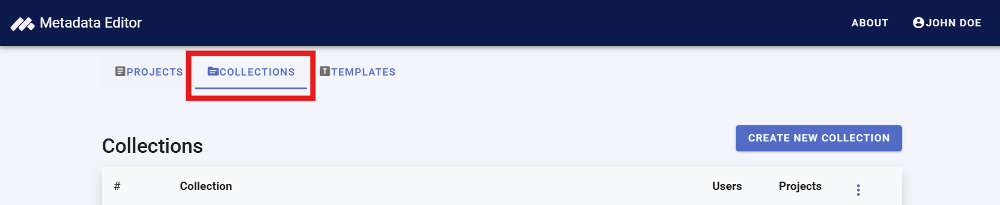
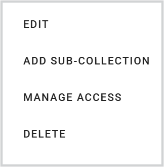

# Managing collections

When a project is created, it is initially visible only to its owner (creator). However, projects can be shared with other registered users of the Metadata Editor, granting different levels of permission (View, Edit, or Admin). This enables project owners to invite specific individuals to collaborate. For further details, refer to the section *Managing Projects*.

Another way to share projects and foster collaboration is by publishing them in *Collections*. Collections (and sub-collections) serve as virtual containers, allowing projects to be grouped based on themes, teams, or other organizational criteria. A project can belong to multiple collections simultaneously.

Collections are particularly useful for organizing projects when the Metadata Editor contains a large number of them. On the *My Projects* page, users can filter project lists by collection. Additionally, collections enable metadata administrators to generate summary reports for specific project groups (refer to the section *Administrator Tools*).

The primary and most significant role of collections is to facilitate permission management. Organizations often prefer to assign roles to teams rather than individual users. Permissions can be granted at both the project level (using the `SHARE` option, see section *Managing Projects*) and the collection level. Each collection has a defined list of collaborators, and all users with access to a collection automatically gain access to all projects published within it.

To access the collection management page in the Metadata Editor, click on `COLLECTIONS` in the main menu. 

## Creating, editing, or deleting a collection

Creating collections requires credentials. The administrator of the system has full authority to create collections. Only the system administrator can create collections at the root level. Other users who are given credentials can create sub-collections of a specific root-level collection. Up to two sub-levels of collections can be created. 

To **create a new collection at root level**, click on "CREATE NEW COLLECTION". Give your collection a short title, and (optional) a description.

To **create a sub-collection**, open the Options menu for the collection and select ADD SUB-COLLECTION. Provide a name and description.

The **EDIT** button allows you to edit the name of description of an existing collection.

The **DELETE** button allows you to delete a collection. Note that, because collections are only virtual containers of projects, deleting a collection does not impact the projects themselves.

## Setting permissions for a collection

Use the "MANAGE ACCESS" option to add/edit the list of users you want to share the collection with, and their role. From this page, you can add or remove users, or edit their roles. All users who appear in this list will be able to view, and possibly edit and delete, all entries listed in this collection (depending on the roles thay are given).

## Adding projects to a collection

A project can be added to a collection by clicking the option "ADD TO COLLECTION" available from the *My projects* page, or in the *Project home page* (see box "Collections"). Refer to the section on **Managing projects** and **Documenting data** for more information.

The collections to which an project belongs will be listed in the *My projects* page. To remove an entry from a collection, click on the "X" next to the collection name.

