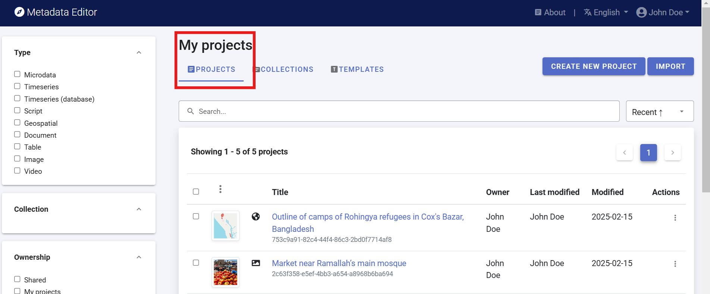
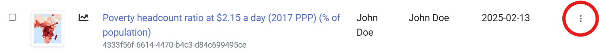
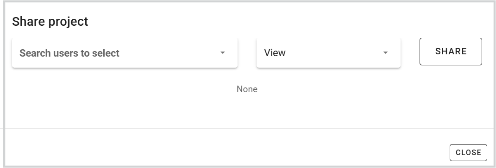
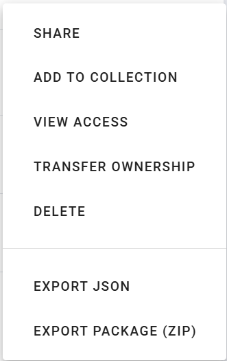
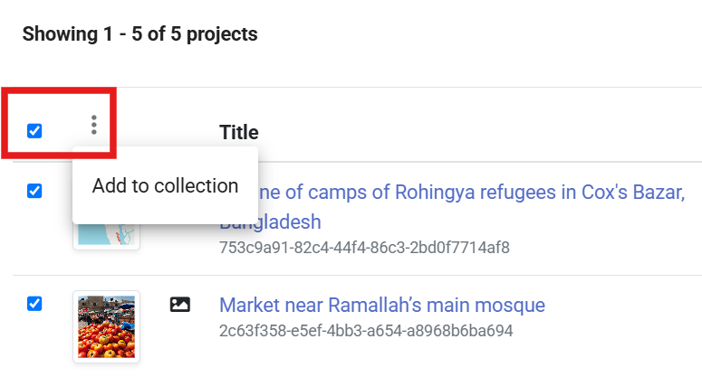
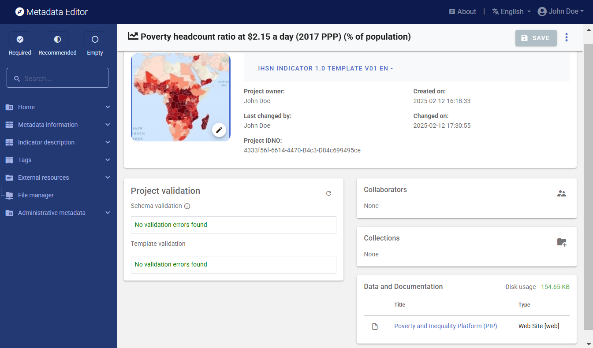

# Managing projects

A **project** in the Metadata Editor represents a "dataset" of any type. This may include:
- A microdataset obtained from a survey, census, sensor, or administrative data recording system.
- An indicator or database of indicators.
- A vector or raster geographic dataset (or a geographic service).
- A document of any type.
- A research project with its associated scripts.
- An image or video.

## The *My Projects* Page

The *My Projects* page is the default page of the Metadata Editor, where all projects available to a user are listed. Other main pages include *Collections* and *Templates*, which are accessible only to users with credentials to manage these sections.

All users, regardless of their roles and permissions, can access the *My Projects* page. The content displayed is determined by the user's credentials, meaning you will only see the projects you have permission to view or edit.

The list of projects can be filtered by:
- Data type
- Collection (if applicable)
- Ownership (projects owned by you or shared with you by another user)

You can also search for projects using keywords. Note that the search only looks for keywords in the project title, not in the full metadata.

## Actions on a project

From the *My Projects* page, you can perform the following actions based on your role and permissions:

- **Create a new project**: Click `CREATE NEW PROJECT` and select a data type from the list. A new project page will open with an *Untitled* project, where you are the owner. You can start entering content immediately, and the new project will be added to your *My Projects* list.

- **Import an existing project**: Click `IMPORT` and specify the project type. Upload a ZIP package generated by the Metadata Editor. This tool is intended for transferring projects across organizations. To share projects with other users of the same instance, use the `SHARE` option.

- **Open an existing project**: Click the project title to open the project page and view or edit the content.

From a specific *Project* page, several actions can be performed by clicking the `Options` button.

  

The available actions include:

- `SHARE`: Share the project with one or more registered users. You can assign different levels of access: *View*, *Edit*, or *Admin*. Shared projects will appear on the recipients' *My Projects* page.
    
    

    
  
- `ADD TO COLLECTION`: Add the project to one or more collections (if you have permissions on the collection). A popup will prompt you to select the collection(s). See the *Managing Collections* section for more details.

- `VIEW ACCESS`: Display information on project permissions, listing users with View, Edit, or Admin rights, as well as the collections the project belongs to. Permissions cannot be modified from this page. To change permissions for a project you own, open the project and use the *Collaborators* section on the *Project home page*.

- `TRANSFER OWNERSHIP`: Transfer project ownership to another registered user. You will be given the option to retain some level of access after the transfer.

- `DELETE`: Delete a project where you have admin rights.

- `EXPORT JSON`: Generate a JSON file containing the project metadata. You can exclude metadata elements marked as *Private* in the metadata template, and choose whether to include administrative metadata and metadata on external resources.

- `EXPORT PACKAGE (ZIP): Generate a ZIP package with all project materials (data, metadata, and related resources). Use this option for archiving or sharing projects with another organization that can import the package into its own instance of the Metadata Editor.

- `LOCK & VERSION`: Lock the project to prevent further edits and assign a version identifier. This step is often required for review and endorsement under an organization's metadata governance mechanism. Upon locking, the reviewer assigns a version number (following semantic versioning rules) and records relevant version details. Once locked, the metadata cannot be edited, but an editable copy remains available for future modifications. All locked versions are preserved and listed in the Metadata Editor. A checksum is generated and stored in the Metadata Editor database.

## Batch actions on projects

You can select multiple projects using the checkboxes next to the project titles and apply batch actions. In the current version, the only available batch action is to add the selected projects to a collection.

## The project "Home page"

Clicking on a project title in the *My Projects* page, or creating a new project, opens the *Project* home page. If you are already working on a project, you can access the home page by clicking *Home* in the navigation tree.

The Project Home Page contains the following sections:

- **Navigation Tree**: Displays the metadata structure defined by the selected template for documenting the dataset.

- **Header**: Shows core information, including data type, creation and modification dates, project owner, project identifier (user-defined and system-generated), version, and status.

- **Template Selection**: Allows selection of a metadata template and the option to add administrative metadata.

- **Project Validation**: Lists violations, if any, of standard requirements (schema validation) and user-defined template rules (template validation).

- **Collaborators**: Lists registered users with access to the project, along with their assigned roles (View, Edit, Admin).

- **Collections**: Shows the collections to which the project belongs, if any.

- **File Management**: Displays files associated with the project and their storage details. Special attention is required for microdata to ensure compliance with security and access rules. Data files uploaded to the server allow automatic generation of data dictionaries and summary statistics. Sensitive data should be deleted from the server to prevent unauthorized access or storage on unaccredited servers.

For more information about the available options in the *Project* home page and other project pages, refer to the section *Documenting Data – General Instructions*.

