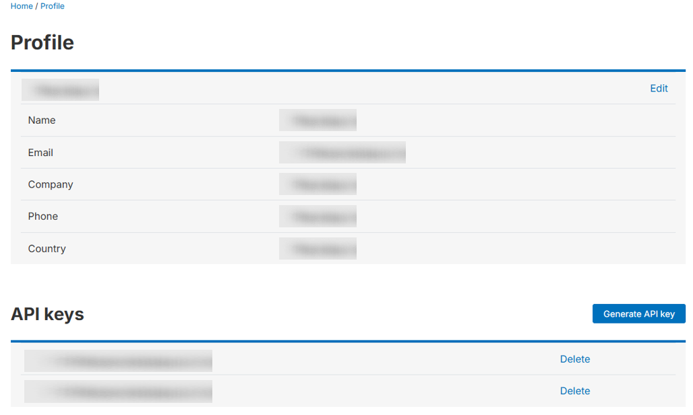
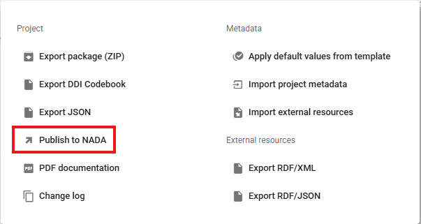
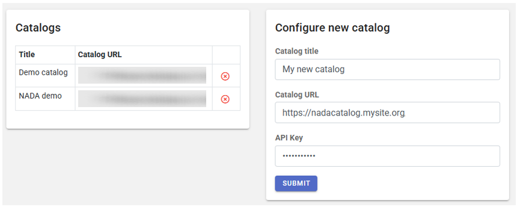
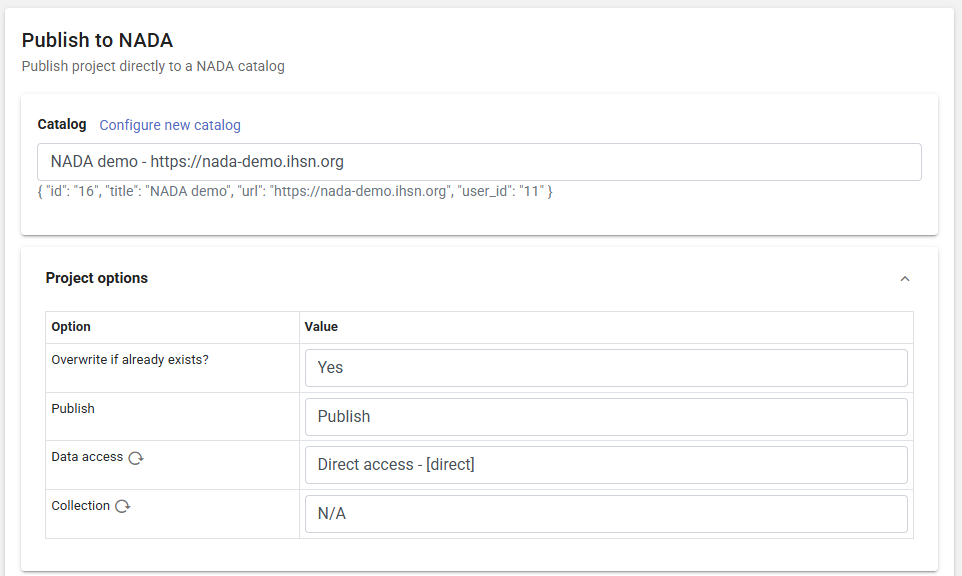
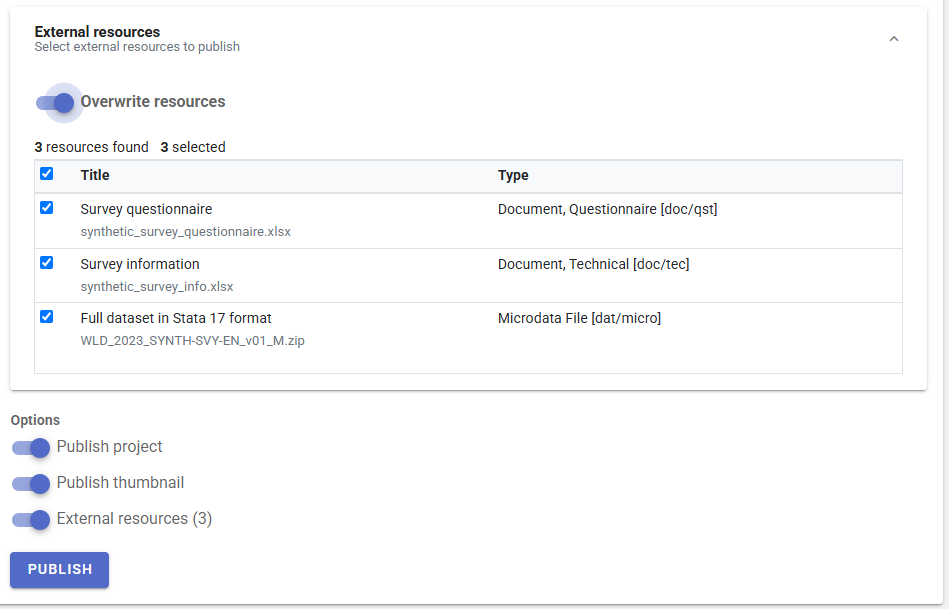
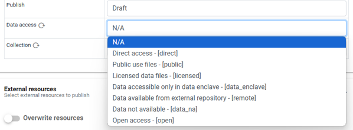

# Publish metadata and data to NADA

Metadata generated by the Metadata Editor (or by another tool that would generate metadata compliant with the same standards) serves as input that can (and should) be published in one or multiple (meta)data dissemination platforms. The World Bank has developed the NADA cataloguing application, an open source application fully compatible with the Metadata Editor.

Metadata exported from the Metadata Editor can be imported from NADA, using the NADA administrator interface. Another option, described below, is to publish the metadata (and data, for microdata) directly to NADA from the Metadata Editor.

Publishing metadata to NADA requires a NADA API key with permissions to publish in NADA. NADA API keys are generated from NADA (login to NADA, open your profile, and click on `Generate API key`).

> ⚠️ **API keys must always be kept strictly confidential. Your permissions and roles are embedded in the key; by sharing your API key, you would share your permissions. If you accidentally share or publish your key (for example in a script), you should immediately DELETE the key and issue a new one (in your *Profile* page in NADA).**

If you have a NADA API key that grants you permission to publish your metadata (and possibly data) in NADA, you will have to first configure a data catalog (the one in which you plan to publish the metadata) in the Metadata Editor. Then you can publish metadata from any project to the NADA catalog.

## Configuring a NADA catalog

In the project page of a project you own, co-own, or collaborate on, click on Publish to NADA in the project main menu. 

In the **Catalog** frame, you will have the option to *Select* a NADA catalog among those you will have configured. If you have not configured any catalog yet, or to add a new one, click on **Configure new catalog**.

The catalog configuration page will be displayed, where you must enter a short name for your catalog, its URL, and your NADA API key (which must be kept strictly confidential). 

## Publishing metadata in NADA

To publish metadata in NADA, click on "Publish to NADA" in the Project page menu. In the **Publish to NADA** page, select a configured NADA catalog then enter the **Project options**. These options are as follows:
- ***Overwrite if already exists?*** The options are Yes (overwrite) or No (do nothing). Answer the question on whether you want to overwrite the project if it has previously been published in the NADA catalog. A project is identified by its **Primary ID**. If a project already exists in NADA with the same primary ID, it will be overwritten if you answer **Yes**.  
- ***Publish*** A project can be pushed to a NADA catalog and made immediately accessible to users of the data catalog (option **Publish**), or it can be pushed but under a **Draft** status, in which case only administrators of the NADA catalog will be able to view it (and will have to publish it themselves by changing the project status in the NADA administrator interface).
- ***Data access*** You may publish your data in NADA, and set the access policy for the dataset. See the next section.
- ***Collection*** If the selected NADA catalog contains collections, this option allows you to select the collection in which you want to publish your metadata. A list of collections (if any) available in the selected NADA catalog will be displayed as a drop-down menu. The project will then be "owned" by this collection. Note that a same project can be shown in multiple collections in a NADA catalog; only one collection will "own" (and administer) the project, the others will only "borrow" it. Publishing a project in multiple collections is done in NADA, not in the Metadata editor.  

In the **External resources** frame, select the files you want to upload to NADA. the files will be accessible to the visitors of the NADA catalog. Indicate whether you want to overwrite the files if they are already found in the NADA catalog.

In **Options**, select what information you want to publish:
- The project metadata
- The project thumbnail
- The external resources

Then click **PUBLISH**. If your metadata is valid (contains mo validation errors), and your API key provides you with the necessary privileges on the NADA catalog, the metadata and related materials will now be published in the catalog. 
  

## Publishing data in NADA

If you want to make your data files available to users in your NADA catalog, you must document the data files as **external resources** in your project (see the section on External resources). If the data are not intended to be openly accessible, and always for microdata, make sure you set the resource type as ***microdata***.  

A specific data access policy will be applied to all external resources identified as *microdata*. The ***Data access*** option provided in the **Publish to NADA** page is where you control how visitors of the NADA catalog will be able to access the data files. 

It offers the following options:
- **Direct access.** Users will be able to download the data after accepting a disclaimer statement. No registration is needed.
- **Public use files.** Registered users will be able to download the data after accepting a disclaimer statement. 
- **Licensed data files.** Registered users will have to submit a request for accessing the data, which will be processed by the NADA administrators. Data will be available for download after the user has been approved.
- **Data accessible only in data enclave.** Data are not accessible from the NADA catalog. They are only accessible on-site. When this option is selected, the microdata file(s) should not be published to NADA.
- **Data accessible from external repository.** Data are not accessible from the NADA catalog but from an external website. When this option is selected, the microdata file(s) should not be published to NADA. The URL to the external catalog must be provided.
- 
  
  
- **Data not available.** Data are not accessible from the NADA catalog or from any other source. When this option is selected, the microdata file(s) should not be published to NADA.
- **Open access.** Data are accessible under an open license (the most permissive option).

