# Quick start: Video

In this example, we will document a video titled "Reshaping Food Security Analytics: An In-Depth Look at Emerging Solutions for Rapid Insights" published on the World Bank Youtube channel  (https://www.youtube.com/watch?v=px1EeqpKDUI&list=PLopq6yGfmFAu3tscprzTPpoPrP1q0E9XZ)). The only file you need to reproduce this Quick-Start example is the image file *.../video/video_food_security.jpg*, a screenshot of the video introduction (feel free to use another image of your choice).

**Step 1: Create a new project and add a thumbnail**

To begin, open the Metadata Editor link and log in with your username and password. The "My projects" page will be displayed, showing all projects you have previously created and those that have been shared with you by others, if any. If you are using the application for the first time and no project has been shared with you by other users of the Metadata Editor, the project list will be empty. 

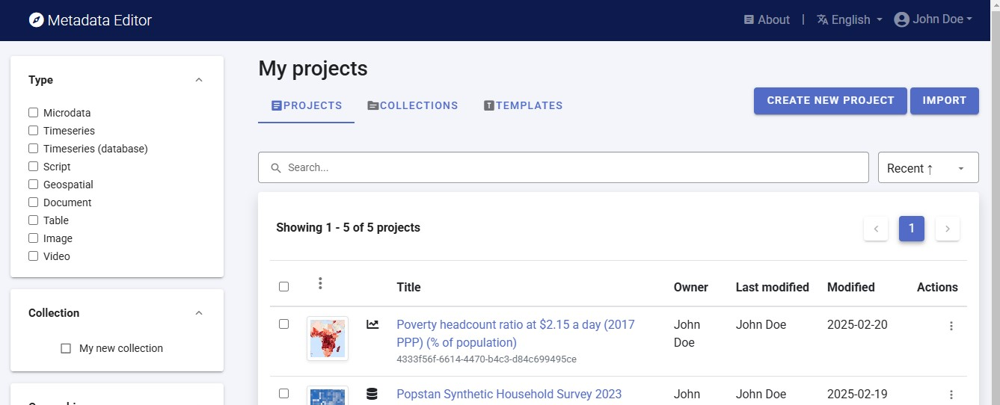

Click on "CREATE NEW PROJECT" and select "Video" when prompted to indicate the type of resource you will be documenting.

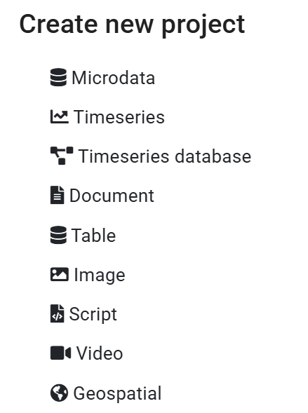
  
A new project page will open in a new tab.

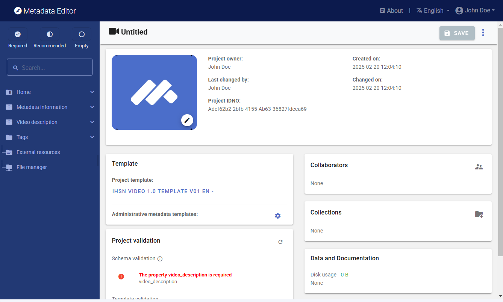

We will use the screenshot image as a thumbnail (which will be displayed in the Metadata Editor and in the NADA catalog if the metadata is published in NADA). Click on the edit button in the screenshot image, and select the image file when prompted. 

**Step 2: Enter metadata**

On the left navigation tree, select "Metadata information / Information on metadata" to enter optional elements used to capture information on who documented the video and when. Enter your name, and the date in ISO format (YYYY-MM-DD). Then click on SAVE.

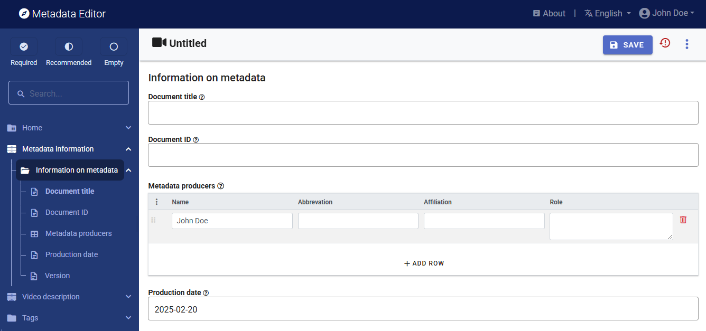

You can now start entering the metadata related to the video itself. In the navigation tree, first select "Title statement" under "Video description", and enter the required **Primary ID** (a unique identifier of your choice, e.g., JD_VDO_001; if you want to publish the video in a NADA catalog, make sure that this same identifier is not used by another user or for another image). Also, enter the title of the video: "Reshaping Food Security Analytics: An In-Depth Look at Emerging Solutions for Rapid Insights".

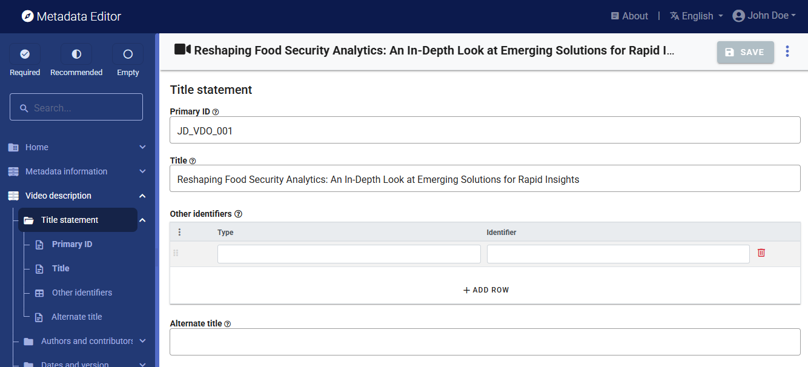

Then proceed with the other sections in the navigation tree and fill out the following elements using the following information provided in the World Bank Youtube channel:
- ***Author:*** World Bank
- ***Description:*** New methods are paving the way for faster data and insight. Get an in-depth look at how AI and machine learning are reshaping food security analytics to deliver actionable information for humanitarian aid, policy-making, and crisis response. From conflict-affected regions to global inflation trends, discover how data-driven solutions—such as the Joint Monitoring Report (JMR), Real-Time Prices (RTP), and the World Food Security Outlook (WFSO)—generate crucial information to provide timely assistance where it matters most.
- ***Genre***: Documentary
- ***Keywords:*** Extract keywords you find relevant from the transcript or from the description of the video provided in the Youtube channel. Some suggestions:  "Food Security", "Famine", "Nutrition data", "Food crisis", "Global Alliance for Food security", "Dry corridor", "El Nino", "Hunger".
- ***Language:*** English (code EN)
- ***Date published:*** 2025-01-23 (in ISO format YYYY-MM-DD)
- ***Geographic coverage:*** Not specific, so we will enter "World" (code WLD)
- ***Duration:*** PT3M25S (3 minutes and 25 seconds). The duration must be entered in ISO8601 format.
- ***Video URL:*** https://youtu.be/px1EeqpKDUI?list=PLopq6yGfmFAu3tscprzTPpoPrP1q0E9XZ
- ***Embed URL:*** https://www.youtube.com/embed/px1EeqpKDUI?list=PLopq6yGfmFAu3tscprzTPpoPrP1q0E9XZ *(Note: This information can be obtained by right-clicking on the video in Youtube. It will open a menu, in which you will find an option to "Copy embed code". Select only the URL (src) part of it.)*
  
  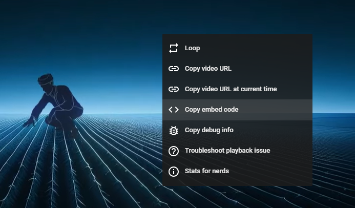 

- ***Transcript:*** *(Copy/pasted, and edited for formatting, from the Youtube channel)*: "In 2022 as 250 million people faced food crises, the G7 presidency and the Worldbank Group came together to launch the Global Alliance for Food Security, mobilising a swift, coordinated response to the growing global hunger crisis. Working alongside international partners, we transformed food and nutrition security data systems by introducing advanced country level assessment and prediction tools. The World Food Security Outlook was developed to enhance understanding of global food and nutrition security. Using machine learning to analyse data from various sources and project food security up to six years in advance. Instead of waiting for crises to emerge, we can now utilise these insights to proactively address and mitigate potential impacts. Additionally, we've created tools to monitor prices of household items and unofficial exchange rates in real time across many locations. This aids in understanding rapid changes in food and fuel affordability, and identifying areas of urgent need.
Furthermore, second layer monitoring tools like the Joint Monitoring Report build on these new data sources to provide more in-depth insights into complex conflict affected areas. These innovations aim to provide precise, timely, and actionable food and nutrition security data to guide Worldbank programming and partner actions. For instance, in the Dry Corridor, the World Food Security Outlook has brought together government, humanitarian and development leaders to assess risks, scale up early action, strengthen safety nets, and adjust agricultural planning for El Nino impacts. In the Horn of Africa, real time prices track water and staple food prices during droughts. Enabling the identification of operational and funding gaps in real time. The shift towards machine learning and real time data is already transforming food security analysis.
Through the Joint Monitoring report, humanitarian and development partners now follow the same data driven approach to collectively recognise emerging crises early and enhance crisis preparedness. These first of their kind reports are speeding up response times and strengthening evidence based decision making, demonstrating how data driven tools deliver transparent, robust and high frequency analysis at a fraction of the cost of traditional food and nutrition security updates. Join the fight against hunger. Explore real time crises and the world food security outlook at microdata.worldbank.org. For more insights and our progress on Sustainable Development Goal 2, visit worldbank.org."

   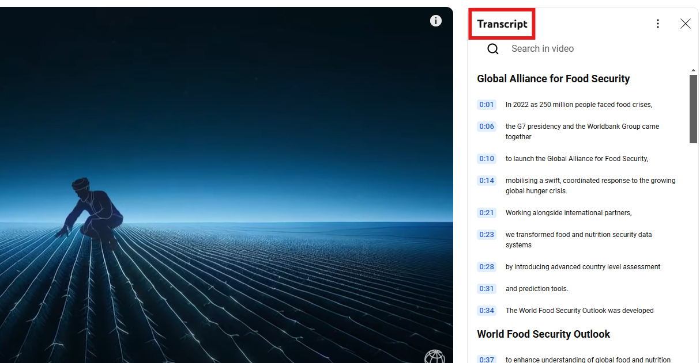
  
This information can be entered in the Metadata Editor as follows:

| Information               | In the metadata template                                   | 
| ------------------------- | -----------------------------------------------------------| 
| Author                    | Video description / Authors and contributors / Creator     |
| Description               | Video description / Content / Description                  |
| Genre                     | Video description / Content / Genre                        |
| Keywords                  | Video description / Content / Keywords                     | 
| Language                  | Video description / Content / Languages                    |
| (derived)                 | Video description / Status ("Published")                   |
| Date published            | Video description / Dates and version / Date published     |
| Geographic coverage       | Video description / Geographic and time coverage / Country |
| Video URL                 | Video description / Access and rights / Video URL          | 
| Embed URL                 | Video description / Access and rights / Embed URL          | 
| Duration                  | Video description / Technical information / Duration       |

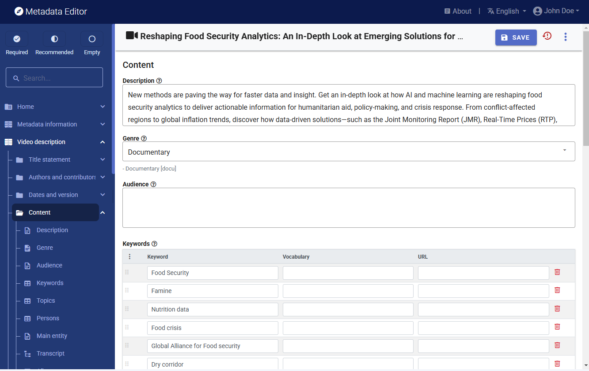

**Step 3: Add information on related resources**

Once you have entered the metadata, you can finalize the documentation of the video by documenting and attaching external resources. External resources include all materials you want to make accessible to users when you publish the video in a catalog. In this example, we will add one external resource: a link to the World Bank YouTube channel. 

To create external resources, click on "External resources" in the navigation tree and then click on "Create resource". Select the resource type ("Web Site"), give it a short title *(World Bank YouTube channel)*, and enter the URL *(https://www.youtube.com/worldbank)*. Then click "SAVE." You will now have two external resources listed.

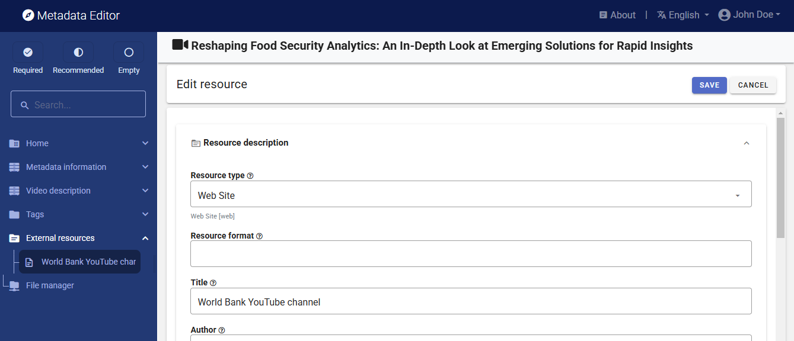

**Step 4: Export and publish metadata**

In the project page, a menu of options will be available to you.

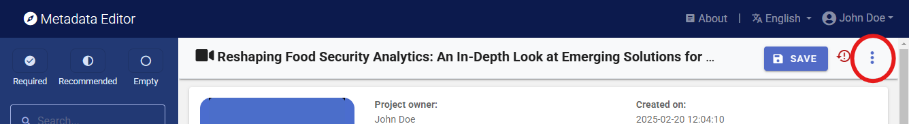

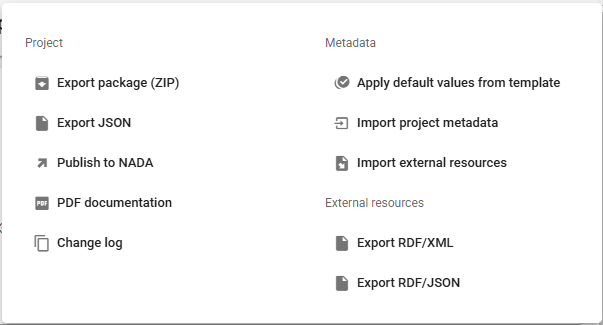

**Export package (ZIP)**

This option will allow you to generate a ZIP file containing all metadata and resources related to the project. This package can be shared with others, who can import it in their own Metadata Editor.

**Export JSON**

Export metadata as a JSON file. 

**Export RDF/XML** and **Export RDF/XML**

These options allow you to export the metadata related to external resources in JSON or XML format.

**Publish to NADA**

If you have a NADA catalog and the credentials to publish content in it, you can also "Publish to NADA". Select a configured NADA catalog, select the options as shown in the screenshot below, and click PUBLISH.

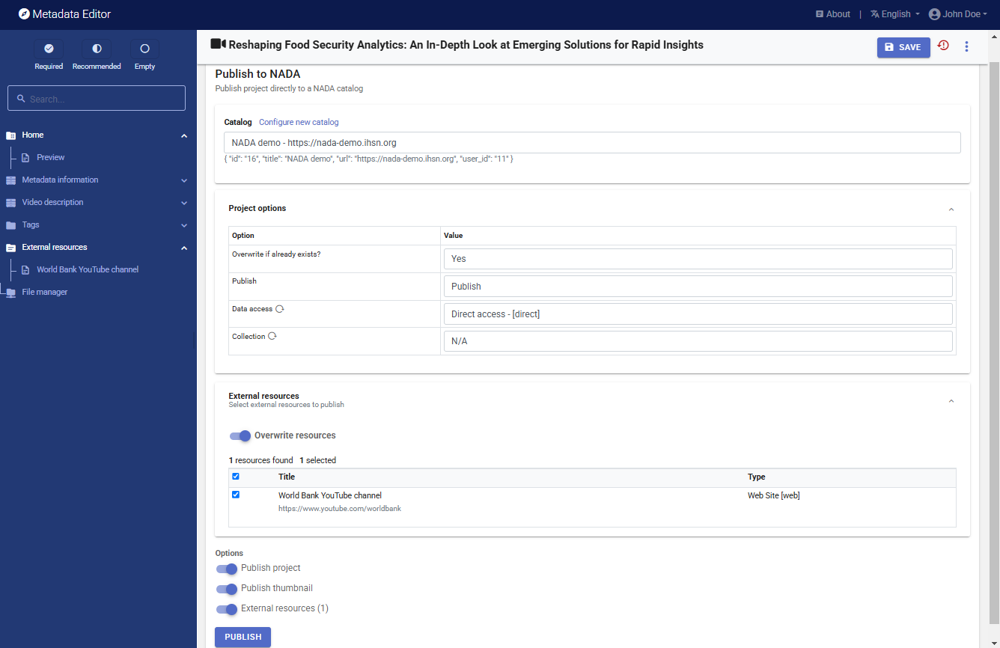

The video will now be listed and made discoverable in the NADA catalog, with a link to the YouTube channel. The video can be viewed from within the NADA page.  

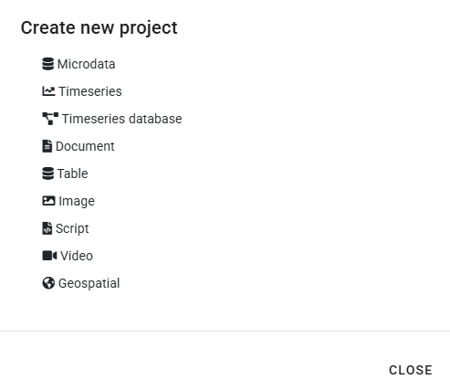

**PDF documentation**

A PDF version of the metadata can be automatically created. Select PDF documentation then click on GENERATE PDF. When the PDF is generated, click on DOWNLOAD PDF. You will obtain a bookmarked PDF file with all entered metadata.

