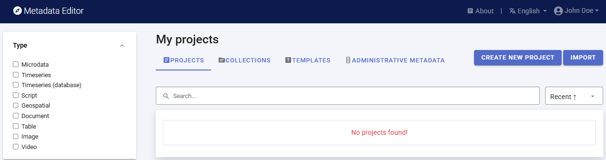
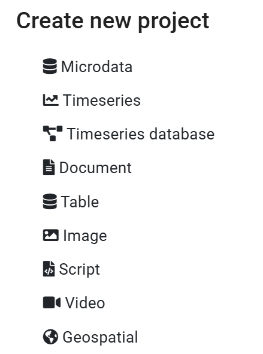
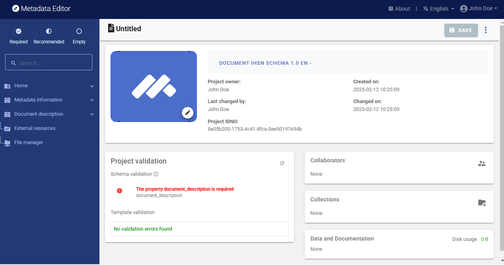
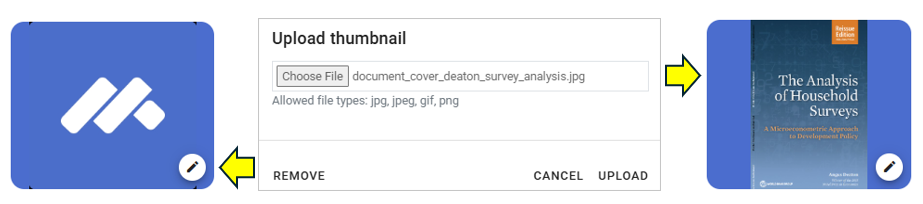

# Quick-start: Document

In this example, we will document a book titled "The Analysis of Household Surveys: A Microeconometric Approach to Development Policy" by Angus Deaton (2019). This book is freely available from the World Bank's Open Knowledge Repository at http://hdl.handle.net/10986/30394. We assume that you want to publish information on the book in a data catalog, with a link to the World Bank's Open Knowledge Repository (i.e., we assume that you not plan to make the book directly available from your catalog).

The only file you need to reproduce this Quick-Start example is the image file of the book's cover page (or feel free to use another image).

**Step 1: Create a new project and add a thumbnail**

To begin, open the Metadata Editor link and log in with your username and password. The "My projects" page will be displayed, showing all projects you have previously created and those that have been shared with you by others, if any. If you are using the application for the first time and no project has been shared with you by other users of the Metadata Editor, the project list will be empty. 

Click on "CREATE NEW PROJECT" and select "Document" when prompted to indicate the type of resource you will be documenting.

  
A new project page will open in a new tab.

We will use the cover page of the book as a thumbnail (which will be displayed in the Metadata Editor and in the NADA catalog if the metadata is published in NADA). We captured a screenshot of the cover page and saved it in file *documen/cover_deaton_survey_analysis.jpg* (you can capture a document cover page with any screen capture tool, and save the image file in JPEG or PNG format). Click on the edit button in the screenshot image, and select the image file when prompted. 

We will use the default metadata template provided, so there is no need to switch template. 

**Step 2: Enter metadata**

On the left navigation tree, select "Metadata information / Information on metadata" to enter optional elements used to capture information on who documented the publication and when. Enter the name of the person who generated the metadata, and the date the metadata was created using the ISO format YYYY-MM-DD. Then click on SAVE.

You can now start entering the metadata related to the book itself in the "Document Description" section. In the navigation tree, first select "Title statement" and enter the required **primary ID** (a unique identifier of your choice, e.g., JD_DOC_001; if you want to publish the document in a NADA catalog, make sure that this same identifier is not used by another user or for another document). Also enter the (optional) **other identifiers** for the document, including the DOI (* 10.1596/ 978-1-4648-1331-3*) and the ISBN (* 978-1-4648-1352-8*). Then enter the **title**, which is a required element (*The Analysis of Household Surveys*) and **subtitle** (*A Microeconometric Approach to Development Policy*) of the book. 

Then proceed with the other sections in the navigation tree and fill out the following elements. 

- **Author**: Angus Deaton
- **Date published** (in ISO format YYYY-MM-DD): 2019-01-16
- **Abstract**: Two decades after its original publication, The Analysis of Household Surveys is reissued with a new preface by its author, Sir Angus Deaton, recipient of the 2015 Nobel Prize in Economic Sciences. This classic work remains relevant to anyone with a serious interest in using household survey data to shed light on policy issues. This book reviews the analysis of household survey data, including the construction of household surveys, the econometric tools useful for such analysis, and a range of problems in development policy for which this survey analysis can be applied. The author's approach remains close to the data, using transparent econometric and graphical techniques to present data in a way that can clearly inform policy and academic debates. Chapter 1 describes the features of survey design that need to be understood in order to undertake appropriate analysis. Chapter 2 discusses the general econometric and statistical issues that arise when using survey data for estimation and inference. Chapter 3 covers the use of survey data to measure welfare, poverty, and distribution. Chapter 4 focuses on the use of household budget data to explore patterns of household demand. Chapter 5 discusses price reform, its effects on equity and efficiency, and how to measure them. Chapter 6 addresses the role of household consumption and saving in economic development. The book includes an appendix providing code and programs using STATA, which can serve as a template for the users' own analysis.
- **Language**: English (code EN)
- **Rights**: CC BY 3.0 IGO
- **Document type**: Book (select from drop down)
- **Keywords** (enter one per row): household survey; survey design; data collection; economic development; development policy (enter one per row)
- **Topics** (enter one per row; only fill in column *Topic*): Development Patterns and Poverty; Living Standards; Poverty Assessment; Poverty and Policy; Statistical & Mathematical Sciences

After entering all available information, click on SAVE. the **Preview** page shows all information you have entered.

**Step 3: Provide a link to the document**

The next step is to provide users with a link to the book or an option to download the PDF version directly from your catalog. This information on the location of the book, along with any related files and links, is referred to as "External resources." To add external resources, select "External resources" in the navigation tree and click on CREATE RESOURCE. 

This will open a new resource page where you can describe the resource. Most elements are optional, but at a minimum, you should enter the **resource type** (select *Document, Technical* from the drop down), the title including subtitle (*The Analysis of Household Surveys: A Microeconometric Approach to Development Policy*), the author (Angus Deaton), and the date (in ISO format: 2019-01-16). To provide users with access to the book, add the external permanent link (http://documents.worldbank.org/curated/en/593871468777303124) to the document in **Resource attachment**. 

Then click SAVE. The document will now be listed as an external resource.

With this, you have completed the documentation of the book. The "Projects" page will show this new entry. You may at any time go back to it to edit or complete the metadata.

**Step 4: Export and publish metadata**

When you open this project, a menu of options is available to you. 

***Export package (ZIP)***

This option will allow you to generate a ZIP file containing all metadata and resources related to the project. This package can be shared with others, who can import it in their own Metadata Editor.

***Export metadata to JSON***

Export metadata to JSON will generate a JSON file containing the metadata. The option is provided to include all elements or only the non-private ones. The JSON file will look like this:

***Generate a PDF version of the metadata***

A PDF verion of the metadata can be automatically created. Select **PDF documentation** then click on GENERATE PDF. When the PDF is generated, click on DOWNLOAD PDF. You will obtain a bookmarked PDF file with all entered metadata.

***Publish metadata in a NADA catalog***

If you have a NADA catalog and the credentials to publish content in it, you can also "Publish to NADA". Select a configured NADA catalog, select the options as shown in the screenshot below, and click PUBLISH. 

The book will now be listed and made discoverable in the NADA catalog.

