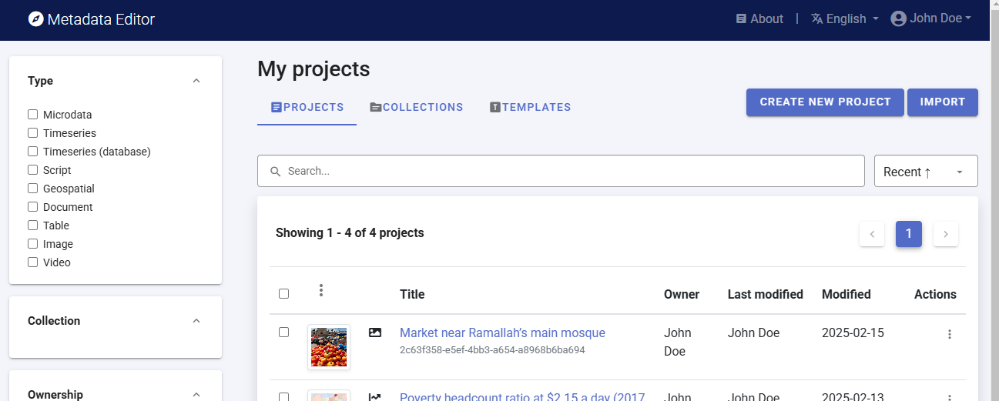
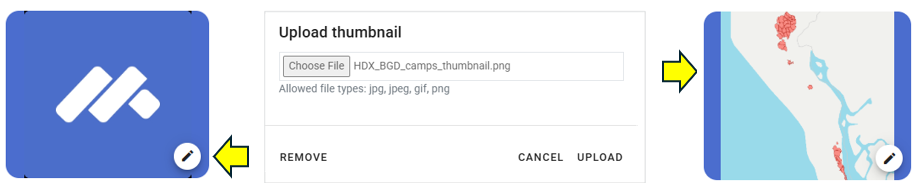
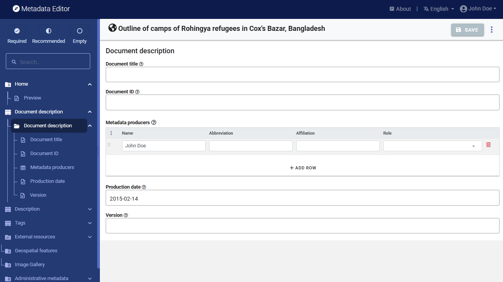
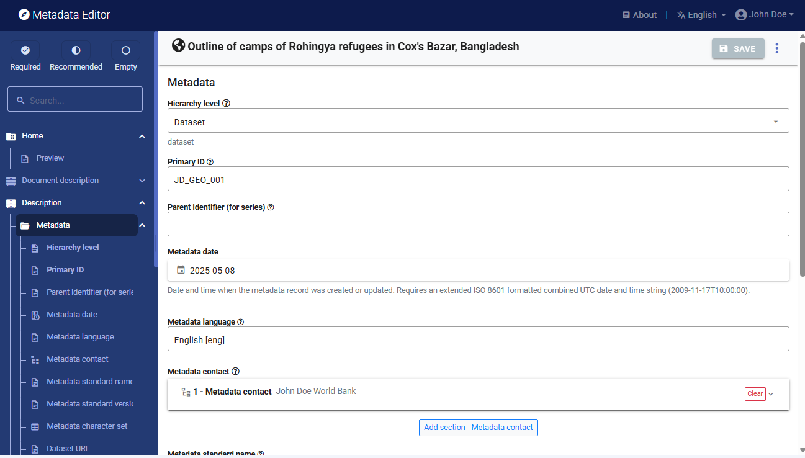
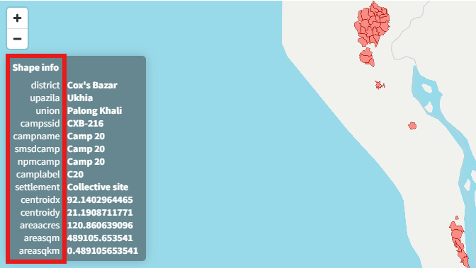
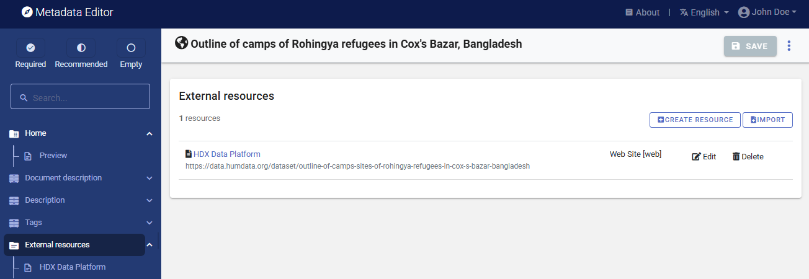
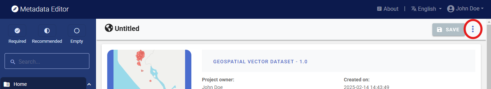
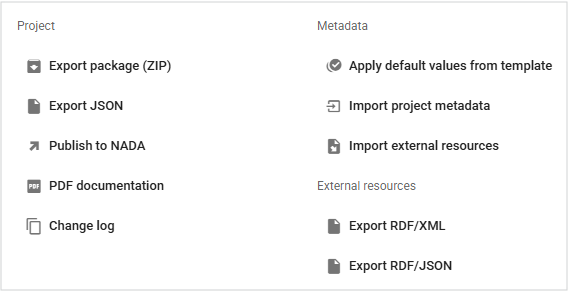
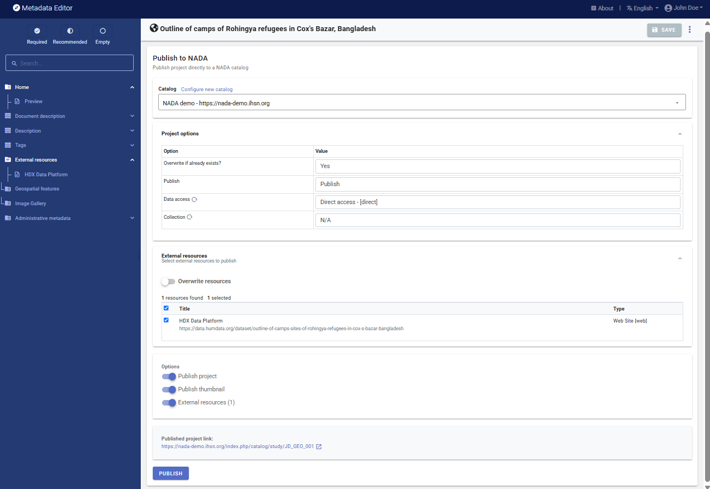
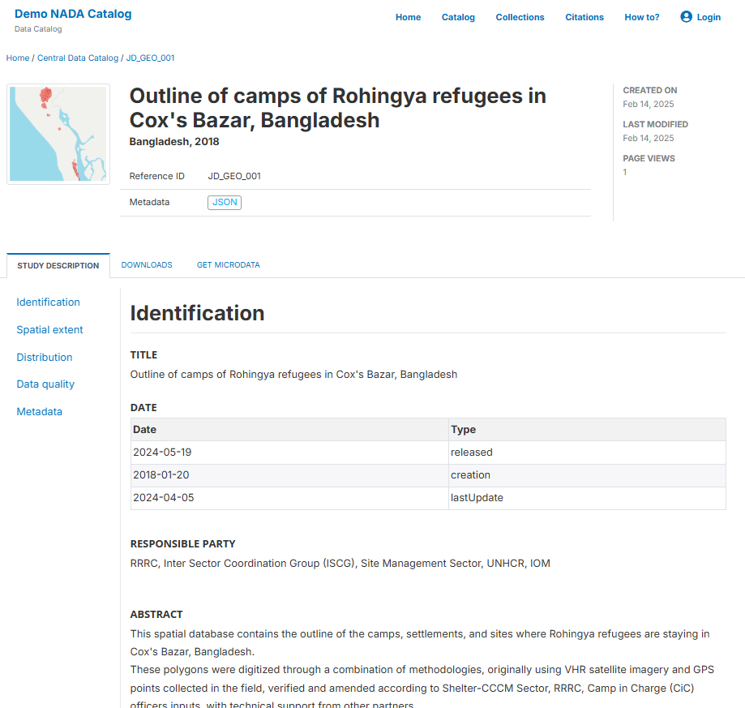

# Quick start: Geographic dataset

In this example, we will document a geographic dataset extracted from the Humanitarian Data Exchange (HDX) website. This dataset provides an outline of camps of Rohingya refugees in Cox's Bazar, Bangladesh. The only file you need to reproduce this Quick-Start example is the image file *.../image/HDX_BGD_camps_thumbnail.jpg* (feel free to use any another PNG or JPG image file of your choice).

**Step 1: Create a new project and add a thumbnail**

To begin, open the Metadata Editor link and log in with your username and password. The "My projects" page will be displayed, showing all projects you have previously created and those that have been shared with you by others, if any. If you are using the application for the first time and no project has been shared with you by other users of the Metadata Editor, the project list will be empty. 

Click on "CREATE NEW PROJECT" and select "Geospatial" when prompted to indicate the type of resource you will be documenting.

  
A new project page will open in a new tab.

We will use the JPG file *HDX_BGD_camps_thumbnail.jpg* as a thumbnail (which will be displayed in the Metadata Editor and in the NADA catalog if the metadata is published in NADA). Click on the edit button in the screenshot image, and select the image file when prompted. 

In this example, we will use the template IHSN ISO 19139-Datasets Template v01 EN (default template for geographic data). There is thus no need to change the template.

**Step 2: Enter metadata**

On the left navigation tree, select "Metadata information / Information on metadata" to enter optional elements used to capture information on who documented the publication and when. Enter your name, and the date in ISO format (YYYY-MM-DD). Then click on SAVE.

You can now start entering the metadata related to the geographic dataset itself. In the navigation tree, first select "Description / Introduction" and enter the required **Primary ID** (a unique identifier of your choice, e.g., JD_GEO_001; if you want to publish the document in a NADA catalog, make sure that this same identifier is not used by another user or for another image). 

Then proceed with the other sections in the navigation tree and fill out the following elements using the following information provided in the HDX website (see "Additional information" section in web page https://data.humdata.org/dataset/outline-of-camps-sites-of-rohingya-refugees-in-cox-s-bazar-bangladesh). The template is a bit complex, due to the complexity of the underlying ISO metadata standard.
- ***Language:*** English
- ***Title:*** Outline of camps of Rohingya refugees in Cox's Bazar, Bangladesh
- ***Description:*** This spatial database contains the outline of the camps, settlements, and sites where Rohingya refugees are staying in Cox's Bazar, Bangladesh.
- ***Time period of the dataset:*** January 20, 2018-April 05, 2024
- ***Modified:*** 19 May 2024
- ***Expected update frequency:*** As needed
- ***Location:*** Bangladesh
- ***Source:*** RRRC, Inter Sector Coordination Group (ISCG), Site Management Sector, UNHCR, IOM
- ***Contributor:*** Inter Sector Coordination Group (ISCG)
- ***Methodology:*** These polygons were digitized through a combination of methodologies, originally using VHR satellite imagery and GPS points collected in the field, verified and amended according to Shelter-CCCM Sector, RRRC, Camp in Charge (CiC) officers inputs, with technical support from other partners.
- ***Caveats/Comments:*** The camps are continuously expanding, and Camp Boundaries are structured around the GoB, RRRC official governance structure of the camps, taking into account the potential new land allocation. The database is kept as accurate as possible, given these challenges.
- ***License:*** Public Domain / No Restrictions (https://data.humdata.org/faqs/licenses)
- ***Tags:*** geodata ; populated places-settlements ; refugee crisis ; refugees 
- ***File formats:*** Geodatabase; SHP; KML
- ***Content of the layers:*** district, upazilla, union, campssid (camp's ID), campname (camp name), smsdcamp, npmcamp, camplabel (camp label), settlement, centroidx (X coordinate of centroid), centroidy (Y coordinate of centroid), areaacres (surface area in acres), areasqm (surface area in square meters), areasqkm (surface area in square kilometers). See:
  
  

This information can be entered in the Metadata Editor as follows:

| Information from HDX      | Corresponding element in the metadata template                            | 
| ------------------------- | --------------------------------------------------------------------------| 
| Language                  | Description / Introduction / Language                                     |
| Title                     | Description / Identification / Citation / Title                           |
| Description               | Description / Identification / Abstract, purpose,credit,status / Abstract |
| Time period of the dataset| Description / Identification / Citation / Date (creation and lastUpdate)  | 
| Modified                  | Description / Identification / Citation / Date (released)                 |
| Expected update frequency | Description / Identification / Resource maintenance / Frequency           |
| Location                  | Description / Identification / Extent / Geographic element (Geo. descr.)  |
| Source                    | Description / Identification / Citation / Responsible party / Org. name   |
| Contributor               | Description / Identification / Abstract, purpose,credit,status / Credit   | 
| Methodology               | Description / Identification / Abstract, purpose,credit,status / Abstract | 
| Caveats/Comments          | Description / Data quality / Lineage statement (scope = Dataset)          | 
| License                   | Description / Identification / Resource constraints / Legal (license)     | 
| Tags                      | Description / Descriptive keywords / Keywords (Keyword column)            | 
| File formats              | Description / Resource format / Name (enter as 3 resource formts)         | 
| Content of the layers     | Description / Feature catalogue / Name (for the 14 features)              | 

**Step 3: Add information on related resources**

Once you have entered the metadata, you can finalize the documentation of the dataset by documenting and attaching external resources. External resources include all materials you want to make accessible to users when you publish the dataset in a catalog. In this example, we will only add one resource: a link to the HDX data platform. 

To create an external resource, select "External resources" in the navigation tree and then click on "Create resource". Select the resource type ("Web Site"), give it a short title *(HDX Data Platform)*, and enter the URL *(https://data.humdata.org/dataset/outline-of-camps-sites-of-rohingya-refugees-in-cox-s-bazar-bangladesh)*. Then click "SAVE." You will now have the external resource listed.

**Step 4: Export and publish metadata**

In the project page, a menu of options will be available to you.

**Export package (ZIP)**

This option will allow you to generate a ZIP file containing all metadata and resources related to the project. This package can be shared with others, who can import it in their own Metadata Editor.

**Export JSON**

Export metadata as a JSON file. 

**Export RDF/XML** and **Export RDF/XML**

These options allow you to export the metadata related to external resources in JSON or XML format.

**PDF documentation**

A PDF version of the metadata can be automatically created. Select PDF documentation then click on GENERATE PDF. When the PDF is generated, click on DOWNLOAD PDF. You will obtain a bookmarked PDF file with all entered metadata.

**Publish to NADA**

If you have a NADA catalog and the credentials to publish content in it, you can also "Publish to NADA". Select a configured NADA catalog, select the options as shown in the screenshot below, and click PUBLISH.

The image will now be listed and made discoverable in the NADA catalog, with a link to the Flickr Album. 

