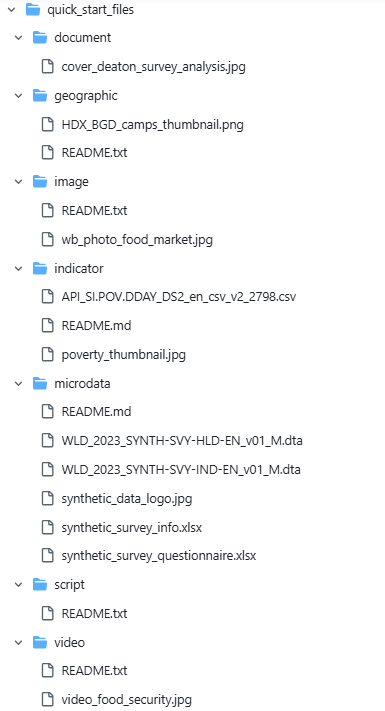

# Quick start: Overview

The Quick Start examples provide a fast and effective way to familiarize yourself with the Metadata Editor and experiment with creating standard-compliant metadata. Designed as step-by-step walkthroughs, these examples guide you through the core features of the application, allowing you to practice metadata creation with pre-provided sample files. Each example focuses on a specific data type supported by the Metadata Editor and includes all necessary materials for replication. 

If you have an installed NADA catalog and have administrator credentials, you will also learn how to publish metadata in an online catalog. NADA is an open source cataloguing application developed by the World Bank. Metadata generated by the Metadata Editor can be directly published in NADA. Refer to the NADA User Guide for instruction on how to install NADA and obtain a NADA API key that would allow you to publish metadata in it.

These examples are intentionally simplified to provide an overview of the application's core functionalities and do not cover all available features. For a more comprehensive understanding, refer to the *Documenting Data* chapters.

## Quick Start Examples

We provide a dedicated quick start example for each supported data type:

- ***Document*** – Documenting a publication (in this case, a book).
- ***Microdata*** – Documenting a survey dataset (a synthetic survey dataset composed of a household-level and individual data files provided in Stata format).
- ***Indicator and Database*** – Documenting a statistical indicator and its source database.
- ***Geographic Dataset*** – Documenting a vector dataset (provided in shapefile format) and a raster dataset (provided in geotiff format).
- ***Scripts*** – Documentation of a research project with multiple related scripts.
- ***Image*** – Documenting a digital photograph from a World Bank photo album.
- ***Video*** – Documenting a video.

## Getting Ready

Before starting, please ensure that:

- You have the Metadata Editor installed on your system (server or PC), with an *Editor* role that allows you to create new projects.
- You have access to a test NADA catalog with the necessary credentials to publish metadata (this is only needed if you want to experiment publishing metadata in a NADA catalog).
- You have downloaded the required example files from ... Insert Download Link ... and saved them in a dedicated folder on your PC (the files do not have to be on the server that hosts the Metadata Editor). If you unzip the file provided on GitHub, you will have a folder with the following structure (which is not imposed by the Metadata Editor; all you need is access to the files):
  

Once ready, follow the step-by-step instructions provided in each example to practice creating, editing, and publishing metadata using the Metadata Editor.

