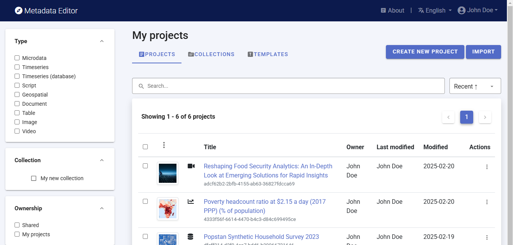
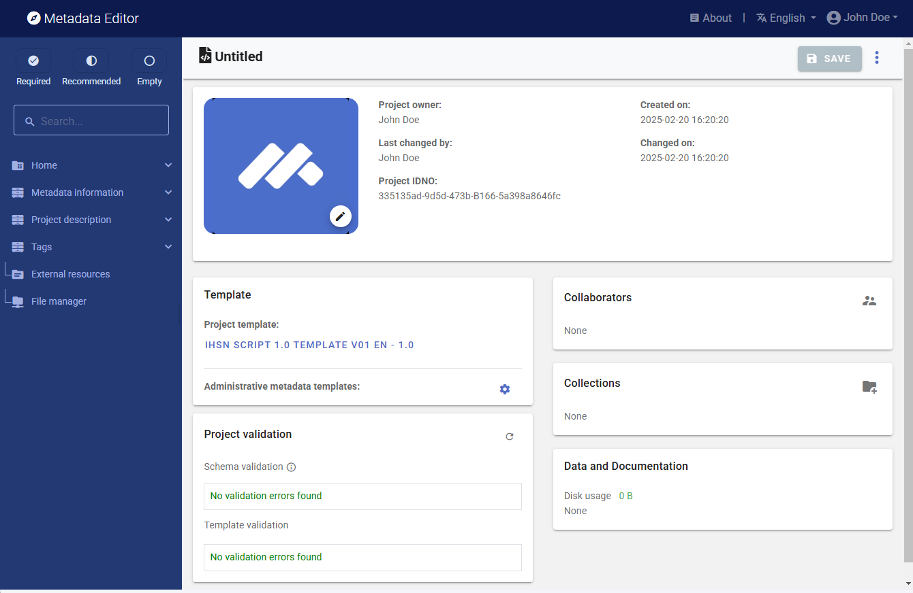
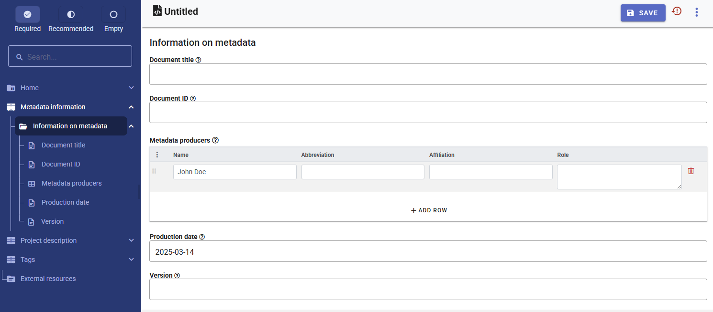
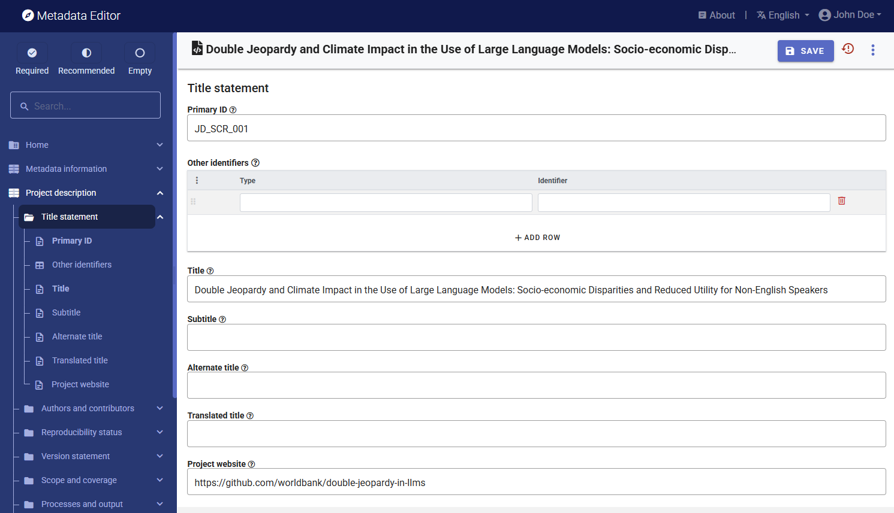

# Quick start: Research projects and scripts

In this example, we will document a research project titled "Double Jeopardy and Climate Impact in the Use of Large Language Models: Socio-economic Disparities and Reduced Utility for Non-English Speakers". The scripts related to the project are available on GitHub in repository "". A working paper was published on arXiv, available at https://arxiv.org/abs/2410.10665. The data used for the project are not open data.

The only file you need to reproduce this Quick-Start example is the image file *.../scripts/image_computer.jpg* (or select any another JPG or PNG image of your choice).

**Step 1: Create a new project and add a thumbnail**

To begin, open the Metadata Editor link and log in with your username and password. The "My projects" page will be displayed, showing all projects you have previously created and those that have been shared with you by others, if any. If you are using the application for the first time and no project has been shared with you by other users of the Metadata Editor, the project list will be empty. 

Click on "CREATE NEW PROJECT" and select "Script" when prompted to indicate the type of resource you will be documenting.

  
A new project page will open in a new tab.

We will use the *image_computer.jpg* image (or an image of your choice) as a thumbnail. The image will be displayed in the Metadata Editor and in the NADA catalog if the metadata is published in NADA. Click on the edit button in the screenshot image, and select the image file when prompted. 

**Step 2: Enter metadata**

On the left navigation tree, select "Metadata information / Information on metadata" to enter optional elements used to capture information on who documented the research project, and when. Enter your name, and the date in ISO format (YYYY-MM-DD). Then click on SAVE.

You can now start entering the metadata related to the project itself. In the navigation tree, first select "Title statement" under "", and enter the required **Primary ID** (a unique identifier of your choice, e.g., JD_SCRIPT_001; if you want to publish the project in a NADA catalog, make sure that this same identifier is not used by another user or for another project). Also, enter the title of the project: "Double Jeopardy and Climate Impact in the Use of Large Language Models: Socio-economic Disparities and Reduced Utility for Non-English Speakers".

Then proceed with the other sections in the navigation tree and fill out the following elements. 

- **Identifier**: create/enter your own identifier
- **Title**: Double Jeopardy and Climate Impact in the Use of Large Language Models: Socio-economic Disparities and Reduced Utility for Non-English Speakers
- **Date**: October 2024 (2024-10 in ISO format)
- **Website**: https://github.com/worldbank/double-jeopardy-in-llms
- **Authors**: Aivin V. Solatorio, Gabriel Stefanini Vicente, Holly Krambeck, Olivier Dupriez (all affiliated with the World Bank)
- **Abstract** *(extracted from the working paper)*: Artificial Intelligence (AI), particularly large language models (LLMs), holds the potential to bridge language and information gaps, which can benefit the economies of developing nations. However, our analysis of FLORES-200, FLORES+, Ethnologue, and World Development Indicators data reveals that these benefits largely favor English speakers. Speakers of languages in low-income and lower-middle-income countries face higher costs when using OpenAI's GPT models via APIs because of how the system processes the input -- tokenization. Around 1.5 billion people, speaking languages primarily from lower-middle-income countries, could incur costs that are 4 to 6 times higher than those faced by English speakers. Disparities in LLM performance are significant, and tokenization in models priced per token amplifies inequalities in access, cost, and utility. Moreover, using the quality of translation tasks as a proxy measure, we show that LLMs perform poorly in low-resource languages, presenting a double jeopardy of higher costs and poor performance for these users. We also discuss the direct impact of fragmentation in tokenizing low-resource languages on climate. This underscores the need for fairer algorithm development to benefit all linguistic groups.
- **Geographic coverage**: World (WLD) 
- **Keywords**: Large Language Models (LLMs), Low-resource languages, Inequity in access, Tokenization
- **Project output**: Working paper published on ArXiv, titled "Double Jeopardy and Climate Impact in the Use of Large Language Models: Socio-economic Disparities and Reduced Utility for Non-English Speakers", by Aivin V. Solatorio, Gabriel Stefanini Vicente, Holly Krambeck, and Olivier Dupriez. Absrtact of the output is same as abstract for the project.
- **Data**: The list of datasets used in the project is provided in the GitHub repository:
  -  ***FLORES-200 and FLORES+*** : A multilingual dataset covering 100 languages, with 1,000 sentences per language. Used for evaluating translation quality and computing the tokenization premium relative to English. (URL: https://github.com/facebookresearch/flores)
  -  ***Ethnologue*** : Provides linguistic data, including the number of speakers, geographic distribution, and writing systems. We use Ethnologue to estimate the number of speakers for each language. (URL: https://www.ethnologue.com/)
  -  ***World Bank, World Development Indicators (WDI)*** : Contains socio-economic data at the country level. Specifically, we use the GDP per capita in current US$ (NY.GDP.PCAP.CD) and the annual population growth rates (SP.POP.GROW) indicators to compute the population-weighted GDP for each language and for aligning population estimates to 2022 based on historical figures from Ethnologue. (URL: https://datacatalog.worldbank.org/dataset/world-development-indicators)
  -  ***OpenAI GPT-4o and GTP-4 Turbo APIs*** : Used to assess the reduced utility of LLMs for non-English speakers. We applied translation with different prompting methods to generate reference translations for FLORES sentences. The LLM translated non-English sentences into English, with the original English sentences serving as a benchmark for evaluating translation quality. (URL: https://openai.com/api/)
- **Software**: Python 3.0 
- **Scripts**: Python notebooks (all under Mozilla Mozilla Public License / URL: https://www.mozilla.org/en-US/MPL/):
  - ***Tokenization of FLORES dataset*** (compute-premium-costs.ipynb): Computes the tokenization premium for the FLORES dataset. The calculation of the population-weighted GDP for each language is also done in this notebook.
  - ***Back-translation task for the FLORES dataset*** (back-translation-task.ipynb): Generates the back-translation task for the FLORES dataset. The notebook implements the batched translation strategy for the translation task and uses the OpenAI GPT-4o API.
  - ***Additional analysis of the results (analysis.ipynb)***: Notebook for additional analysis of the results. Key visualizations are generated in this notebook, including the comparison of the tokenization premiums between two different tokenizers (GPT-4o vs. GPT-4 Turbo).
- **Technology environment and requirement**: This work has been developed using a MacBook Pro with an M1 Pro processor and 64GB of RAM. No GPU is needed for the computations. Access to the OpenAI API is required.
- **Instructions for reproducibility**:  
- **Github repo**: double-jeopardy-in-llms (URL: https://github.com/worldbank/double-jeopardy-in-llms/tree/main)
- **Licensing**: Mozilla Public License (URL: https://www.mozilla.org/en-US/MPL/)

This information is entered in the metadata template as follows:  

| Information               | In the metadata template                                                  | 
| ------------------------- | ------------------------------------------------------------------------- | 
| Identifier                | Project description / Title statement / Primary ID                        |
| Title                     | Project description / Title statement / Title                             |
| Website                   | Project description / Title statement / Project website                   |
| Date                      | Project description / Version statement / Project completion date         |
| Authors                   | Project description / Authors and contributors / Authoring entity         |
| Abstract                  | Project description / Scope and coverage / Abstract                       |
| Geographic coverage       | Project description / Scope and coverage / Geographic areas               |
| Keywords                  | Project description / Scope and coverage / Keywords                       |
| Project output            | Project description / Processes and output / Output                       |
| Data                      | Project description / Data / Datasets                                     |
| Software                  | Project description / Methods, Software and scripts / Software            |
| Scripts                   | Project description / Methods, Software and scripts / Scripts             |
| GitHub repo               | Project description / Methods, Software and scripts / Repository          |
| Licensing                 | Project description / Access and rights / License                         |

After entering all available information, click on SAVE. the **Preview** page shows all information you have entered.

**Step 3: Add information on related resources**

Once you have entered the metadata, you can finalize the documentation of the project by documenting and attaching external resources. External resources include all materials you want to make accessible to users when you publish the project in a catalog. In this example, we will add two external resources: a link to the GitHub repository, and a link to the working paper. 

To create external resources, click on "External resources" in the navigation tree and then click on "Create resource". For the GitHub repository, select the resource type ("Website"), give it a short title *(GitHub repository: double-jeopardy-in-llms)*, and enter the URL *(https://github.com/worldbank/double-jeopardy-in-llms/tree/main)*. Then click "SAVE." For the working paper repository, select the resource type ("Document, analytical"), enter the title *(Double Jeopardy and Climate Impact in the Use of Large Language Models: Socio-economic Disparities and Reduced Utility for Non-English Speakers)*, and enter the URL *(https://arxiv.org/abs/2410.10665)*. You may also enter the name of the authors, date (2024-10-14), and abstract. Then click "SAVE." You will now have two external resources listed.

**Step 4: Export and publish metadata**

In the project page, a menu of options will be available to you.

**Export package (ZIP)**

This option will allow you to generate a ZIP file containing all metadata and resources related to the project. This package can be shared with others, who can import it in their own Metadata Editor.

**Export JSON**

Export metadata as a JSON file. 

**Export RDF/XML** and **Export RDF/XML**

These options allow you to export the metadata related to external resources in JSON or XML format.

**PDF documentation**

A PDF version of the metadata can be automatically created. Select PDF documentation then click on GENERATE PDF. When the PDF is generated, click on DOWNLOAD PDF. You will obtain a bookmarked PDF file with all entered metadata.

**Publish to NADA**

If you have a NADA catalog and the credentials to publish content in it, you can also "Publish to NADA". Select a configured NADA catalog, select the options as shown in the screenshot below, and click PUBLISH.

The indicator will now be listed and made discoverable in the NADA catalog, with a link to the PIP platform. 

