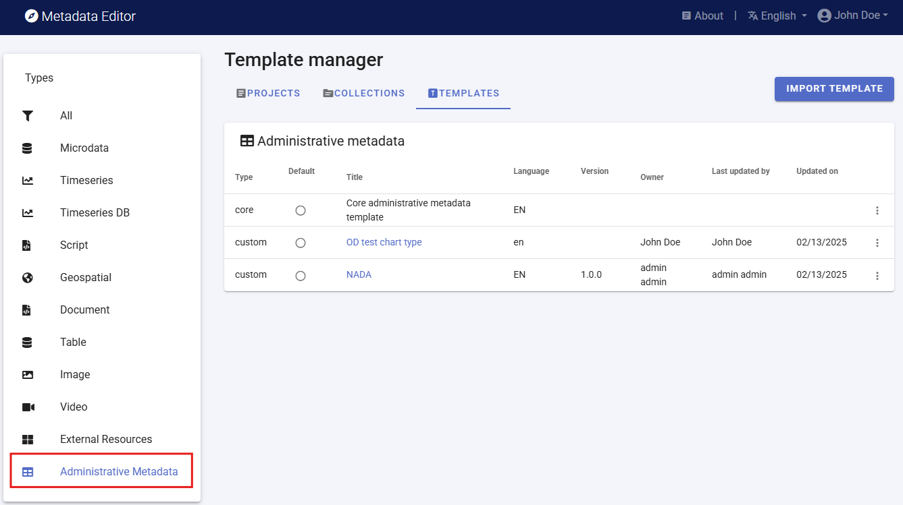
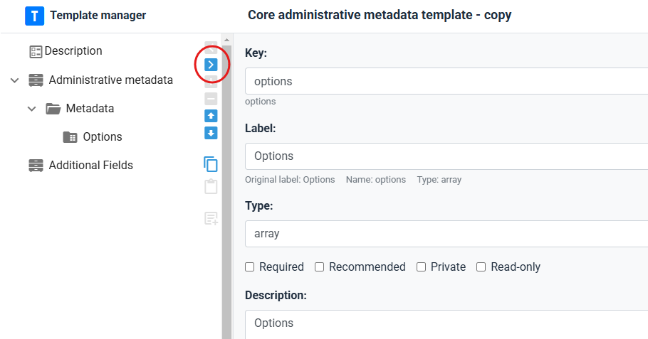
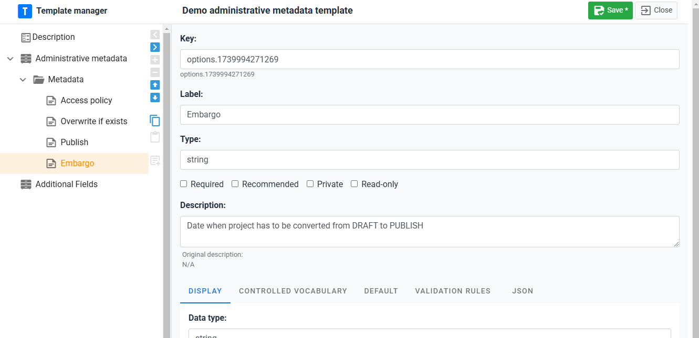
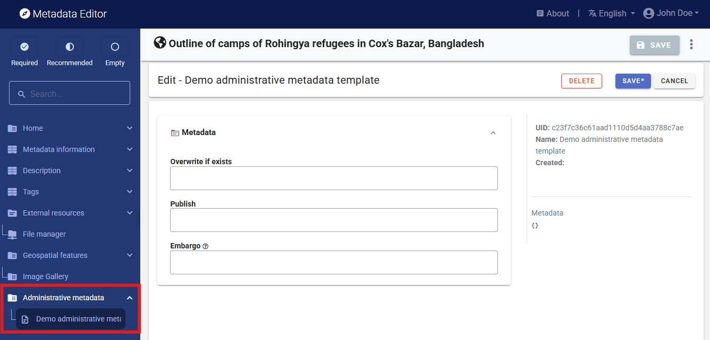

# Administrative metadata templates

The templates page includes all administrative metadata templates. By default, the Metadata Editor includes a core starter template named “Core administrative metadata”. This core template is not editable and cannot be used except to be duplicated and modified for creating new templates.

**Creating a new administrative template**  

To create a new administrative template, select DUPLICATE in the list of options available for the template (trille-dot icon next to the template title). In the **Description** page, provide a name (at least), and other information describing the new template being created. Then SAVE the template.

You may now start customizing the template by adding your own metadata elements. Start by removing all fields under the “Metadata” section in thenavigation tree. To remove a field, select the field in the navigation tree and click on the right blue arrow [>]. This will result in having an empty template, ready for customization. DO NOT remove the *Metadata* section. You cannot add elements directly under the container, so this folder is necessary.

Start adding the metadata elements you need. Select the *Metadata* folder in the navigation tree, then add an element by clicking on one of the three possible types of elements. The template supports 3 types of elements: 

Once create, add the following information on the metadata element:
- ***Key***: The *Key* defines the JSON path that will be used for storing the metadata. This is the identifier of the metadata element. It can only contain alphanumeric values. The key must be unique to each metadata element within the template.
- ***Label***: Give a label to the new element (replace "untitled")
- All other components of the page are identical to project templates. See section **Designing templates**.

**Defining who can enter content in administrative templates**

Administrative templates are designed, usually by IT/system experts, for the needs of specific data management or dissemination systems. The information to be entered in an administrative template when a project is documented will usually not be entered by the data curator (who will document the data), but by a system expert. This means that a different permission system will apply to the management of the content of administrative metadata.

The information on who has permission to enter administrative metadata is not set at the project level, but at the template level. The list of contributors authorized to enter content in a metadata template is defined in the ACL tab of the metadata sharing screen.

To access the screen, click on SHARE in the template menu (accessed by clicking on the tripple-dot icon in the template list). 

A popup menu will open, with the option to share the template itself (tab SHARE), and to enter the list of collaborators authorized to enter content when the template is used in a project (in tab ACL). Add the collaborators, making sure to give them **Edit** permission.

(

In any project where the template is activated, the administrative template will be displayed in the navigation bar. Authorized users listed in ACL will be able to enter and edit content.

