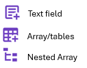
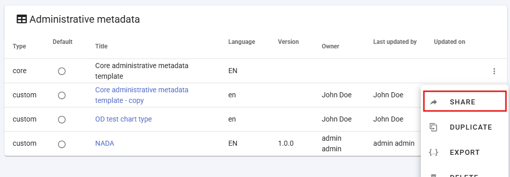
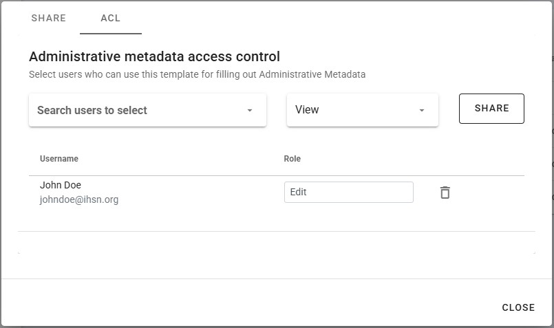

# Administrative metadata

## Purpose

Administrative metadata refers to the metadata required for managing and operating data management and dissemination systems. Administrative metadata will only be used by large data cataloguing systems, and by data systems that require automation of processes. Not all users of the Metadata Editor will need administrative metadata.

Unlike metadata intended for data users, administrative metadata is primarily used internally and is not shared externally. It contains essential instructions that guide software applications, such as data catalogs, in handling data storage, display, and accessibility parameters. For example, an organization may maintain two versions of a data catalog: one for internal use, the other one accessible to external users. While the descriptive and structural metadata of datasets will be the same for  both catalogs, the way the data and metadata are displayed and the data access conditions will likely differ. Administrative metadata will in such case be used to store instructions specific to each platform. Administrative metadata contribute to ensuring data governance principles and procedures, adherence to privacy protection rules, and compliance with the Bank’s Access to Information Policy (by including metadata on information classification of data assets, in particular flagging restricted and confidential information).

> The content of administrative metadata is specific to each organization and IT system. For that reason, no metadata standard is provided for administrative metadata. Instead, the metadata schema is entirely created "from scratch" using the Template Manager tool in the Metadata Editor. 

The creation of administrative metadata follows a structured approach similar to that of descriptive metadata. A set of metadata elements forms a structured schema (template). These elements are defined by IT specialists to ensure alignment with system functionalities and operational needs.

Metadata schemas created by an organization can then be used by the organization to capture administrtaive metadata for any project. Each project can be assigned one or more administrative metadata templates. 

Administrative metadata is securely stored within the Metadata Editor and can be exported (as JSON files), and is accessible via APIs to allow data management and dissemination systems to retrieve and utilize it as needed. But administrative metadata is not included in metadata exported for public use.  

## Creating administrative metadata schmeas (templates)

Although administrative metadata schemas are specific to each organization and IT system, the Metadata Editor provdes a starter template named “Core administrative metadata”. This core template is not editable and cannot be used except to be duplicated and modified for creating new templates.

To create a new administrative template, select `DUPLICATE` in the list of options available for the template (trille-dot icon next to the template title). In the **Description** page, provide a name (at least), and other information describing the new template being created. Then `SAVE` the template.

You may now start customizing the template by adding your own metadata elements. Start by removing all fields under the “Metadata” section in the navigation tree. To remove a field, select the field in the navigation tree and click on the right blue arrow `>`. This will result in an empty template, ready for customization. 
  > Do NOT remove the *Metadata* section. You cannot add elements directly under the container, so this folder is necessary.

Start adding the metadata elements you need. Select the *Metadata* folder in the navigation tree, then add an element by clicking on one of the three possible types of elements. The template supports 3 types of elements: 

Once created, add the following information on the metadata element:
- ***Key***: The *Key* defines the JSON path that will be used for storing the metadata. This is the identifier of the metadata element. It can only contain alphanumeric values. The key must be unique to each metadata element within the template.
- ***Label***: Give a label to the new element (replace "untitled")
- All other components of the page are identical to project templates. See section **Designing templates**.

## Defining who can enter administrative metadata for a project

Administrative templates are designed, usually by IT/system experts, for the needs of specific data management or dissemination systems. The information to be entered in an administrative template when a project is documented will usually not be entered by the data curator (who will document the data), but by a system expert. This means that a different permission system will apply to the management of the content of administrative metadata.

The information on who has permission to enter administrative metadata is not set at the project level, but at the template level. The list of contributors authorized to enter content in a metadata template is defined in the ACL tab of the metadata sharing screen.

To access the screen, click on SHARE in the template menu (accessed by clicking on the tripple-dot icon in the template list). 

A popup menu will open, with the option to share the template itself (tab SHARE), and to enter the list of collaborators authorized to enter content when the template is used in a project (in tab ACL). Add the collaborators, making sure to give them **Edit** permission.

(

In any project where the template is activated, the administrative template will be displayed in the navigation bar. Authorized users listed in ACL will be able to enter and edit content.

## Entering content in administrative templates

See section ***Administrative metadata*** in chapter **Documenting data - General instructions**
