# Creating and editing templates

*This section is about designing templates for the various data types. For the design of administrative metadata templates, see the next section ***Administrative metadata templates***.

Data curators will rarely make use of all elements available in a metadata standard. Many of the available elements may not be relevant in the context of a specific organization. Metadata templates provide a solution to define and tailor subsets of metadata elements available in a standard. 

Metadata templates are created and/or edited using the *Template Manager* tool in the Metadata Editor. 

Not all users of the Metadata Editor will have the credentials to create or edit templates; this is a specific role that must be assigned to selected users in an organization. Templates should be created and maintained by one or multiple managers(s) of the data curation process. The metadata templates they create can then be made available to all data curators. 

More than one template can be developed for each metadata standard (i.e., for each main data type). It is highly recommended to keep the number of metadata templates small. This will foster consistency in the metadata being produced, facilitate the work of data curators, and reduce the burden of maintaining a collection of templates.

## Pre-designed templates and template list

You access the **Template Manager** by clicking on `TEMPLATES` in the main menu of the Metadata editor. This will open a page showing all available templates by type of data. The list can be filtered by selecting a data *Type* in the left frame.

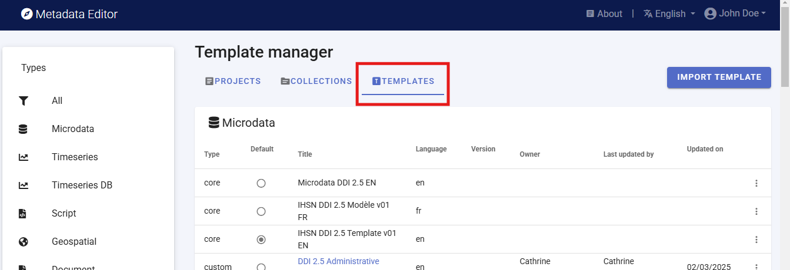

For each main data type (i.e., for each metadata standard), the Metadata Editor provides one or multiple **core** templates which are non-editable. One of the core templates contains **all elements** of the corresponding metadata standard, with their default parameters (label, description, etc.). Other core templates are provided as suggested templates, which only contain what is considered as the most important metadata elements for a general use case. Typically, new templates will be created by generating a copy of a core template, then editing it. 

## Actions on templates

When clicking on a template *Title* in the list of templates, the *Template* page will open. 

A set of options and actions is available in this page:

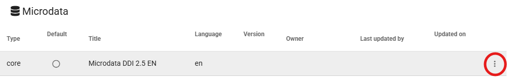

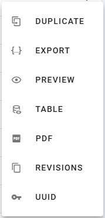

- **`DUPLICATE`**

  Clicking on DUPLICATE will generate an editable copy of the selected template. Clicking on the title of the duplicated template in the list of templates will open this new template page. 

  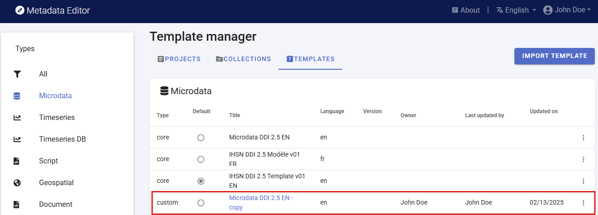

  The duplicated template can then be customized, and saved under a new name.

  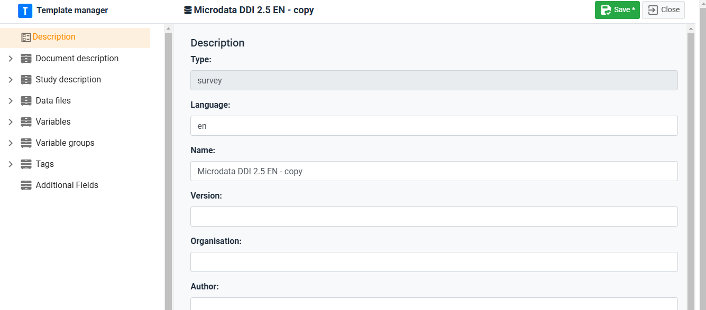
 
- **`EXPORT`** (and IMPORT)

  Exporting the template will create a JSON copy of it, which can be saved as a file with [.json] extension. Exporting templates allows sharing them with other organizations, who can `IMPORT` templates in their own instance of the Metadata Editor.

  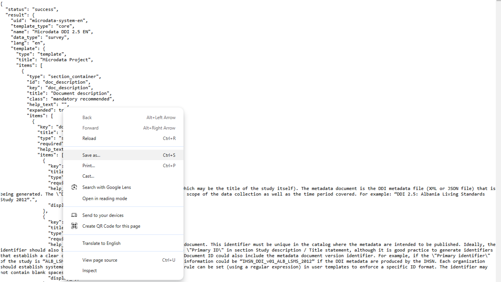

  Exported templates can be imported in the metadata Editor by clicking on **IMPORT TEMPLATE**.

  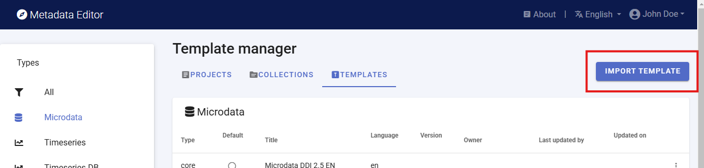

- **`DELETE`**

  Delete the selected template (only available for custom templates, not for core templates).

- **`PREVIEW`**

  Preview will generate an HTML version of the template, which will open in a web browser.

  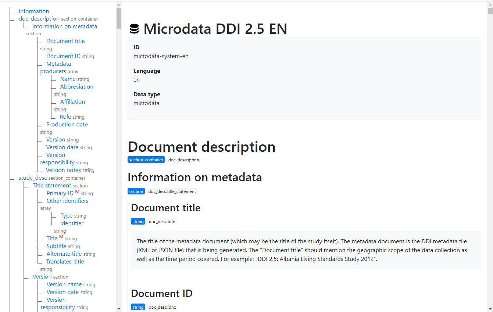

- **`TABLE`**

  This option will generate a tabular description of the template, which can be copy/pasted in MS-Excel if needed.

  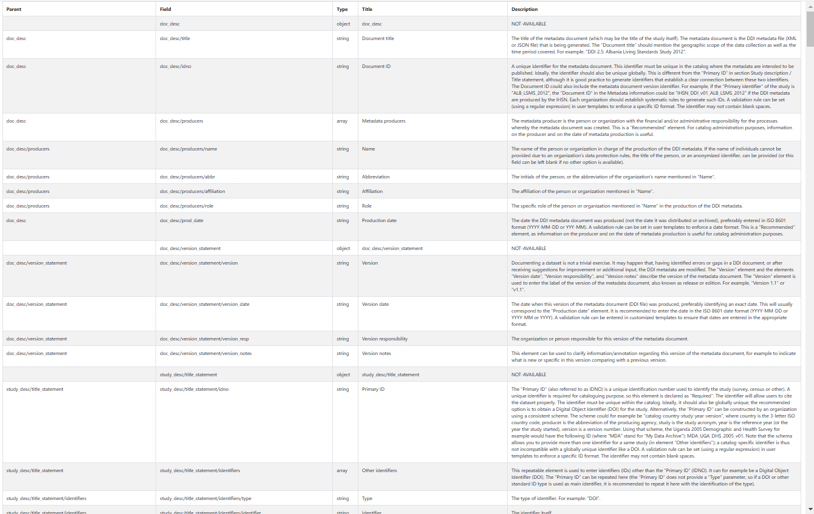

- **`PDF`**

  The PDF option generates a PDF version of the template. If the template contains detailed descriptions of all metadata elements, and examples of content, the PDF file may serve as a useful instruction guide for data curators.

  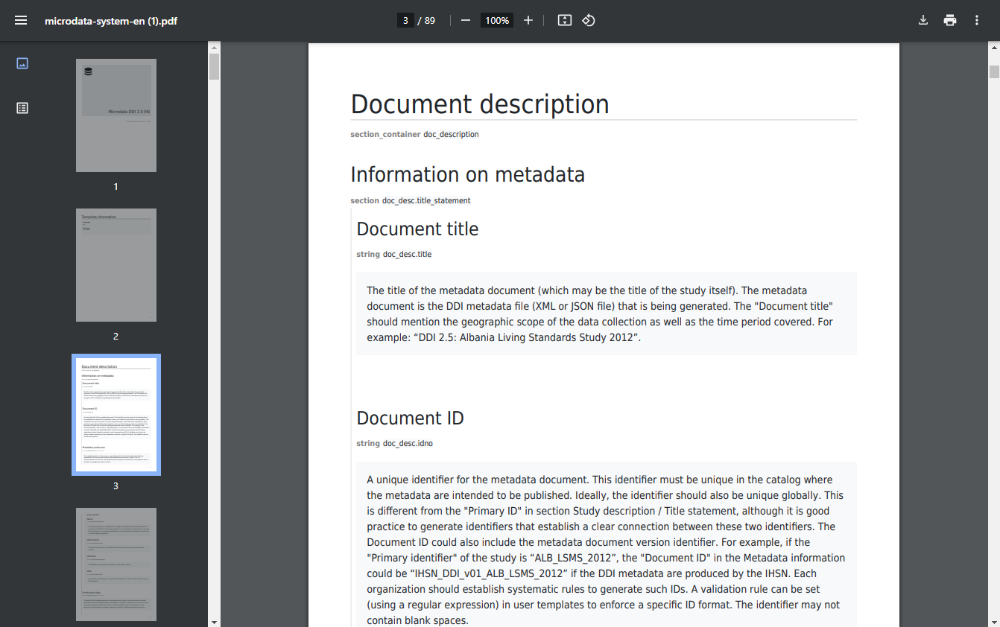

- **`REVISIONS`**

  This option provides a history of changes to the template since its creation.

- **`UUID`**

  This option allows template administrators to edit the unique identifier of the template. By default, a system identifier is created. This identifier can be changed to a more readable one. This will typically be done for administrative metadata templates.

## Editing a template

### Description page 

The **Description** page of the template is where you provide the main identification information of the template. It includes the following elements: 
- **Type**: The type of data to which the template applies (microdata, indicator, database, geographic dataset, document, etc.) 
- **Language**: The language of the template
- **Name**: The name of the template.
- **Version**: The version of the template.
- **Organization**: The organization that developed the template or for whom the template was developed.
- **Author**: The author(s) of the template.
- **Description**: A brief description of the template.
- **Instructions**: A set of instructions related to the template. This mainly intended to generate useful content for the PDF version of the template, which can then serve as an instruction guide to data curators. The content of this element can be plainn text or formatted text (using markdown syntax). 

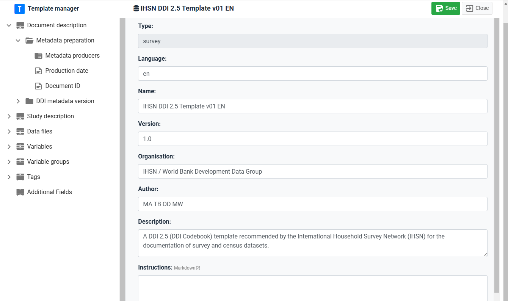

### Navigation tree 

The Template Manager navigation frame shows the structure and content of the template. This structure and content will define the metadata entry pages that data curators who enter metadata will see. There is a perfect match between the navigation tree in the Template Manager and the navigation tree in the user's page of the Metadata editor.

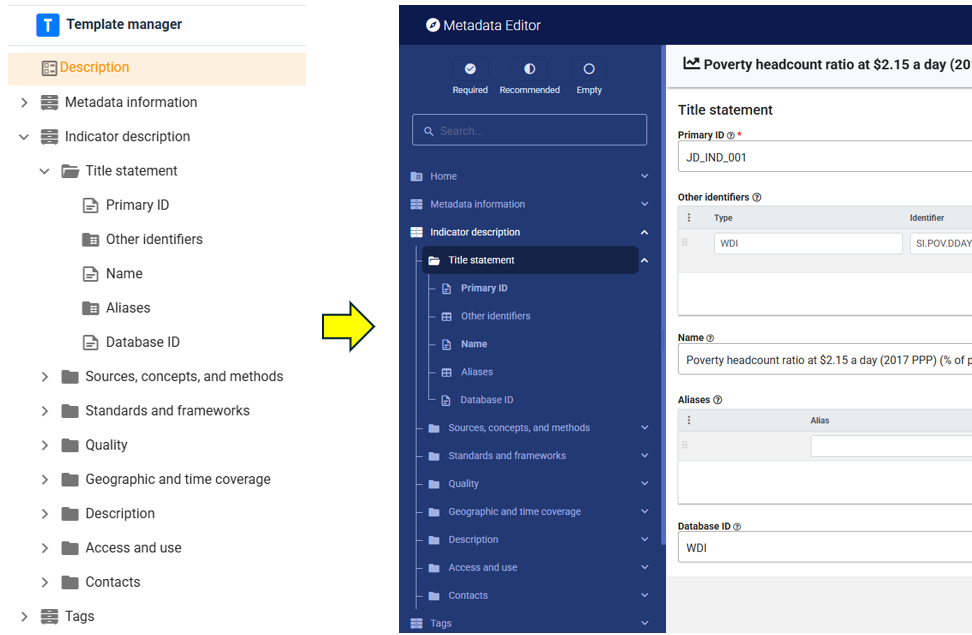

The navigation tree in the Template Manager indicates the type of element using the following icons:

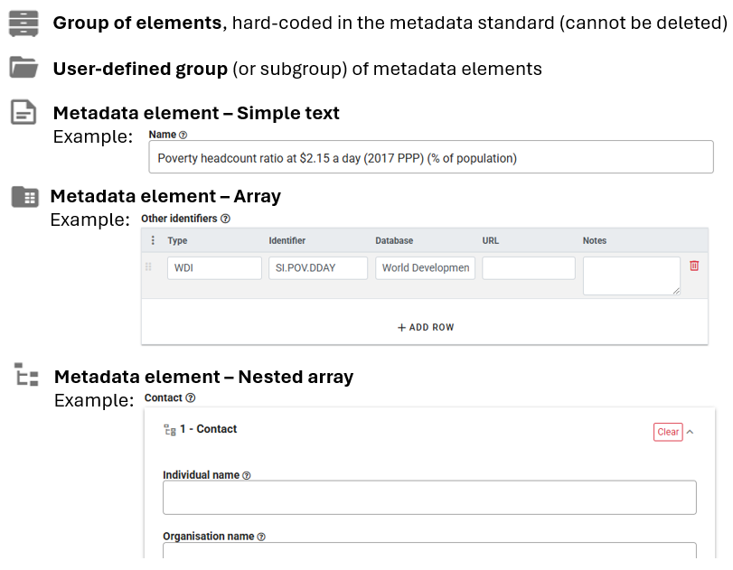

The navigation frame contains a toolbar used to edit the structure and content of the template. The available tools are the following:

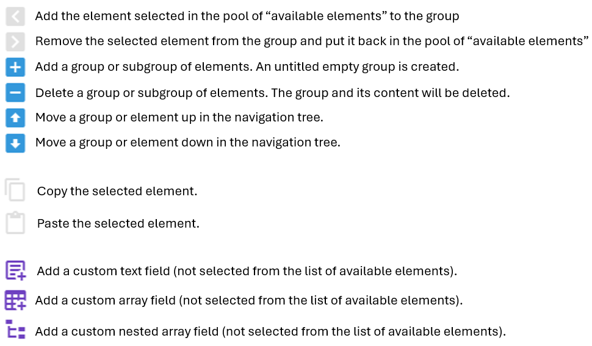

### Customizing the template 

**Groupings** 

Metadata are grouped by *container*. Containers are the main group of metadata elements. They are not editable; containers are hardcoded in the respective metadata standards. Within containers, elements can be organized by *group* and *sub-group* ("sections"). Groups and sub-groups are user-defined. The purpose of the grouping is to organize the metadata elements in a way that will be user-friendly to data curators who will enter the metadata. All metadata elements in a template must be placed in a user-defined group (they cannot be placed directly under a container).

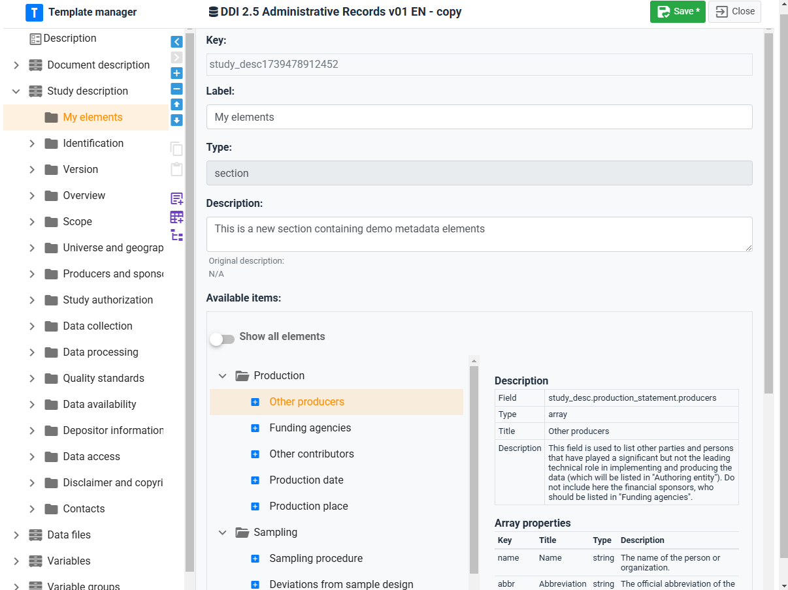

Groups and subgroups are created by clicking on the [+] button in the navigation bar (the button is only active when a container or group is activated in the navigation tree). When a new group is created, change replace the *Untitled* label with a short label of your choice, and provide a brief description of it (optional). You can move the group up or down the navigation tree by using the Up and Down arrows.

You can delete a group by clicking on the [-] button. The group and all its elements will be removed from the navigation tree. All elements that were included in the tree will also be removed. The elements that belong to the standard will be put back to the list of available elements (see below), but their customization will be lost. The additional elements that may have been included in the group (elements that do not belong to the standard) will be lost. 

**List of available elements**

Templates are intended to be a customized organization of metadata elements from a metadata standard (with possible addition of new elements not found in the standard). A template is therefore created mainly by selecting elements from the list of elements available in the metadata standard, and placing them in the structure shown in the navigation bar. The list of available elements (which contains all elements from the metadata standard that have not yet been selected, i.e. not found in the navigation bar) is shown in the right frame of the Template Manager, **when a group is selected in the navigation bar**. An option is provided to **show all elements**. The list of available elements is the pool of metadata elements from the metadata standard that can be added to the template. 

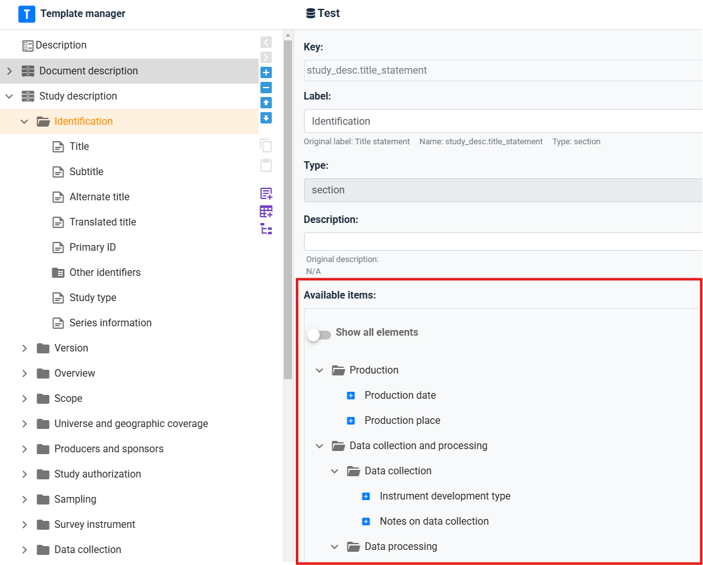

**Adding metadata elements**

The elements included in the template will typically come from the metadata standard for the data type. Some may be created as *additional* elements.

Metadata elements must be placed within groups or sub-groups (not directly under a container).  

- To add an element from the standard: In the navigation tree, select the group in which you want to add the element. Then select the element from the list of available elements by clicking on the + button next to the element. The element will now be listed in the group. You can move the element up or down the list within the group. You can remove the element from the navigation tree by selecting it and clicking on the [>] button in the toolbar. the element is sent back to the list of available elements, with its default description (i.e. customizations will be lost). You can also copy/paste elements to move them from one group to another (within the same container). To do this, select the element(s) to be copied, and click on the **Copy** button in the toolbar (the elements included in the clipboard will be marked in the navigation tree). Select the group where the elements have to be pasted, and click on the **Paste** button.  

To edit metadata elements:

When you select a metadata element in the navigation tree, all information about the element is displayed in the right frame. Some of this information can be edited. The information includes the following:

- ***Key:*** The key is the unique identifier of the element in the metadata standard. This information is not editable, except for additional elements created by the user. 
- ***Label:*** The label of the element can be edited. It should be short and informative.
- ***Type:*** The type of element. A metadata element can be a text field, an array, a nested array, or a simple array.
- ***Status:*** Each element can be categorized as:
   - ***Required*** (or not): Required means that metadata for any dataset must contain information for this element. Metadata that fauil to include content for a required element will not be validated (validation errors will be displayed).
   - ***Recommended*** (or not): This status is mainly used to facilitate metadata entry by data curators and for quality assurance.
   - ***Private*** (or not): Some metadata may be useful to the organization who generates the metadata, but not be part of the metadata to be published. Metadata elements marked as private may be excluded from the metadata files exported from the Metadata Editor.  
   - ***Read-only*** (or not).
- ***Description:*** The description of the metadata element should provide a clear indication of what data curators are expected to enter in the field. The instructions will be displayed as "help" in the metadata entry pages. By default, the instructions are those that are provided in the metadata standard description. They can be customized. 
- ***Field properties:*** This information only applies to elements of type "array" and "nested_array". Arrays contain multiple elements. The *Field properties* is where the content of the array is selected and edited. 
- ***DISPLAY:*** This tab contains information that only applies to elements of type "text". The following information can be edited:
   - ***Data type:*** This indicates the type of content expected in the element: string (text), number, integer, or boolean.
   - ***Display:*** This indicates the *Data Type*, and *Display options*: how the field will appear in the metadata entry pages, with the following options: "text" (one-line text field), "text area" (multi-line text field), "date" (date in ISO format; the metadata entry page will show a calendar from which the data curator can select a date); "dropdown" (one-line text field with a drop down from which the data curator must select an entry, with no option to enter free text); and "dropdown-custom" (one-line text field with a drop down list, but allowing data curators to enter content other than what the dropdown suggests). The content of the dropdown lists is defined by the *controlled vocabulary* for the element (see below). For selected text fields, the *DISPLAY* tab will also contain information on *Input format* which indicates whether formatted text can be entered for the element. By default, only non-formatted text is allowed. But exceptions can be made to allow Markdown, LaTex, or HTML content to be entered by the data curator. LaTex allows capturing formulas. See section *Documenting data - General instructions* for an example.
     
     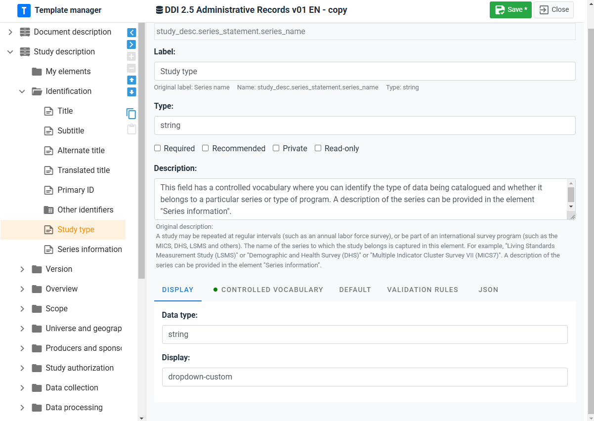
     
- ***CONTROLLED VOCABULARY:*** A controled vocabulary (or code list) A controlled vocabulary, or *code list*, is a predefined and structured set of terms (with corresponding codes) that are consistently used to populate specific metadata elements. Controlled vocabularies may be applied to some metadata elements to ensure uniformity and precision. Utilizing controlled vocabularies helps ensure that the same concept is consistently represented by the same term across various records, thereby reducing ambiguity and enhancing searchability and interoperability. A controled vocabulary will typically provide, for each term, a code and a label. The Template Manager allows defining which column should be used as value: the *Code*, the *Label*, or both (*Label with code*). When a controlled vocabulary is entered, a green dot appears next to the title of the tab.
  
  
  
- ***DEFAULT:*** A default value can be provided for an element. This will rarely be used. Default values will not be automatically entered in the metadata; instead, the data curator will have the option to "Add default values" when documenting a dataset.
  
  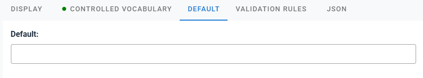
  
- ***VALIDATION RULES:*** Validation rules can be set for a metadata element, to control quality. The content entered for the element by the data curator will be validated against this set of rules, and Validation errors will be shown in the project home page. Validation rules can be of different types: regex (regular expression), min or max (minimum or maximum value, for numeric files), max_length (maximum number of characters in the entry), alpha (only letters accepted), alpha_num (only alphanumeric characters allowed), numeric (numeric value must be entered), is_uri (entry must be a URI). When one or multiple validation rules are entered, a green dot appears next to the title of the tab.
  
  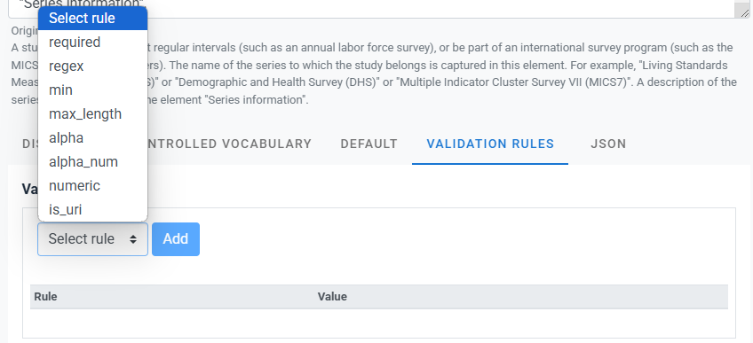
  
- ***JSON:*** The JSON version of the element description. This is not an editable content. 
  
  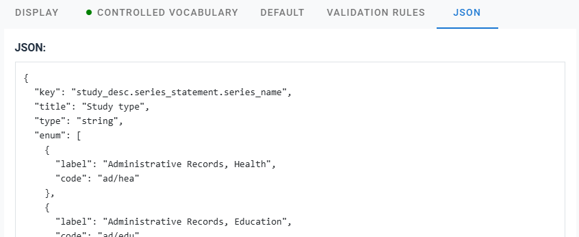

### Creating additional fields 

Metadata elements that are not provided by a metadata standard can be added as "additional fields". Such metadata elements are created and managed the same way as other metadata elements, except that a unique *Key* has to be provided, which will be the identifier of the newly created element.

### Setting a template as default

The Template Manager allows the administrator of the system to select, for each data type, the template to be used by default (one default template per type, indicated by the radio button).

