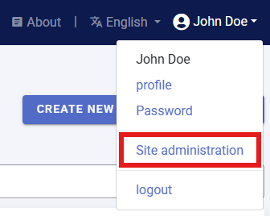
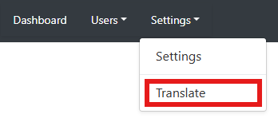
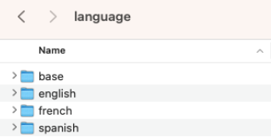
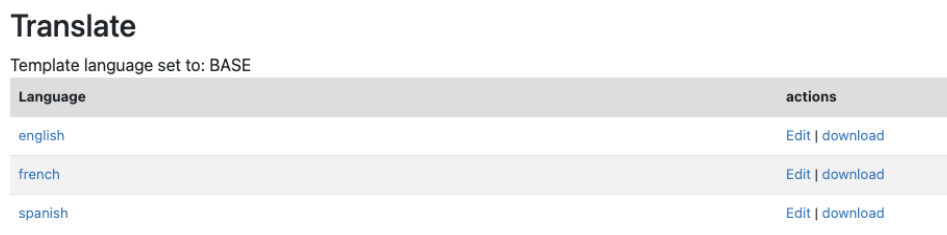
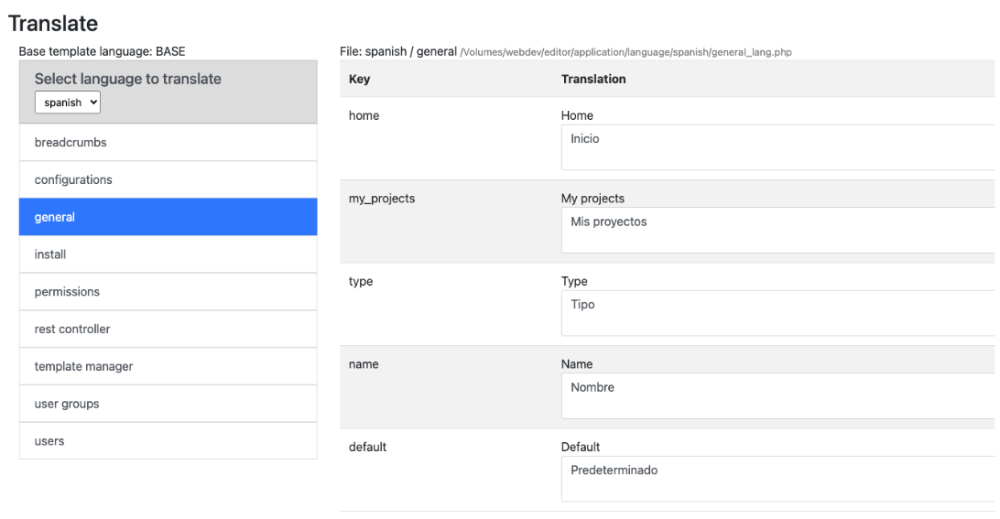
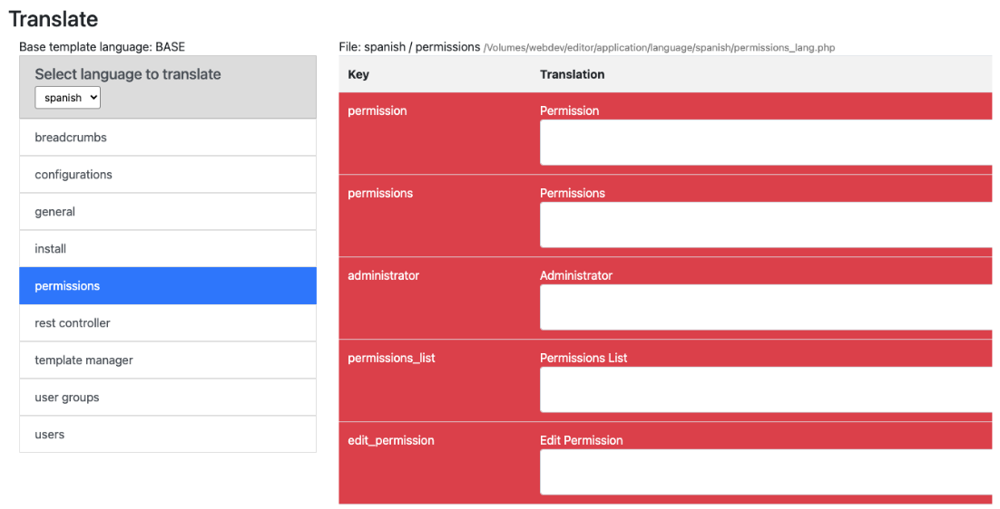
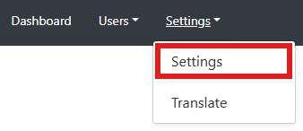
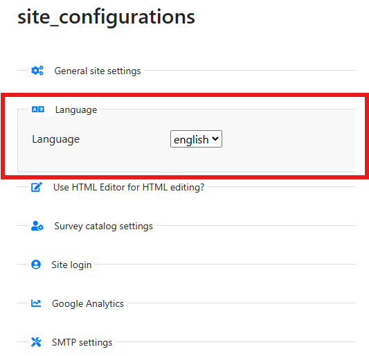
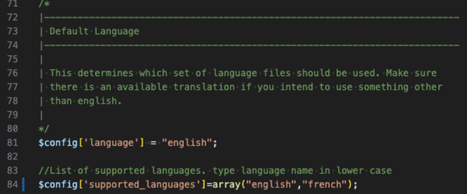
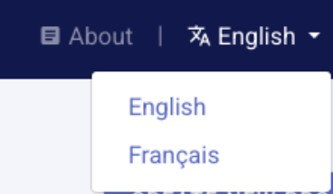

# Translation of the software and templates

## Translating the Metadata Editor software application

The Metadata Editor was designed in compliance with internationalization best practice. The software can easily be translated to other languages by any user, using the translation tool provided. 

If the application is not available in your language, you may cerate a translation using a user interface. This requires System administrator privileges. If you have been assiged a role as System administrator, the *Site administration* item will appear in the menu that opens when you click on your name. Clisk on *Settings* then select *Translate* in the *Site administration* main menu.  

Instructions on how to translate the software are provided below. The output of a translation will consist of a series of PHP files (with extension [.php]) that can be uploaded on the server where the Metadata Editor is installed. Instructions on where to save these files, and on how to activate a new language, are also provided below. These translation files can be shared with other organizations that use the Metadata Editor. You are thus encouraged to share them, and to inform the World Bank about the availability of your translation (validated translations, if provded as open materials, may be published in the World Bank repository). 

The Metadata Editor supports translation into any UTF8-encoded language, including Arabic, Chinese, and Russian. For right-to-left languages like Arabic, the User Interface (UI) must be adjusted for correct display. Translations only affect the labels, not the UI layout. 

Note:  The application allows translation from a language to itself, e.g., from English to English. This option can be used to modify the display of labels/text in the Editor interface. It allows site administrators to adapt the user interface to specific terms used in their organization. 

### Adding a new translation 

To create a translation for a new language, a new folder must be created in the `application/languages` folder on the server or computer where the application is installed. For example, to create a new translation for `Spanish`, a folder named `Spanish` must be created. No UI is provided to create a new folder.

Once the folder is created, it will be available on the translations page UI. 

Select the added language and click "Edit". 

The items for which no translation is available will be displayed with a red background. Enter your translation in the box. Note that if the length of the translation is significantly longer than the text in English, the text may not display properly in the interface (when used in menus, buttons, or other locations with limited space). 

After translating a section, make sure to **Save** your work. 

### Activating a new translation 

To activate the new translation as the main language for the Metadata Editor, use the Settings/language option provided in the site administration menu.  

Select the language to be used from the list of available translations. This will make the new language the new default language for your instance of the Metadata Editor.

### Using multiple languages 

The Metadata Editor allows enabling more than one language by modifying the configuration settings. One language will be the primary/default one, the other one(s) will be available for selection by the user of the Metadata Editor. This is done by editing the file *application/config/config.php* (no user interface is provided for this). Edit the *supported_languages* line of the file as follows. 

When there is more than one language selected, a dropdown menu will be shown in the site navigation main menu, allowing users to select the language of the UI. 

## Translating the metadata templates

If you translate the Metadata Editor, you will likely also want to translate the metadata templates, as the templates also define the UI that data curators will see when they use the application. To translate a template, use the Template Manager (see section on **Designing templates**). First, duplicate the template you want to translate, then translate all labels, instructions, and controlled vocabularies. Set templates translated into your language as the default templates.   

